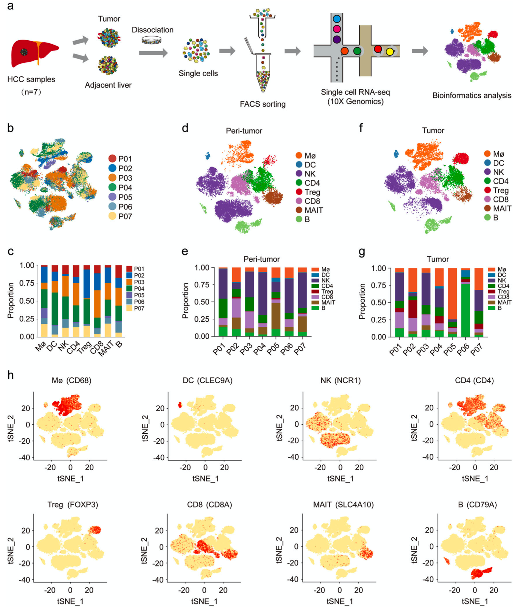
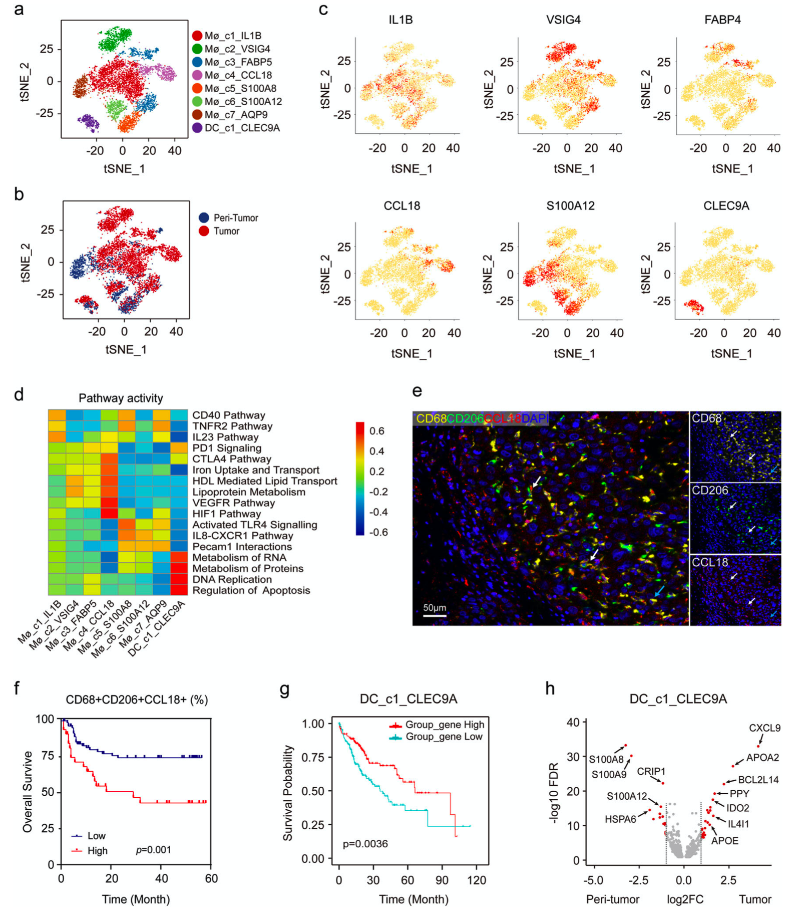
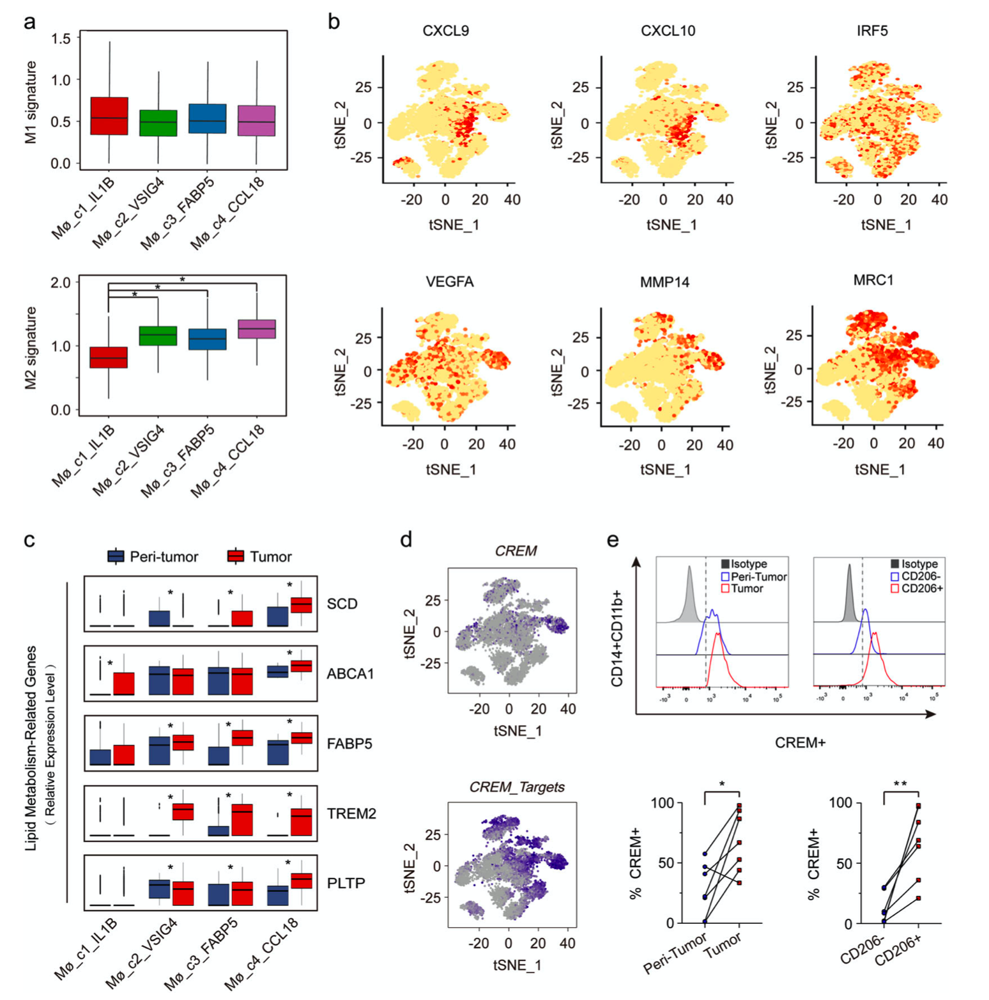
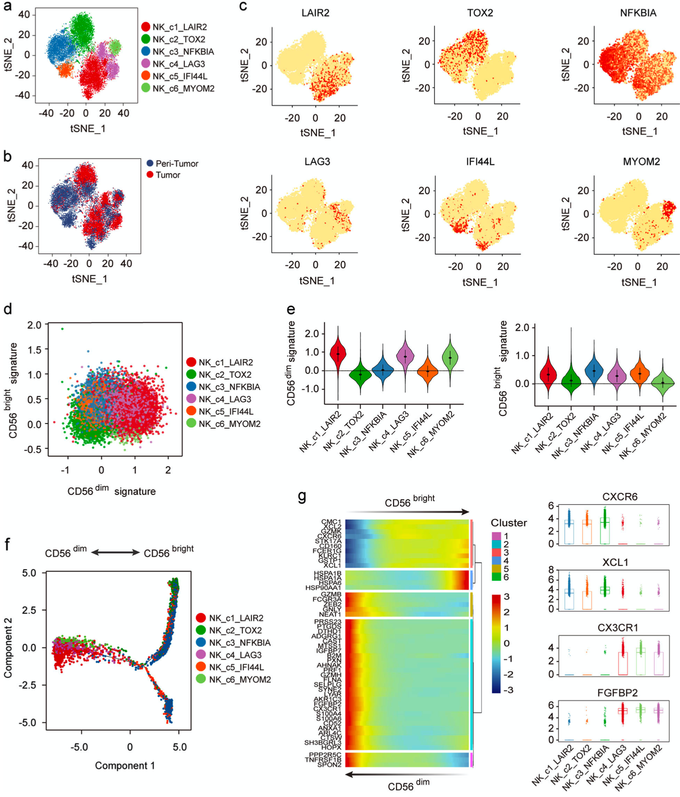

### Global immune characterization of HBV/HCV- related hepatocellular carcinoma identifies macrophage and T-cell subsets associated with disease progression

---

### Abstract

肿瘤微环境中的不同免疫细胞形成了一个复杂的生态系统，但我们对它们在肝细胞癌(HCC)中的异质性和动力学的了解仍然有限。
为了在单细胞水平上评估HBV/HCV相关肝癌微环境中免疫细胞的可塑性和表型，我们对7对HBV/HCV相关肝癌组织和非肿瘤肝组织中的41,698个免疫细胞进行了单细胞RNA测序。
我们结合生物信息学分析、流式细胞术和多重免疫组化来评估不同免疫细胞亚群在功能特征、转录调控、表型转换和相互作用方面的异质性。
我们鉴定了29个免疫细胞亚群，包括髓系细胞、NK细胞和淋巴细胞，这些细胞亚群在HCC中具有独特的转录特征。
一个高度复杂的免疫网络是由不同的免疫细胞亚群组成的，这些细胞亚群可以在不同的状态之间转移并相互作用。
值得注意的是，我们发现一组M2巨噬细胞高表达CCL18和转录因子CREM，在晚期HCC患者中富集，并可能参与肿瘤的进展。
我们还检测到一个新的激活的CD8+T细胞亚群，它高表达XCL1，与更好的患者存活率相关。
同时，也鉴定了从早期到晚期肝癌的不同转录特征、细胞毒表型和效应CD8+T细胞的进化轨迹。
我们的研究提供了对HBV/HCV相关肝癌的免疫微环境的洞察力，并强调了新的巨噬细胞和T细胞亚群，这些细胞和T细胞亚群可以在未来的免疫治疗中进一步开发。

### Introduction

肝细胞癌(HCC)是全球第四大癌症死亡原因，慢性乙型肝炎(HBV)和丙型肝炎病毒(HCV)感染是最主要的危险因素1。
最近的免疫疗法，包括阻断免疫检查点的抑制剂，在HCC的临床治疗中显示出令人鼓舞的效果。
然而，不同患者的治疗结果不同，仅达到约20%的应答率2，3。HCC被认为是一种炎症驱动的疾病，免疫细胞浸润和动态相互作用的质量和数量可能会对免疫治疗的疗效产生重大影响，这是合理的。

肿瘤微环境(TME)是一个复杂的异质生态系统。
先天免疫细胞，如经典激活的巨噬细胞(M1)可以杀死和清除肿瘤细胞，而M2巨噬细胞，也被认为是肿瘤相关巨噬细胞(TAMs)，促进肿瘤的进展。
虽然目前已明确巨噬细胞在肿瘤免疫应答中起双重作用，但M1和M2巨噬细胞的异质性、功能特征和相互关系仍需进一步研究。
此外，TME中不同亚群的获得性免疫细胞在抗肿瘤反应中表现出相当大的可塑性。
例如，CD8+细胞毒性T细胞在肿瘤控制中起着关键作用，有助于改善HCC6的预后。
然而，这些细胞可以在持续的抗原刺激下表现出疲惫的状态，并表现出产生促炎细胞因子的能力受损7。
因此，对不同免疫亚群的综合表征将为肿瘤免疫治疗的发展提供新的线索。

单细胞RNA测序(scRNA-seq)以一种前所未有的方式实现了对免疫系统的全面分析。
将scRNA-seq应用于免疫细胞群体，已经在许多类型的肿瘤中发现了新的免疫亚群，包括肺9，10，结直肠11，肝12，13和乳腺癌14。
在这里，我们对7例HBV/HCV相关的HCC患者的免疫细胞进行了全面的scRNA-seq分析，没有筛选出细胞类型标记物。
我们发现免疫亚群具有相当大的时空异质性和可塑性。
重要的是，我们检测并验证了CCL18+M2巨噬细胞和XCL1+CD8+T细胞的新亚群，它们分别与疾病进展和抗肿瘤反应相关。
我们的发现为深入了解HBV/HCV相关的HCC免疫学提供了有价值的资源，并可能指导未来的免疫治疗策略。

## Results

#### 肝细胞癌微环境中免疫细胞的单细胞图谱

我们对7例单纯肝细胞癌(P01~P07)和邻近的非肿瘤肝组织(图1A-c；补充图)分离的免疫细胞进行了scRNA-seq实验。
S1a、b)。

> 图1肝癌和远端瘤周不同免疫细胞的单细胞图谱。
> 研究工作流程概述。
> Bc. t-SNE图和7名患者注释的所有41,698个细胞的比例。
> De. t-SNE图和细胞类型的比例在来自瘤周组织的不同样本上有所不同。
> Fg. t-SNE图和细胞类型的比例在不同来源的肝癌样本中有所不同。
> h. T-SNE图显示细胞类型特异性标记基因的H表达。

除1例HCV感染外，其余均为HBV感染(P0.05)，其中I期3例，III期4例(补充表S1)。
共有41,698个细胞通过质量控制，包括21,991个来自非肿瘤肝组织(图1D，e)和19,707个来自HCC(图1F，g)的细胞，平均数量为5549个UMIS/细胞和1709个基因/细胞(补充表S2)。
我们使用Single R算法15将细胞分组为主要免疫细胞类型，并通过t分布随机邻居嵌入(t-SNE)进行可视化。
我们鉴定了8个免疫亚群，表达了众所周知的标记基因(图1H)。
与以前的数据一致12，T细胞是肿瘤中最丰富的免疫细胞类型(36.20%)，其次是NK细胞(28.57%)和巨噬细胞(25.04%)。
虽然树突状细胞(DC)的数量最少(1.19%)，但UMI的数量和基因序列最多(16438个UMIS/细胞和3187个基因/细胞；补充图)。
S1c-f)。

#### 肝细胞癌微环境中髓系细胞功能的多样性

髓系细胞由不同的亚群组成，在肿瘤免疫中显示出不同的功能。
为了进一步研究HCC中的髓系群体，无监督的7008髓样细胞集群清楚地显示了八个不同的集群(图2A，b；补充图。
S2A-E)。

> 图2显示肝细胞癌中不同的髓样细胞群。
> a. 以不同颜色显示的八个髓样细胞子集(每个点对应一个单个细胞)的t-SNE投影。
> b. 不同髓样细胞团来源的Bt-SNE图。
> c. 标记基因在tSNE图中显示的每一簇的表达。
> d. GSVA分析每细胞通路活性差异的三维热图。
> e. 代表CD68+CD206+CCL18+巨噬细胞分布的mIHC图像：CD68(黄色)、CD206(绿色)、CCL18(红色)和DAPI(蓝色)。
> 白色箭头(CD68+CD206+CCL18+)，蓝色箭头(CD68+CD206+CCL18−)。
> f. 标尺，50μM.f Kaplan-Meier曲线显示在本组队列中CD68CD206+CCL18+巨噬细胞比例高与比例低的患者存活率低(对数秩检验，P=0.001)。
> g. TCGA HCC患者的G Kaplan-Meier生存曲线，按DC_C1_CLEC9A细胞标记基因的平均表达(高表达与低表达)分组，如表S3所示。(对数秩检验，P=0.0036)。
> h. Volcano图显示DC_C1_CLEC9A细胞癌周与肿瘤间差异表达基因。每个红点表示一个单独的基因超过了我们的P值和折叠变化阈值。

在我们的数据中，Mø_C1代表最丰富的巨噬细胞(37.10%)，高表达IL1B，以及CXCL10和CXCL9(图2C；补充表S3)，它们可能参与抗肿瘤反应16。
这些巨噬细胞持续表达较高水平的干扰素-γ相关基因，如TNFAIP3、GBP1、APOBEC3A和GBP5。
Møc2和Møc3(分别为13.54%和13.31%)被认为是Kupffer样细胞，因为它们高表达VSIG4，VSIG4是一种组织驻留巨噬细胞特异性的膜蛋白17。
值得注意的是，Mø_c4(11.16%)主要在晚期HCC患者中浸润(P04和P07)，其特点是CCL18的高表达，这在以往的scRNA-seq研究中是没有的。
这些巨噬细胞在脂质运输和代谢以及与免疫抑制相关的途径中表现出很强的活性(图2D)。
我们证实CCL18主要由M2巨噬细胞分泌(图2E)，肝癌患者肿瘤中CD68CD206+CCL18+巨噬细胞的比例较高，与肿瘤体积大(P=0.025)、TNM分期晚期(P=0.034；补充表S4)和生存率差(图2F，P=0.001；补充表S4)显著相关(图2F，P=0.001；补充表S4)。
S2f)在我们的队列中。

Mø_c5-Mø_c7具有较强的供体表型，被定义为单核细胞髓系来源的抑制细胞(M-MDSCs，分别为8.78%、8.16%和7.95%)，其特征是高表达S100A12、S100A9和S100A818(补充图)。
S2g)，以及CCR2，这可能有助于它们运输到肿瘤部位19。
特别值得一提的是，主要来源于36岁男性患者P06(HBVDNA载量高达127,000IU/mL)的Mø_c7，表现出IFI44L和IFI6的上调，暗示在抗病毒反应中有潜在的作用20，21。

CDC1细胞的抗原呈递标志CLEC9A和XCR1表达丰富，部分原因是样品偏倚或组织消化方法不同，我们仅回收了DC_C1的一个亚群(DC_C1)。
CDC1细胞通过递呈抗原22在激活T细胞方面发挥重要作用。
正如预期的那样，DC_C1标记基因表达增加的肝癌在TCGA队列中的存活率显著提高(P=0.0036，图2G)。
有趣的是，DC_C1在与RNA和蛋白质代谢以及DNA复制相关的途径中表现出丰富的表达，这意味着它们的转录上调，这与它们拥有最多基因的发现是一致的。
此外，由于CXCL9、IDO2、APOA2和APOE的表达增加，TME的重塑可能导致DC_C1细胞功能改变和脂质利用增强(图2H)。

#### 不同亚群巨噬细胞转录组的异质性

巨噬细胞是表型和功能可塑性的，但巨噬细胞极化的模型仍然存在争议。
我们评估了M1和M2签名基因14(补充表S5)在Mø_C1-Mø_c4中的表达，以确定它们的表型，并执行Monocle 2算法23，以揭示它们的潜在转变(补充图。
S3A)。
结果表明，Møc1和M4的表型分别更像M1和M2巨噬细胞，而M2和M3则出现在中间阶段(图3A)。结果表明，Møc1和Møc4的表型更像M1和M2巨噬细胞，而Møc2和Møc3则出现在中间阶段。

> 图3巨噬细胞四个亚群的转录组异质性。
> a. 模块为单细胞水平上的每个巨噬细胞亚集对Azizi等人定义的M1和M2表达签名进行评分(补充表S5中的基因列表)。
> *P<0.01。
> b. M1(上)和M2(下)表达式签名的t-SNE图。
> c. 通过方框图绘制的脂代谢相关基因的表达。
> *P<0.01。
> d. CREM基因表达及其靶基因调控的t-SNE图谱。
> e. 肝癌及癌旁CD14+CD11b+巨噬细胞、CD14+CD11b+CD2 0 6+−或CD14+CD11b+CD2 0 6+巨噬细胞CREM表达的代表性流式细胞术图谱(上)及统计学分析(下)，分别为CD14+CD11b+CD2 0 6+巨噬细胞、CD14+CD11b+CD2 0 6+巨噬细胞。数据分析采用Wilcoxon配对符号秩检验。
> *P<0.05，**P<0.01。

在从M1到M2状态的转变过程中，巨噬细胞获得了促进肿瘤侵袭、转移和免疫抑制的功能，上调的基因如MMP14、VEGFA和MRC1(图3B；补充图。
S3b)。
然而，尽管巨噬细胞逐渐获得了M2表型的特征，但它们并没有明显下调M1信号。
这一发现表明M2样巨噬细胞仍保持一定的抗肿瘤特性，支持TME中巨噬细胞活化不遵循经典极化模式14、24的观点。

巨噬细胞可能会改变代谢基因的表达，以适应能量需求，例如增加脂肪酸氧化，为M2极化提供关键的能量来源25。
我们发现，与M1巨噬细胞相比，M2巨噬细胞表现出进行性的脂质代谢增强(图3C)，这一点在M2巨噬细胞26的标记基因Mø_c2-Mø_c4中高表达TREM2就是例证。
此外，肿瘤中的M2巨噬细胞比非肿瘤中的M_2巨噬细胞表现出更强的脂质代谢特征，提示TME可能促进M_2巨噬细胞的脂质代谢。
脂质代谢相关基因FABP5、ABCA1、SCD和PLTTP在M2巨噬细胞亚群中异质性表达，表明不同M2亚群之间存在代谢异质性。

以M4中距离M2最近的巨噬细胞为研究对象，我们发现转录因子CREM在该簇中表达较强，其靶基因也通过单细胞调控网络推理和聚类(SIENIC)27分析在Møc2-Møc4巨噬细胞中高度上调(图3D；补充图)。
S3c，d)。
CREM能与IL-2启动子结合，减少其在T细胞28中的产生，然而，CREM是否在巨噬细胞中表达尚不清楚。
我们进一步通过流式细胞术(图3e)证实CREM在HCC的M2巨噬细胞中显著上调，其确切作用需要功能研究。

#### 不同状态NK细胞的免疫调节和细胞毒作用

NK细胞表型分为CD56bright和CD56dim，它们在TME中发挥不同的作用。
最近，在非肿瘤患者29-31的血液和脾脏中发现了几种新的NK细胞亚群，这意味着NK细胞的组织相关多样性。

我们通过非监督聚类识别了NK细胞的六个亚群(14,934个细胞)(图4a，b；补充图。S4a-d)。

> 图4肝癌及癌旁组织中不同的NK亚群。
> a. 所有NK细胞的t-SNE图显示6个不同的NK细胞簇。
> b. 不同NK细胞簇来源的t-SNE图谱。
> c. 规范标记基因在6个NK细胞群体中的表达。
> d. 对每个NK细胞进行Hanna等人定义的CD56bright和CD56dim表达程序的D模块评分。
> e. 小提琴曲线图，表示每个NK群集的CD56dim(左)和CD56bright(右)的分布模块分数。
> 误差条显示平均值±SD。
> f. 在Monocle2定义的二维状态空间中，来自肿瘤部位的所有NK细胞簇沿着伪时间的F轨迹。每个点对应一个细胞，每种颜色代表一个NK细胞簇。
> g. 沿假时间差异表达的基因(行)(左)和显示CXCR6、XCL1、CX3CR1和FGFBP2表达的盒图(右)。

NK细胞的免疫亚群具有高度的供体特异性，这可能反映了不同个体在遗传起源或对不同TME的适应性上的差异。
NK_c3和NK_c5主要来源于非肿瘤肝组织(分别为23.57%和5.97%)，其特征是高表达转录因子Fos、FosB、Foxp1和ATF4，以及参与NF-κB途径的两个基因NFKBIA和NFKBIZ(图4C；补充图)。
S4E)。
此外，NK_c5主要来源于P06，如前面提到的高HBV DNA载量，由于其特异性表达抗病毒相关基因，如IFI44、IFI44L和MX1(补充表S3)，可能具有额外的抗病毒作用，这在非HBV人群中尚未发现29。
NK_c5持续高表达STAT2、IRF9和IRF7(补充图。
S4F)，这有助于多个病毒诱导基因的转录激活32。
此外，我们还恢复了一个末端NK亚集(NK_c1，标记基因：LAIR2、IGFBP7和CD55，27.66%)，一个耗尽的NK亚集(NK_c4，标记基因：LAG3、PTMS和S100A6，13.55%)和两个未定义的NK亚集(NK_c2，标记基因：TOX2、CXCR6和XCL1，23.81%)和NK_c6(标记基因：MYOM2、CX3CR6，13.55%)，以及两个未定义的NK亚集(NK_c2，标记基因：TOX2，CXCR6和XCL1，23.81%)和NK_c6，标记基因：MYOM2，CX3CR6

我们发现NK细胞主要形成两个不同的亚群，即NK_c1、NK_c4和NK_c6强表达细胞毒相关基因GZMB、GNLY、FGFBP2和FCGR3A(CD16)，而NK_c2、NK_c3和NK_c5则高水平表达CD56组织驻留NK细胞的标志基因GZMK、CXCR6和CD69(补图)。
S4G)。
然后，我们将这些NK亚群的表达谱与CD56bright和CD56dim基因表达程序进行比较，以阐明Hanna等人定义的它们的性质(图4D)。
结果表明，NK_c1、NK_c4和NK_c6更像CD56dim NK细胞(图4e)，流式细胞仪证实颗粒溶素、颗粒酶B、KIR2DL1和CX3CR1在这些NK细胞中有较高的表达(补充图4e)。
S4h)，表明其具有较强的细胞毒作用。
有趣的是，NK_c1和NK_c4与NK_c3和NK_c5一样，在CD56细胞上也有较高的积分，提示NK细胞的免疫调节作用并不局限于CD56细胞，传统的NK细胞分类方法并不适用于所有的NK细胞亚群。

我们还鉴定了CD56bright NK细胞转化为CD56dim NK细胞的连续过程(图4F)，支持CD56bright NK细胞是CD56dim NK细胞30的前体的观点。
CD56bright NK细胞高水平表达CXCR6、CD160、KLRC1等膜受体，以及XCL1、XCL2等趋化因子，提示其在TME中具有免疫调节作用。
在这一转变过程中，FCGR3A和CX3CR1等膜受体以及GZMB、FGFBP2、PRF1和GNLY等细胞毒基因的表达逐渐增加，表明CD56dim NK细胞的肿瘤杀伤能力逐渐增强(图4G)。