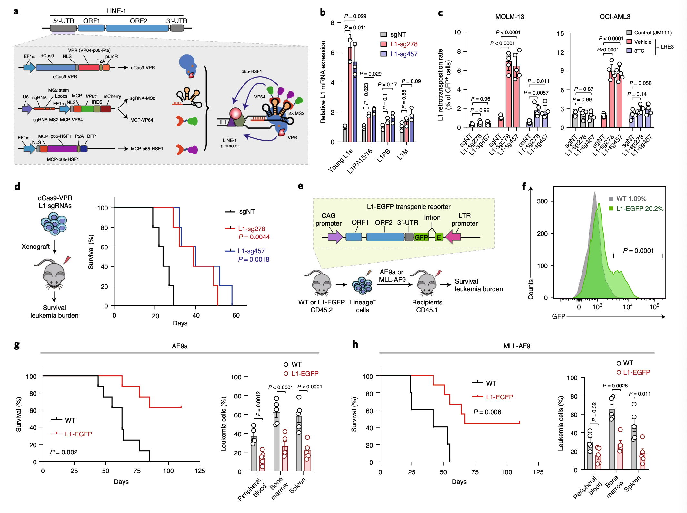

## Silencing of LINE-1 retrotransposons is a selective dependency of myeloid leukemia

### Abstract

转座因子或转座子是遗传变异性和基因组进化的主要参与者。长期散布的元件-1（LINE-1或L1）逆转录转座子的异常激活在人类癌症中很常见，但其肿瘤-类型-特定功能的表征却很差。我们将MPHOSPH8 / MPP8（人类沉默枢纽（HUSH）复合体的组成部分）确定为急性髓细胞性白血病（AML）-通过表观遗传调控子的选择性依赖性-聚焦CRISPR筛选。尽管MPP8对于稳态造血是必不可少的，但MPP8的丧失通过重新激活L1诱导DNA损伤反应和细胞周期退出而抑制了AML的发展。内源性或异位L1s的激活模拟了MPP8丢失的表型，而阻断逆转座则废除了MPP8缺乏引起的表型。 AML致癌突变的表达促进L1抑制，而增强的L1沉默与人类AML预后不良相关。因此，尽管逆转座子因其促进癌症的功能而被普遍认可，但我们描述了髓样白血病中L1逆转座子的肿瘤抑制作用。

### Body

人类基因组中大约一半由转座因子组成，也称为转座子或“垃圾” DNA。 L1逆转座子是人类中唯一可自主移动的转座子。大约有500,000个L1拷贝占据了人类基因组的17％，但是只有大约100个全长的人特异性L1 Hs元件能够进行转位1-4。 L1编码的蛋白质ORF1p和ORF2p还动员了非自治逆转录转座子，非编码RNAs和信使RNAs（m RNAs），从而导致了人类基因组的三分之一的产生[2,4-6]。因此，L1被认为是最有害的，因为它们的活性会导致插入诱变-分裂，染色体重排和基因组不稳定，从而导致包括癌症在内的人类疾病[4,6-9]。

引起疾病的L1逆转位首先在A型血友病中得到认可，其中凝血因子VIII（F8）基因中诱变的L1插入是造成疾病的原因7。最近，全癌基因组分析显示，所有癌症样本中约有一半含有体细胞逆转位事件，导致L1相关的染色体改变，这种改变常出现在诸如食管腺癌和头颈癌，肺癌，结直肠癌等实体瘤中[10]。 ，11。然而，包括骨髓增生性肿瘤和AML在内的髓样恶性肿瘤发生L1逆转位的发生率最低10,11。逆转录转座子对肿瘤-类型-特定作用的生物学意义和潜在机制尚不清楚。表观遗传基因调控的改变是包括AML在内的人类癌症的标志，导致异常的自我更新和阻碍的谱系分化。表观遗传状态失调还会造成选择性和可针对性的漏洞。白血病细胞选择性依赖性的鉴定提供了对AML发病机制的洞察力，并启用了针对12,13个表观遗传调控物的新治疗策略。这些方法主要依赖于干扰染色质相互作用的结构域[14,15]，从而强调了在癌症病理生理学中理解蛋白质结构域的重要性。然而，缺乏对人类白血病细胞通过染色质结构域的表观遗传学依赖性的全面调查-专注于功能性询问。此外，表观遗传调控因子控制逆转录转座子在人细胞中的表达[17-21]，但在癌症病理学中它们在调控肿瘤特异性L1活性中的作用尚待进一步研究。在这里，我们将HUSH复合物的一个成分MPHOSPH8 / MPP8识别为髓系白血病的选择性依赖性。通过将遗传学研究与AML细胞，小鼠和人类中的正交方法相结合，我们建立了证据，表明HUSH / MPP8对于稳态造血是必不可少的，但通过L1逆转座子的表观遗传沉默对于AML的发展是必需的。因此，尽管反转录转座子在历史上被认为是遗传不稳定性和体细胞突变的来源，以促进癌症的发展，但我们描述了L1逆转座子的肿瘤抑制功能。

### Results

#### HUSH / MPP8是髓样白血病的依赖性

为了鉴定人类白血病细胞中必需的染色质调节剂，我们使用靶向表观遗传调节剂的定制单向导RNA（sg RNA）文库进行了CRISPR敲除筛选（图1a）。我们首先用强力霉素诱导的Cas9表达建立了白血病细胞系（扩展数据图1a），并使用绿色荧光蛋白（GFP）-靶向sg RNA证实了Cas9介导的基因破坏的功效（扩展数据图1b， C）。接下来我们设计了一个CRISPR文库，其中包含3248 sg RNAs，靶向266个保守的染色质-在266个带注释的表观遗传调节剂22和1800 个sg RNAs靶向311个表观遗传调节剂的5′外显子，以及阳性和阴性对照sg RNAs （扩展数据图1d和补充表1）。基于CRISPR的阴性选择筛选23分别在代表性的人AML和急性淋巴细胞白血病（ALL）细胞系MOLM-13和REH中进行。将重复的筛选进行关联（扩展数据，图1e），并鉴定AML和ALL细胞中特定的表观遗传调控因子（图1b，c）。

在少数几个在MOLM-13细胞中被确定为髓样白血病特异性依赖性的候选基因中，我们选择重点研究MPHOSPH8（MPP8），因为它是sg RNA耗竭排名靠前的候选基因，但不是公认的必需基因（图1b，c ）。 MPP8是HUSH复合物的一个亚基，其功能是通过异染色质形成来抑制L1逆转座子18、19、21。为了验证筛选结果，我们首先在表达GFP报道分子（sg RNA-GFP）的可诱导Cas9和MPP8-靶向sg RNA的白血病细胞中采用了负选择竞争试验（图1d，e）。 MPP8的耗竭导致明显的生长缺陷，这由7种AML细胞系中的6种表达sg RNA-GFP的细胞百分比降低所表明，而对3种淋巴白血病细胞系没有明显影响（补充图1），从而验证了MPP8为髓样leu-贫血-选择性依赖。此外，异种移植到NOD-scid IL2 Rgnull（NSG）小鼠体内后，MPP8缺陷型MOLM-13 AML细胞在白血病发展中受损，从而导致白血病负担显着降低和存活时间延长（图1f，g）。异种移植了MPP8-缺陷AML细胞的Moribund小鼠恢复了MPP8的表达，这可能是由于逃避了Cas9介导的编辑的细胞的生长所致（扩展数据图1f），这表明MPP8的丧失与AML细胞的繁殖不相容。

MPP8包含一个保守的染色体结构域（CHD），可用于与三甲基化组蛋白H3赖氨酸9（H3 K9me3）结合，从而实现染色质沉默和四个锚蛋白重复结构域（ANK1-ANK4）。使用一系列34 sg RNAs作为靶向离散MPP8域的阵列，我们观察到CHD的破坏对白血病细胞的生长表现出最深远的影响（图1h）。接下来，我们针对编码序列或3'-UTR序列，使用小发夹RNAs（sh RNAs）去除了MPP8表达（扩展数据，图1g）。 MPP8 RNA干扰模仿了MOLM-13细胞中Cas9介导的MPP8敲除的表型，导致细胞生长受损（扩展数据图1h）。重要的是，野生型（WT）而不是CHD缺陷型MPP8的重新引入挽救了MPP8缺陷型AML细胞的生长缺陷（图1i）。

#### HUSH是骨髓白血病的传播所必需的。

HUSH复合体由MPP8，TASOR和PPHLN1组成，并将H3 K9me3甲基转移酶SETDB1募集到染色质上（扩展数据图2a）19,21。 MORC2和ATFIP7也被确定为L1沉默的关键调节剂[18,20]。接下来，我们通过阴性选择竞争试验确定了其他L1调节剂是否也需要用于AML。其他HUSH亚基（TASOR和PPHLN1），SETDB1，MORC2或ATFIP7的耗竭也损害了MOLM-13细胞的生长（扩展数据图2b，c）。 TASOR或PPHLN1耗竭的MOLM-异种移植NSG小鼠的白血病发展中受损了13个细胞，从而大大减轻了肿瘤负担。与对照sg NT相比，TASOR或PPHLN1耗竭导致移植后三周的生物发光显着降低（荧光素酶表达的AML细胞发生信号），脾脏大小减小，骨髓，外周血，脾脏和肝脏中的白血病细胞减少异种移植的受体，并延长了生存期（扩展数据图2d–j）。此外，sh RNA介导的MPP8耗竭削弱了人原代AML细胞的集落形成活性和繁殖，而对正常CD34 +造血干细胞和祖细胞（HSP Cs）没有明显影响，这是通过离体连续平板接种实现的（扩展数据图3a，b） 。 HUSH / MPP8丧失导致的主要细胞表型包括诱导凋亡，G0 / G1细胞周期停滞和增强髓系分化，这是由髓系标志物CD11b和与分化髓系细胞相关的基因表达增加所表明的（扩展数据图3c– F）。总之，这些结果突显了HUSH复合体在人类AML细胞繁殖中的关键作用。

#### MPP8可用于稳定状态的造血功能，但对于白血病的发展必不可少。

通过使用成对的sg RN As进行CRISPR靶向生成了MPP8组成型和条件性敲除小鼠，该RNs位于CHD域的侧面-包含Mphosph8基因的外显子2（图2a）。通过基因分型PCR验证了MPP8无效或条件性敲除等位基因（扩展数据图4a–c）；MPP8表达的缺失通过骨髓和脾细胞的Western印迹分析得以证实（扩展数据图4d，e）。我们首先注意到，MPP8纯合-基因敲除（Mpp8-/-）小鼠的出生率较低（扩展数据图4f），表明部分胚胎致死表型。存活的Mpp8-/-小鼠正常发育，体型和体重显着降低（扩展数据图4g，h）。为了确定MPP8对造血功能的需求，我们对外周血的全血细胞计数和流式细胞仪检测了各种成熟的造血细胞类型，包括红系（Ter119 +），B-淋巴样（B220 +），T-淋巴样（CD3 +）和骨髓（Mac1 + WT或Mpp8-/-小鼠的骨髓和脾脏中的Gr1 +）细胞（扩展数据图5a–c）。我们的结果显示，成熟造血细胞的频率没有明显异常。 HSPC群体的细胞密度和频率，包括造血干细胞（HS Cs），多能祖细胞（MPP），Lin-Sca-1 + c-kit +（LSK）细胞，常见髓系祖细胞（CMP），粒细胞/在WT，Mpp8 +/-和Mpp8-/-小鼠的骨髓中，单核细胞祖细胞（GMP）和巨核/红细胞祖细胞（MEP）具有可比性（图2b和补充图2）。通过竞争性骨髓移植，Mpp8-/-HS Cs的再生能力在多谱系重构中也可与野生型WT媲美（扩展数据图5d）。我们还使用干扰素诱导型Mx1-Cre24生成了造血-选择性MPP8条件性基因敲除，并且在稳态造血过程中未观察到明显缺陷（扩展数据图5e–h）。

确定了MPP8对于造血的非必需作用后，我们接下来确定了MPP8在体内对白血病发展的需求。我们使用了两个建立良好的模拟人AML的鼠AML模型，其中包含RUNX1和ETO（AE9a）25或MLL1和AF9（MLL-AF9）基因之间的翻译。我们用GFP标记的逆转录病毒将AE9a或MLL-AF9引入WT和Mpp8-/-骨髓谱系-阴性细胞中，并注入致死剂量辐照的受体中（图2d）。用AE9a或MLL-AF9转化的WT细胞引起致命性白血病，中位生存期为98或65 d，而用AE9a或MLL-AF9转化的MPP8缺陷型细胞分别无法在78％或89％的小鼠中引起致命性白血病（图。尽管归巢效率没有差异（图5i的扩展数据），但仍与图2e，f）相同。 MPP8丢失导致外周血，骨髓和脾脏中的白血病负担显着降低（图2e，f）。这些结果强烈表明，Mpp8-/-造血细胞无法在体内使髓样白血病永存。

为了探索MPP8在已确立的白血病中的作用，我们通过干扰素诱导型Mx1-Cre产生了MPP8条件性敲除。非诱导控制（Mx1- Cre-; Mpp8lox P / lox P）或Mx1- Cre +; Mpp8lox P / lox P骨髓谱系-阴性细胞用AE9a或MLL-AF9转化，移植到同种受体中，并在确认存在白血病后，通过多聚I-多聚C（p Ip C）诱导MPP8缺失。外周血中GFP +白血病细胞的表达（图2g和扩展数据图5j）。与对照组相比，带有Mpp8基因敲除（Mx1- Cre +; Mpp8lox P / lox P）白血病细胞的小鼠具有明显的生存优势，并减轻了白血病负担（图2h，i）。在耗尽MPP8的AML细胞中，没有发现已知AE9a或MLL-AF9基因靶标的表达发生明显变化（扩展数据图5k）。此外，MLP-AF9转化的白血病细胞在施用p Ip C 2-4周后显示出有效的MPP8耗竭，但在6-8周后和垂死的小鼠中逐渐恢复了MPP8的表达，这很可能是由于选择逃脱Cre介导的切除的细胞（扩展数据图5l）。因此，尽管MPP8对于正常的造血是必不可少的，但MPP8的失活与体内髓样白血病的发生或维持是不相容的。

#### L1反转录子的表观遗传沉默需要MPP8。

为了确定潜在的机制，我们通过在MPP8 WT和敲除的MOLM-13 AML细胞中通过链特异性配对末端RNA测序（RNA-seq）检查了MPP8依赖性基因的表达。我们采用了优化的方法对L1转录本进行比对和定量，包括进化上年轻的L1s18,27。相对于WT AML细胞，MPP8基因敲除中几乎所有带注释的L1元素均上调（图3a）。进化上年轻的灵长类动物-特异的L1s（包括逆转座）-主管L1 Hs亚家族是上调程度最高的L1s（图3a）。基因集富集分析（GSEA）还揭示了MPP8敲除细胞中人L1基因标记的显着上调（图3b）。为了验证转录组学分析，我们使用了设计为选择性靶向L1 Hs，L1 PA15 / 16，L1 PB和L1 M的L1亚家族的引物，通过逆转录（RT-q PCR）进行了定量PCR。我们观察到L1 Hs m在MOLM-13和OCI-AML3细胞中MPP8丢失后，RNas显着上调，而其他L1亚家族则被适度上调（图3c）。此外，其他HUSH成分（TASOR和PPHLN1）或SETDB1的活化也使AML细胞中的年轻L1s重新活化（扩展数据图6a），这表明HUSH介导的H3 K9me3沉积既需要读取功能，又需要写入功能。表观遗传学-L1逆转座子的沉默。

为了确定MPP8是否直接调节L1，我们在MOLM-13细胞（ab1，ab2和ab3；图3d）中使用独立抗体进行了MPP8染色质免疫沉淀，然后测序（Ch IP-seq）。 MPP8 Ch IP-seq信号在包括全长L1 Hs的L1s高度富集（图3d和图6b，c的扩展数据）。在人原代AML细胞中，MPP8还富集于L1 Hs-相关的色度-锡和MPP8耗竭重新激活的年轻L1s（扩展数据图6d，e）。而且，L1编码的ORF1p的表达在MPP8缺陷的AML细胞中被上调（图3e），这说明一些重新激活的L1s包含完整的OR Fs，并且可以生成全长L1蛋白。这些结果强烈表明，MPP8是沉默L1逆转座子所必需的，其丢失会导致髓样白血病中L1 m RNA和蛋白质的阻遏。

这些发现确立了在白血病细胞中HUSH / MPP8介导的L1沉默的作用，但没有解决L1介导的逆转座是否可以被MPP8丢失激活。因此，我们将L1逆转录转导子稳定地引入了AML细胞
（图3f）。简而言之，将在CMV启动子控制下被内含子序列打断的增强型GFP（EGFP）报告基因以反义方向（LRE3-EGFP）引入全长L1的3'-UTR。在L1转录，剪接，逆转录和整合到基因组中后，逆转位和重组的EGFP被激活，提供了对L1 RNA中间产物的加工以及随后的从头转位28,29的测量。作为阴性对照，我们还建立了稳定表达逆转录转位的AML细胞-带有ORF1p29中错义突变的缺陷L1 RP / JM111报告基因。使用该测定法，我们观察到MPP8 WT MOLM-13和OCI-AML3细胞中的逆转座率分别为0.5％和2.0％，表明AML细胞中的基础L1活性较低。相比之下，耗尽MPP8的细胞的逆转座率分别提高到4.7-5.4％和8.0-8.4％（图3g和图6f的扩展数据）。 L1逆转录和随后的逆转录可以被核苷逆转录酶抑制剂3 TC（或拉米夫定）30-32有效阻滞（图3f，g和图6f的扩展数据）。通过3 TC抑制L1逆转座可以消除MPP8缺失的细胞的生长缺陷（图3h），提示髓样白血病中MPP8-缺乏-诱导的phe-notypes需要重新激活的L1逆转座。

#### AML癌基因的表达促进L1抑制。

为了评估我们在人类髓样疾病中发现的一般性，我们检查了人类原发性CD34 +骨髓增生异常综合症（MDS）和AML样本以及正常HSP C中的L1表达。令人惊讶的是，MDS和AML样品中L1的表达显着下调（图4a）。 AML以散乱的等级组织，由一群自我更新的白血病干细胞（LS Cs）维持，从而产生了更多的更成熟的白血病母细胞[33,34]。 LS Cs的存在与白血病患者的治疗后复发有关[34,35]。值得注意的是，相对于白血病母细胞，在人CD34 + CD38- LS Cs中观察到了L1s的增强抑制作用（图4b）。
并且通过有限的稀释和移植分析，在相对于LS Clow AML细胞经过功能验证的LS Chigh中（图4c）36。造血细胞移植和/或化疗后复发患者的AML样品中L1的表达也低于诊断[37,38]（图4d），表明L1的活性有助于AML中的治疗反应。重要的是，L1 Hs的表达降低与AML患者的生存率显着降低有关（图4e和图6g的扩展数据），说明了L1s在髓样白血病中的潜在“肿瘤抑制”作用。
考虑到人类骨髓恶性肿瘤的异质性，我们调查了造血干/祖细胞（例如LSK）中L1的表达，这些细胞从含有常见AML致癌性病变（包括DNMT3 AR878 H突变39，TET2敲除）的基因工程小鼠模型中分离带有NRASG12 D 40，TET2突变41或带有EZH2敲除的NRASG12D。值得注意的是，AML致癌突变的表达显着下调了L1（图4f），这增加了AML癌基因可能诱导HUSH / MPP8介导的L1抑制的可能性。与此观点一致，与其他癌症类型相比，HUSH成分和其他L1调节剂的表达在AML中排名最高（补充图3）18-21,43。

为了进行实验测试，我们在AML癌基因AE9a或MLL-AF9 ex的短期（72 h）表达后，测量了小鼠造血干/祖细胞（例如LSK和GMP）和人原代CD34 + HSP Cs中的内源性L1 m RNA表达体内或长期（2个月）在移植的受体小鼠中表达后。我们注意到，短期AE9a或MLL-AF9表达导致L1s下调38.5–64.7％，而长期癌基因表达进一步将L1s下调92.6–94.3％（相对于LSK；图4g）。 AE9a或MLL-AF9表达也下调了人类CD34 + HSP Cs中的L1表达（图4g）。总之，这些结果支持了一个模型，在该模型中，致癌基因诱导的AML起始细胞的转化和繁殖需要L1逆转座子沉默。

#### 重新激活L1逆转位会损害髓样白血病

MPP8丢失对L1表达和逆转座的主要作用表明，MPP8缺乏的功能性后果可能是由白细胞中L1的重新激活介导的。我们通过使用CRISPR介导的L1启动子的表观遗传学调控激活内源性L1s进行了测试。由于高拷贝数和反转录转座子的变异，调节内源性L1表达一直具有挑战性。为此，我们首先设计了一种改进的基于CRISPR的激活（CRISP Ra）系统，方法是将d Cas9-VPR（VP64-p65-Rta）融合蛋白tein44和sg RNA设计与MS2发夹相结合，这是公认的MCP RNA结合结构域与共激活因子（VP64和p65-HSF1）45融合（图5a）。接下来，我们分别对Ls Hs共有启动子序列进行了十个sg RNs阵列的检测，确定了两个有效激活内源性L1 m RNA和蛋白质的三重sg RNA组合（L1- sg278和L1- sg457）。 （扩展数据图7a-d）。重要的是，在AML细胞中，CRISP Ra显着上调了进化上的年轻L1s的表达，而不是较老的L1亚家族的表达（图5b）。使用这个新系统，我们观察到内源性L1s的活化导致体外和异种移植中L1逆转录的增加和白血病细胞生长的损害，而通过3 TC抑制L1逆转录的作用消除了这些表型（图5c，d和扩展数据图7e）。 - H）。

为了确定L1激活对体内白血病发展的影响，我们采用了包含由组成型CAG启动子驱动的全长L1和EGFP报告基因驱动的全长L1串联复制的转基因小鼠模型（L1-EGFP小鼠；图5e ）46,47。值得注意的是，来自L1-EGFP小鼠的L1激活谱系-阴性细胞未能在一部分受体小鼠中引起AE9a或MLL-AF9-诱导的白血病-mia，从而延长了存活时间并降低了外周血中的白血病负担，降低了骨骼损伤和脾脏（图5f–h）。综上所述，这些结果表明-造血细胞中L1的活化与MPP8的丧失相似，对骨髓性白血病的发展产生了负面影响，这表明重新活化的L1逆转座子是MPP8-缺乏症诱导的表型的基础。

#### L1抑制可保护髓系白血病的基因组稳定性-MIA

上述发现突出了在AML发病机理中涉及癌基因诱导的和HUSH介导的L1抑制的调节途径。有待解决的是MPP8缺失或L1重新激活如何干扰AML癌基因的致白血病活性。 AML致癌驱动程序的一个标志性特征是其抑制骨髓分化和促进造血前体细胞恶性自我更新的能力。癌症干细胞的自我更新需要维持基因组稳定性。由于DNA损伤应答蛋白（例如ATM，ATR和BRCA1）（参考文献48）或表观遗传调控因子（例如MLL4和LSD1）失活而导致的DNA损伤而导致的基因组完整性丧失48-52促进了AML的分化-起始细胞。 L1逆转座是造成基因组不稳定的主要来源，它会产生双链DNA断裂53,54，从而激活组蛋白H2 AX（γH2 AX）和细胞周期蛋白依赖性激酶抑制剂p21（CDKN1 A）的磷酸化，从而调节G1– S检查点，应对DNA损伤。为此，我们检查了AML细胞中γH2 A.X-标记的基因组基因座和p21表达的形成。与阴性对照（sg NT）相比，MPP8耗竭或L1激活显着增加了MOLM-13和OCI-AML3细胞中的γH2 AX灶，这被3 TC介导的L1逆转抑制所废除（图6a– d）。同样，MPP8耗竭或L1激活会上调p21，而3 TC介导的逆转座抑制会减弱L1诱导的DNA损伤（图6e，f）。体内具有MPP8缺失或L1活化的MLL-AF9转化的白血病细胞中，γH2 A.X和p21也显着增加（图6g，h），表明L1活性诱导了AML中的DNA损伤。髓样白血病细胞对DNA敏感-损伤-诱导的细胞周期退出，分化和生长抑制48-52，这可能解释了MPP8-缺陷-诱导的表型。我们认为，阻断DNA损伤检查点途径，例如使细胞周期抑制剂p21失活，可能会抵消AML中L1逆转座诱导的表型。为了测试这一点，我们使用具有或不具有p21基因敲除的MPP8缺陷或L1激活的MOLM-13或OCI-AML3细胞进行了阴性选择竞争试验（扩展数据图8a，b）。虽然单独敲除p21对白血病细胞的生长没有明显影响，但将MPP8耗竭（或L1激活）与p21敲除相结合可在体外和异种移植中挽救细胞生长缺陷（Extended Data图8c，d），从而增加白血病负担和缩短的生存期（扩展数据图9a-f）。接下来，我们分别生成了p21和MPP8组成型或条件性（由Mx1-Cre）双敲除小鼠（扩展数据图9g，h）。虽然单独的MPP8敲除会削弱AE9a诱导的AML的发生和维持（图2d–i），而单独的p21敲除则没有作用48，但联合p21和MPP8的敲除可以恢复AE9a诱导的体内白血病发展（图6i）。 ，j）。在MLL-AF9模型中观察到了相似的结果（扩展数据图9g–j），说明了髓样白血病的L1诱导表型需要DNA损伤途径和通过p21退出细胞周期。

鉴于p21是将DNA损伤与细胞周期停滞联系起来的p53活性的既定目标，我们确定了p53是否也是L1诱导表型所必需的。像p21一样，通过MPP8敲除或CRISP Ra进行的L1激活显着增加了p53的表达，这在MOLM-13和OCI-AML3细胞中被3 TC废除了（扩展数据图10a，b）。接下来，我们生成了p53单敲除和p53 / MPP8联合敲除的人AML细胞。虽然单独使用MPP8敲除会损害AML细胞的生长，而单独使用p53敲除并没有明显的作用，但将MPP8和p53敲除结合起来可以很大程度上挽救MPP8缺陷引起的细胞生长缺陷（扩展数据图10c，d）。同样，我们生成了带有或不带有CRISP Ra介导的L1激活的p53敲除AML细胞，并观察到p53敲除消除了L1激活诱导的AML生长缺陷（扩展数据图10e）。最后，我们使用MPP8组成型或条件性（通过Mx1-Cre）基因敲除小鼠模型确定了p53耗竭的体内作用。虽然单独敲除MPP8会损害AE9a或MLL-AF9诱导的AML的发生和维持（图2d–i），但p53的耗竭在很大程度上恢复了MPP8缺陷细胞白血病的发展，从而显着缩短了生存期并增加了白血病负担移植的接受者的数量（扩展数据图10f-1）。

综上所述，这些研究表明，HUSH介导的L1逆转座子的抑制功能可维持基因组的稳定性，以增强AML癌基因诱导的分化阻滞和异常的自我更新，从而在体内建立逆转录转座子的“肿瘤抑制”功能。骨髓性白血病（图6k）。

### Discussion

历来，人们对逆转座子在人类癌症中的作用并未给予足够的重视。通过人类染色质调节剂的CRISPR筛选，我们发现甲基H3 K9结合蛋白MPP8（HUSH复合物的一个组成部分）是AML细胞生存所必需的。 HUSH介导了L1逆转座子的表观遗传沉默18,19，但其在人类癌症中的作用却难以捉摸。我们观察到，在体外，异种移植和体内，MPP8的失活会损害AML细胞的增殖，从而将MPP8确立为髓系白血病-mia中新近认可的表观遗传学依赖性。虽然对于稳态造血不可或缺，但MPP8丢失可通过重新激活L1逆转座来抑制AML的发展。这些结果支持了一个模型，其中HUSH / MPP8对L1逆转座子的表观遗传沉默对于髓样白血病的传播至关重要。由于高拷贝数和可变性，调节L1表达和评估L1 ret-rotransposition1-3的功能影响具有挑战性。在这项研究中，我们采用正交试验来干扰L1的表达和/或活性，包括逆转录转运记者检测，CRISP Ra介导的L1活化，转基因L1-EGFP记者小鼠和L1逆转的药理抑制作用，两者都是损失-逆转录转座子在白血病生物学中的作用及其功能研究。我们发现内源性或异位L1s的激活损害了AML的传播，而阻断L1逆转座则废除了了L1-重新激活-诱导的表型。重要的是，L1激活诱导的细胞作用需要p53和p21介导的DNA损伤反应，这说明反转录转座子抑制在安全保护基因组完整性以实施癌基因诱导的分化阻断中起着关键作用。重要的是要注意，L1逆转座也可能对其他DNA损伤修复途径产生选择性依赖性，例如Fanconi贫血蛋白或p53缺陷肿瘤细胞中的DNA复制机制56。尽管我们在癌症基因组图谱（TCGA）队列中未观察到p53 WT和突变AML样品之间L1 Hs表达的显着差异，但p53在其他细胞环境中也可能调节L1表达和/或活性57,58。这些发现为基因组转座因子如何功能性调节DNA损伤途径以控制基因组稳定性和癌基因诱导的分化阻滞提供了新的见解。通过将遗传学研究与正交方法相结合以调节AML模型中的L1活性，我们的工作确定了L1逆转座，DNA损伤与致癌基因诱导的白细胞生成所需要的分化阻断之间的分子联系。这些发现不仅为增强对髓样恶性肿瘤中反转录转座子活性的抑制奠定了分子基础[10,11]，而且为髓样白血病细胞对DNA-损伤-诱导分化的异常敏感性提供了机理解释[48-52]。此外，L1 m RNA的转录和/或逆转录可能通过胞质DNA和/或双链RNA感应途径诱导I型干扰素应答，从而导致干扰素-α/β介导的活化。炎症59-62。活化的干扰素信号传导促进髓性白血球细胞的循环和分化，并已被治疗性地利用[63,64]。因此，L1激活可能调节免疫应答和/或免疫监视是合理的，而逆转录转座子活性的抑制对于白血病-髓系恶性肿瘤的衰老和/或克隆进化过程中的起始细胞可能是有利的59、65、66。 L1逆转座子的这一功能可能会提供新的前哨生物标志物或治疗靶标，尤其是在高风险，耐治疗性髓样白血病中。由于正常造血和HS C受MPP8损失的影响最小，因此可利用调节L1逆转座来使白血病引发细胞对标准遗传毒性治疗的有效性敏感。此外，单独或与其他药物（包括化学疗法和免疫调节剂）联合使用L1逆转座子的新策略可能会增强抗白血病的活性。进一步开发用于抑制HUSH和/或L1调节的特异性试剂的进一步工作将为未来的翻译应用铺平道路。因此，尽管L1s通常被其作为促进体细胞突变的重要来源的癌变促进作用所识别，但我们描述了逆转录转座子在髓样白血病中的致癌基因诱导的分化阻滞作用中的肿瘤抑制功能，其干预可能会导致抗白血病治疗的改善

### 附图

