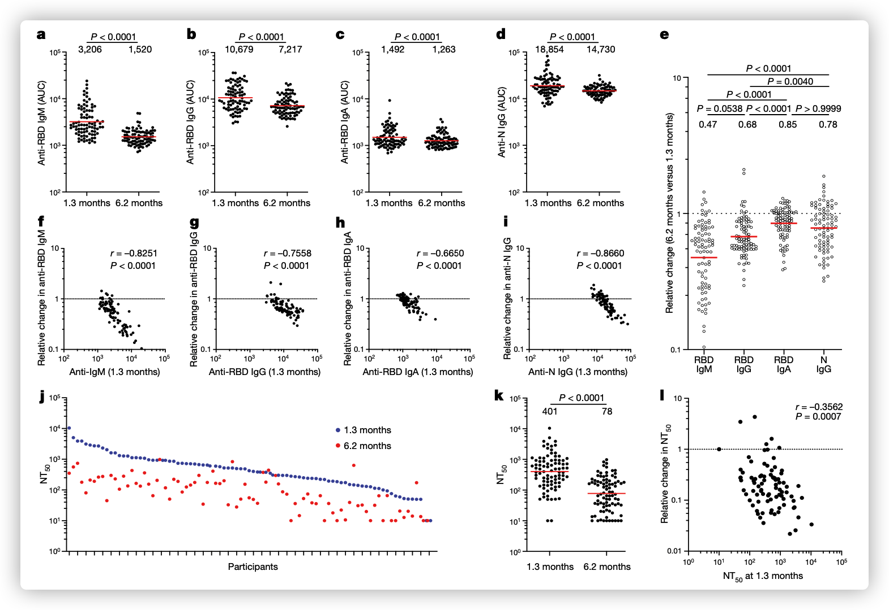
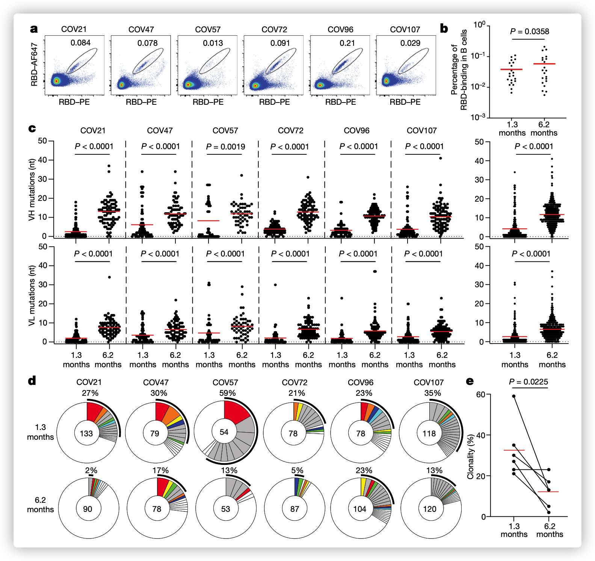
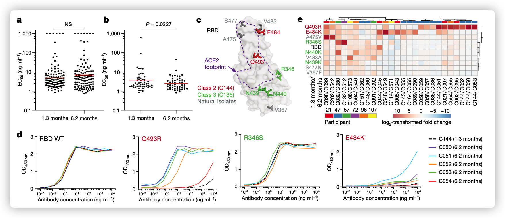
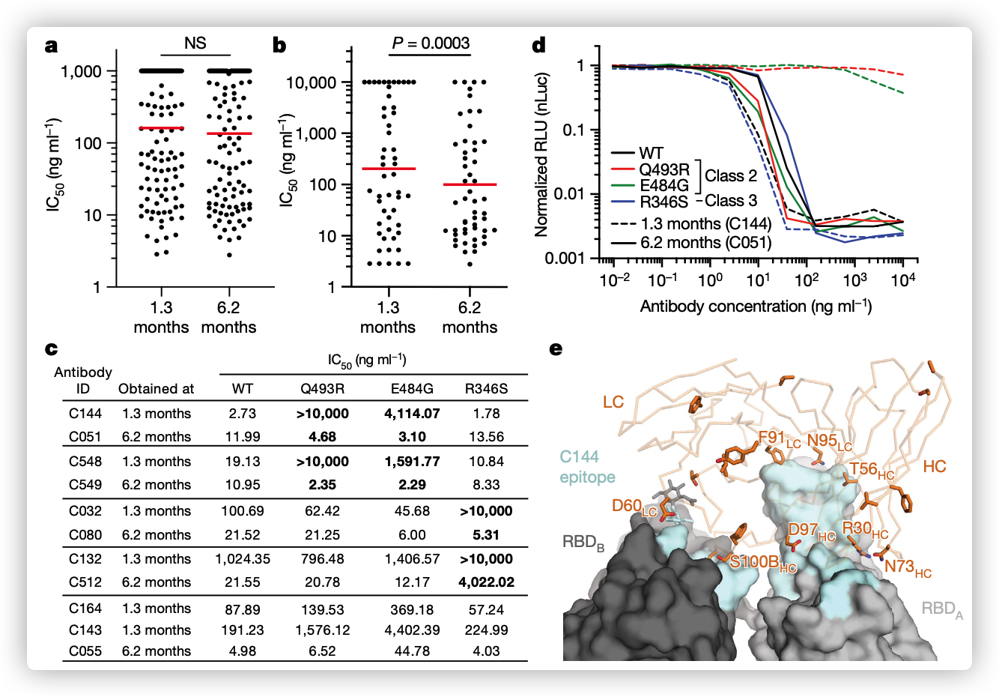
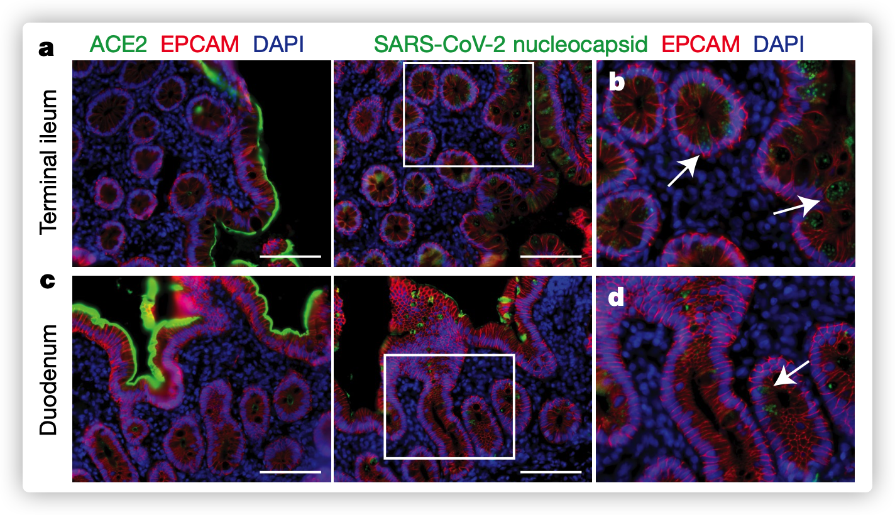

## Evolution of antibody immunity to SARS-CoV-2

SARS-CoV-2抗体免疫的进化

RBD受体结合域

### Abstract

严重急性呼吸系统综合症冠状病毒2（SARS-CoV-2）感染了7800万人，迄今为止造成超过170万人死亡。感染与具有中和活性的可变水平抗体的发展有关，可以预防动物模型中的感染1,2。抗体水平随时间降低，但是据我们所知，在重新感染后产生抗体所需的记忆B细胞的性质和质量尚未得到检验。在这里，我们报告了在感染SARS-CoV-2后1.3和6.2个月评估的87个队列中的体液记忆反应。我们发现针对受体结合域（RBD）的IgM和IgG抗体的效价在此期间，SARS-CoV-2峰值蛋白的表达显着下降，而IgA受的影响较小。同时，在假型病毒测定中血浆中的中和活性降低了五倍。相比之下，在感染后6.2个月，RBD特异性记忆B细胞的数量保持不变。记忆B细胞在6.2个月后显示出克隆更新，它们表达的抗体具有更大的体细胞超突变，对RBD突变的抵抗力和增强的效力，这表明体液反应的持续发展。冠状病毒病2019（COVID-19）发作后4个月从无症状个体获得的肠道活检的免疫荧光和PCR分析显示，SARS-CoV-2核酸的持久性和小肠中7个人的小肠中的免疫反应性。我们得出结论，感染后在1.3到6.2个月之间，对SARS-CoV-2的记忆B细胞反应以与抗原持久性一致的方式演变。

### Body

最初在感染后约40天（1.3个月）从COVID-19康复的个体队列中表征了对SARS-CoV-2的抗体应答1。在2020年8月31日至10月16日之间，有100名参与者返回进行了为期6个月的随访研究访问。尽管最初的标准允许通过逆转录PCR（RT-PCR）1确认患有SARS-CoV-2感染的个体的密切接触者，但其中13例接触者并未进行血清转换，因此不再进行进一步分析。其余87名接受RT–PCR的参与者-确认为SARS-CoV-2感染和/或血清转化，在症状发作后约191天（6.2个月；165至223天）返回分析。在该队列中，症状在急性期持续了中位数12天（0到44天），并且有10名参与者（11％）住院了。与其他报告，38（44％）的参与者报告，长期持续症状可归因于COVID-19（方法，补充表1、2）。在第二次研究访视中出现持续性急性后症状的参与者中，急性疾病期间症状的持续时间和严重性明显更高（ExtendedDataFig。1m–q）。重要的是，所有87名参与者在6个月的随访研究访问中均使用了基于唾液的PCR分析（方法）测试为SARS-CoV-2阴性。参加者的人口统计学和临床特征见补充表1、2。

#### 血浆SARS-Co V-2抗体反应性

通过酶联免疫吸附测定（ELISA）和自动血清学测定法测定血浆中SARS-Co V-2的RBD和核蛋白（N）的抗体反应性1,5,6。抗RBD检测呈高度相关性（在1.3个月时抗RBD Ig G ELISA和Pylon–Ig G，抗RBD Ig M ELISA和Pylon–Ig M，分别为r = 0.9200和r = 0.7543，P <0.0001）（扩展数据图2a-d）和抗N检测显示中等程度的相关性（抗N Ig G ELISA和罗氏抗N总免疫球蛋白在1.3个月时，r = 0.3596，P = 0.0012）（扩展数据图2e） ， F）。血浆中的抗RBD和ELISA抗N抗体在1.3到6.2个月之间显着下降（图1a–d）。值得注意的是，降低的结合活性因同种型和靶标而有实质性差异。 Ig M的抗RBD反应性下降最大（53％），其次是Ig G（32％）。抗RBD Ig A仅降低15％，抗N Ig G水平降低22％（图1e）。相比之下，罗氏（Roche）抗-N分析6在两个时间点之间显示出微小但显着的反应性提高（19％）（Extended Data Fig。2g），这可以通过使用抗原桥接方法来解释。在所有情况下，降低的幅度与初始抗体水平成反比，并与之直接相关，因此，具有较高初始水平的个体显示出较大的相对变化（图1f–i，扩展数据图2h）。在两个时间点之间，所有测量值均具有很强的相关性（扩展数据图2i–m），在1.3个月时抗N Ig G与各自的Ig M，Ig G和Ig A的抗RBD反应性相关（扩展数据图2n–m）。 p）。值得注意的是，具有持续性急性后症状的个体在两次研究访问中均具有较高的抗RBD Ig G和抗N总抗体水平（扩展数据图1a-1）。

我们使用HIV-1病毒pseu-用SARS-Co V-2穗突蛋白进行复型，测量了血浆中和活性。1,8。与其他报告9,10一致，这组87名参与者的几何平均半数–最大中和效价（NT50）在1.3和6.2个月分别为401和78，代表下降了五倍（图1j，k）。中和活性与Ig G抗RBD ELISA测量值直接相关（扩展数据图2q，r）。此外，中和活性降低的绝对幅度与较早时间点的中和活性成反比，并与之直接相关（图1l）。我们得出的结论是，在大多数个体中，SARS-Co V-2感染后6个月，针对RBD和血浆中和活性的抗体显着降低，但仍可检测到。

为了检查循环中B细胞的表型情况，我们在两个时间点对41个随机选择的个体进行了高维流式细胞术，并将结果与19个健康个体的COVID前样本（n = 20）进行了比较。具有t分布随机邻居嵌入的全局高维映射显示，从COVID-19中恢复的个体存在显着的持续性变化（扩展数据，图3a）。簇的相对表达量-2、7、8和10（分别对应于天真，记忆，成浆细胞和浆细胞）在1.3个月时降低，并在以后的时间点保持不变。 Metacluster 15（对应于来自骨髓的新近未成熟B细胞）在早期时间点有所增加，但在观察期结束时恢复到对照水平（扩展数据图3b-d）。

#### SARS-Co V-2记忆B细胞库

浆细胞是循环抗体的来源，而记忆B细胞则有助于召回反应。为了鉴定和枚举循环中的SARS-Co V-2-特异性记忆B细胞区室，我们使用流式细胞术分离了具有结合到RBD1的受体的单个B淋巴细胞（图2a，扩展数据图4）。值得注意的是，在21个随机选择的个体中，RBD结合记忆B细胞的百分比在1.3到6.2个月之间略有增加（图2b）。

为了确定6.2个月后记忆B细胞产生的抗体是否发生变化，我们从在较早的时间点1进行检查的同一6个人中获得了532条配对的抗体重链和轻链（补充表3）。在两个时间点，IGV基因的表达没有显着差异，包括IGHV3-30和IGHV3-53基因片段的过度表达1,11–16（扩展数据图5a，b）。与该观察结果一致（并且与早期时间点类似），共享相同IGHV和IGLV基因的抗体占不同个体所有序列的8.6％（扩展数据图5c）。可以预料的是，表达Ig G的抗RBD记忆细胞的百分比总体上有小幅但显着的增加，从49％增至58％（P = 0.011）（扩展数据图5d-f）。与Ig G记忆细胞的分数增加相一致，两个时间点之间所有六个个体中IGH和IGL的体细胞超突变程度都显着不同。在第一个时间点，IGH和IGL的平均核苷酸突变数分别仅为4.2和2.8，而在第二个时间点，这些值分别增加至11.7和6.5（P <0.0001）（图2c） ，扩展数据图6a-f）。相比之下，IGH和IGL的总体平均长度和互补决定区3（CDR3）的疏水性没有变化（扩展数据图6g，h）。

与早期的时间点类似，我们在6.2个月时发现了记忆B细胞的扩展克隆（包括在两个时间点均出现的23个克隆）。但是，扩增的克隆在6.2个月后仅占所有抗体序列的12.4％，而在1.3个月后仅为32％（P = 0.0225）（图2d，e）。此外，在我们检查的所有个体的两个时间点，记忆区室的总体克隆组成都不同（图2d）。在6.2个月后无法检测到出现在早期时间点的43个扩展克隆，出现了22个新的扩展克隆。另外，在两个时间点出现的克隆的相对分布也不同。例如，指定为COV21和COV57的个体中的优势克隆（在1.3个月后它们分别代表所有序列的9.0％和16.7％）在之后分别降低为所有序列的1.1％和1.9％ 6.2个月（图2d，补充-基本表3）。我们得出的结论是，尽管在感染SARS-Co V-2后1.3个月至6.2个月之间，RBD特异性记忆B细胞区隔的大小得以保留，但克隆的广泛更新和抗体序列的进化与生发中心反应延长相一致。

#### SARS-Co V-2单克隆抗体

我们在6.2个月的时间点测试了122种代表性抗体与RBD的反应性（补充表4）。我们评估的抗体包括：（1）从仅出现一次的那些抗体中随机选择的49种抗体； （2）23个抗体在1.3和6.2个月时均单发出现； （3）23个新出现的扩展克隆的代表； （4）在两个时间点都出现了27个扩展克隆的代表。在122种与RBD结合的抗体中，有一百零五岁是青少年，这表明流式细胞仪可以有效地鉴定出产生抗RBD抗体的B细胞（图3a，补充表4、5）。将所有抗体合在一起，在两个时间点ELISA的平均半数最大有效浓度（EC50）没有显着差异（图3a，补充表4）。然而，比较两个时间点都存在的抗体，发现6.2个月后EC50有了显着改善（P = 0.0227）（图3b，图7a的扩展数据）。

为了确定记忆B细胞在较晚时间点表达的抗体是否也显示出改变的广度，我们在使用对照和突变RB Ds的结合测定中将它们与较早的克隆亲戚进行了比较。选择替代品E484 K和Q493 R17来抵抗与RBD1,18–20和R346 S，N439 K和选择N440 K来抵抗不直接干扰ACE2结合的第3类抗体（例如C135）[1,17–20]（图3c）。此外，我们还测试了RBD的V367 F，A475 V，S477 N和V483 A突变体，它们代表了对1类和2类抗体具有完全或部分抗性的循环变异体17,18,21（图。 3c）。在两个时间点出现的52个抗体克隆对中，有43个（83％）在6.2个月的时间点显示出与突变RB Ds的结合整体增加（扩展数据图7b-k，补充表5）。例如，C144（在1.3个月的时间点恢复的抗体）无法与RBD（Q493 R）或RBD（E484 K）结合，但是在6.2个月收集的所有五种克隆衍生物均与RBD（Q493 R）结合。 ），并且还显示了与RBD（E484 K）的结合（图3d）。总的来说，结合的最明显增加发生在氨基酸位置的影响RBD的突变上，例如E484，Q493，N439，N440和R346，这对于2类和3类抗体的结合至关重要17,18（图3e ，扩展数据图7b-k，补充表5）。

接下来，我们在假型SARS-Co V-2中和试验中1,8（图4a，补充表6）测试了从6.2个月的时间点开始的所有122种抗体的活性。与RBD结合测定一致，当比较所有抗体时，两个时间点的平均中和半数最大抑制浓度（IC50）值无显着差异（图4a）。但是，比较两个时间点都存在的抗体，发现6.2个月时的IC50值有了显着提高（P = 0.0003）（图4b，扩展数据图8a）。**However, comparison of the antibodies that were present at both time points revealed a significant improvement of the IC50 values at 6.2 months (*P* = 0.0003) (Fig. 4b, Extended Data Fig. 8a).**

为了确定表现出改变的RBD结合的抗体是否也显示出增加的中和广度，我们测试了在两个时间点回收的五种代表性抗体对，分别针对以E484 G，Q493 R和R346 S突变体刺突蛋白假型化的HIV-1病毒（图4c，补充表6）。值得注意的是，Q493 R和E484 G假型病毒对C144的中和具有抗性。相反，C051（C144的6.2个月克隆衍生物）中和了两个变异体，IC50值分别为4.7和3.1 ng ml-1（图4c，d）。同样，R346 S假型病毒对C032有抗性，但C080（C032的6.2个月克隆衍生物）中和了该变体，IC50为5.3 ng ml-1（图4c，扩展数据图8b-f）。与观察到的结合和中和活性的变化一致，几种较晚出现的抗体（例如，C051）已在RBD结合对位上或附近获得了突变（图4e，扩展数据图8g-j）。我们得出的结论是，在观察期内进化的记忆B细胞表达的抗体具有更高的中和力和广度。

#### SARS-Co V-2抗原持久性

抗体的进化是通过在生发中心进行体细胞突变和选择而发生的，其中抗原可以以免疫复合物的形式保留在滤泡树突状细胞表面上很长一段时间。组织中的残留蛋白质代表了另一种潜在的抗原来源。 SARS-Co V-2在肺，鼻咽和小肠中表达ACE2的细胞中复制22-25，即使从鼻咽x26-28中清除病毒后，粪便样品中也检测到病毒RNA。为了确定临床疾病消退后子宫内是否存在抗原持久性，我们在首次COVID后平均4个月（2.8至5.7个月）从14个人的上消化道和下消化道获得了活检样本- 19诊断（补充表7）。进行免疫染色以确定在上消化道和下消化道-胃肠道中是否也可检测到病毒蛋白，并以大流行之前（n = 10）的个体的活检标本作为对照。 ACE2和SARS-Co V-2 N蛋白在14个人中的5个人的肠肠上皮细胞中检测到（图5a-d，扩展数据图9a-h，10a，b，补充表7），但在对照样品中未检测到（扩展）数据图9i-1）。当被检测到时，免疫染色是偶发性的，斑片状的，只存在于肠上皮细胞中，与炎症浸润无关（Extended Data图9a–h，10a，b）。活检时，所有14例患者的临床批准的鼻咽拭子PCR检测均为阴性。但是，来自14名参与者中3名的活检样本产生了PCR扩增子，这些扩增子被序列化-验证为SARS-Co V-2（方法，补充表7）。另外，通过原位杂交在来自被测试的两个参与者的活检样品中检测了病毒RNA（扩展数据图10c，d），但是在对照样品中未检测到（扩展数据图10e）。内窥镜检查过程中的样品变异性可能是由于病毒RNA的检测与蛋白质检测之间的不完全一致。

感染后大多数个体会产生抗SARS-Co V-2的中和抗体，但会随着时间的推移而衰减7,9,10,29–32。这些抗体可有效预防和治疗动物模型，并可能在保护人类免受再感染方面发挥作用2。尽管在1.3到6.2个月之间血浆中和活性显着下降，但是在大多数个体中als9,10,29-36的抗体滴度仍然可以测量。在恢复期早期从个体获得的中和性单克隆抗体显示出较低的体细胞突变水平，先前的一些报道归因于生发中心形成的缺陷11、12、14、37-40。我们的数据表明，抗SARS-Co V-2记忆B细胞反应在感染后的前六个月内发生，伴随着免疫球蛋白体细胞突变的积累，以及产生具有更高中和广度和效力的抗体。持久的抗体进化发生在生发中心，需要B细胞暴露于以卵泡树突状细胞的免疫复合物形式捕获的抗原41。这种形式的抗原可以长寿，因为卵泡树突状细胞不会使免疫复合物内在化。另外，即使少量的持久性病毒抗原也可以促进抗体的进化。感染后几个月，SARS-Co V-2 m RNA和蛋白质在某些个体的小肠上皮中仍可检测到的观察结果与抗RBD Ig A抗体的相对持久性和持续的抗体进化相一致34-36。记忆反应负责防止再次感染，对于有效疫苗接种至关重要。记忆B细胞反应在6.2个月后不会衰减34,35,42而是继续进化的观察结果强烈暗示感染SARS-Co V-2的个体可以对细菌迅速产生有效的反应。病毒一旦重新暴露。