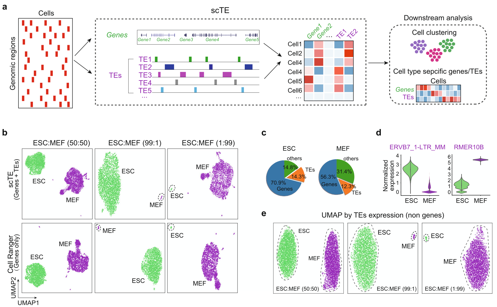
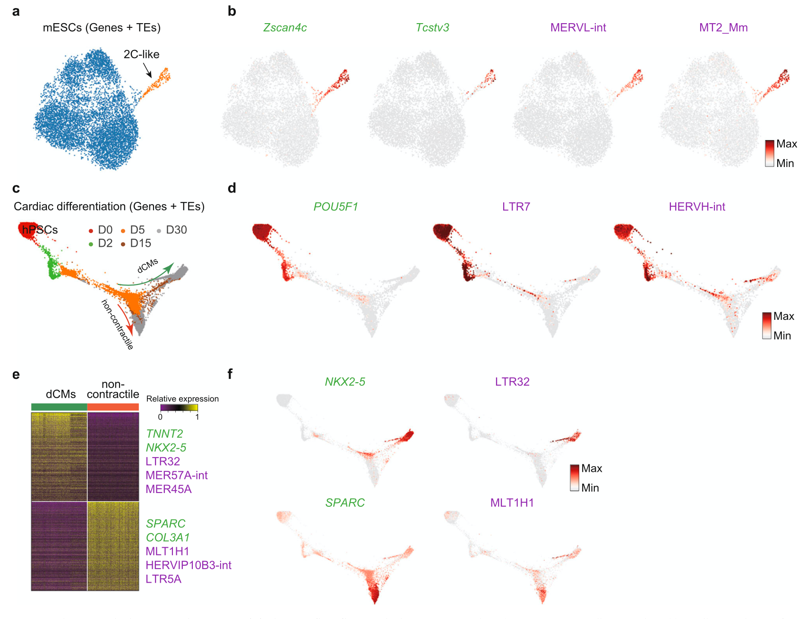
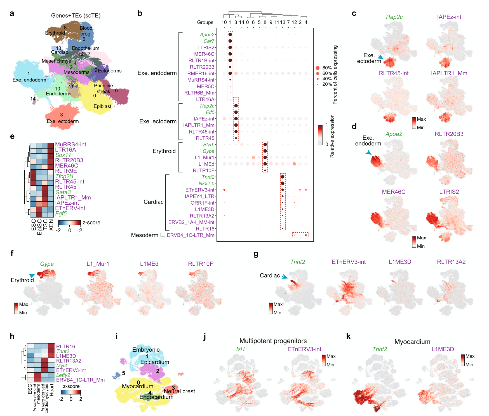
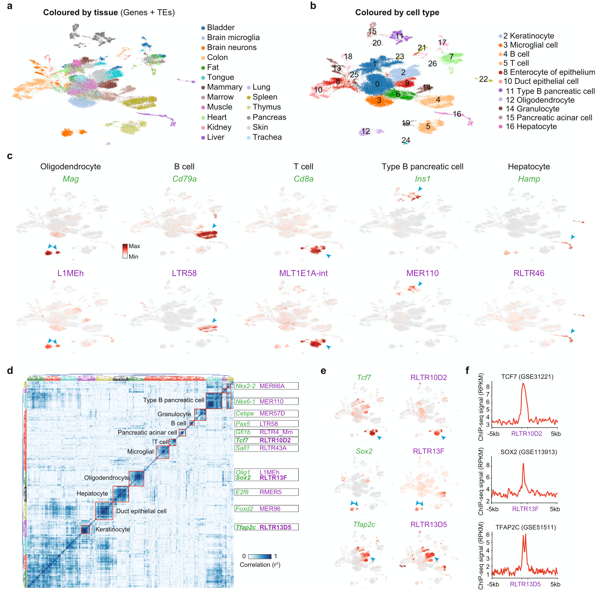
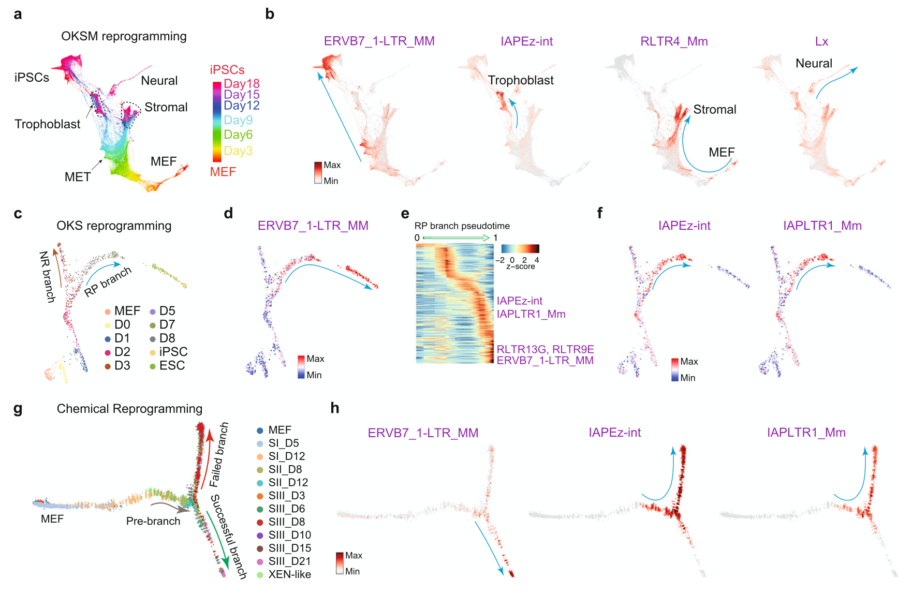
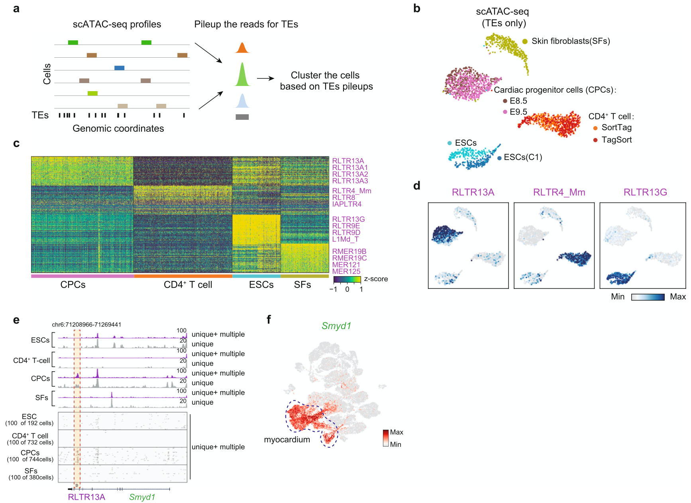

## scTE识别转座因子动态表达

转座因子（TEs）构成了典型真核生物基因组的大部分，并以不清楚的方式促进了细胞异质性。单细胞测序技术是探索细胞的强大工具，但是分析通常以基因为中心，而TE表达尚未得到解决。在这里，我们开发了单细胞TE处理管道sc TE，并报告了在一系列生物学环境中T E在单细胞中的表达。特定的TE类型在胚胎干细胞亚群中表达，并在多能性重编程，分化和胚胎发生过程中受到动态调节。出乎意料的是，TEs在包括人类疾病在内的体细胞中表达-在批量分析中无法检测到的特异Tes。最后，我们将sc TE应用于单细胞ATAC seq数据，并证明sc TE可以单独使用TEs的染色质来区分细胞类型。总体而言，我们的结果将TEs在单个细胞中的动态模式及其对细胞异质性的贡献进行了分类。

## Abstract

转座因子（TEs）是基因组元件的异质集合，其在真核生物基因组中的各个阶段均已侵入并广泛复制。 TE的绝大部分是化石，不能再复制-自我，但它们仍保留在基因组内，在哺乳动物中占近总DNA1的一半。有趣的是，越来越明显的是，活跃和残留的TE都参与进化创新和生物过程2-6，例如胚胎发育7-10，以及人类疾病和癌症11,12。此外，TEs带有顺式调控序列，它们的复制和插入可以通过重新分布转录因子（TF）结合位点和发展新的增强子活性来重塑基因调控网络-13-15。 TEs的转录也对哺乳动物基因组的转录输出有关键影响16。然而，T E在细胞类型异质性和生物过程中的作用只是最近才开始深入研究。

单细胞RNA-seq（scRNA-seq）已发展成为观察细胞活性的强大工具17-19。已经开发了许多新技术来恢复或重建缺失的观测值，例如空间，时间和细胞谱系信息。然而，到目前为止，基因组信息的重要来源已被超越-在单细胞研究中已被发现：TEs的作用。尽管它们很重要，但我们对这些基因组元件如何参与单个细胞水平的细胞命运调控缺乏定量的了解。由于TEs的简并性和多个基因组拷贝，在定量方面提出了独特的挑战，因此在单个细胞水平理解TEs的先决条件是对基因组中数百至数百万个重复元素进行定量的工具。为此，我们开发了scTE，该算法可量化单细胞序列数据中的TE表达。

在这项研究中，我们首先通过对小鼠胚胎干细胞（mESCs）的分析来证明sc TE的功能，这是TE表达的最佳特征模型之一，因为内源性逆转录病毒（ERV）MERVL的表达很小全能的胚胎干细胞（ESC）培养中的细胞数量20、21。 sc TE可以准确地恢复预期的异构MERVL表达模式。然后，我们将我们的方法应用于几种生物系统，包括人类体外心脏分化，小鼠胃造血，成年小鼠体细胞，诱导的多能重编程过程和人类疾病数据。总体而言，我们深入了解了哺乳动物发育和人类疾病中复杂的TE表达模式。

### Result

##### Quantification of TE expression in single cells with scTE.用scTE定量单细胞中的TE表达。

TEs的分析面临着特殊的挑战，因为它们存在于基因组中数百至数百万个拷贝中。常规分析中的常见策略是丢弃多个映射的读段，但是，这会导致TEs信息丢失。将这些读段分配到最佳对齐位置是解析TE（派生的读段）的最简单方法，但对于单个副本而言，并非总是正确的[22,23]。为解决此问题，我们设计了一种算法，其中根据TE类型-特定序列将TE读段分配给TE metagenes。读图-映射到基因组中的任何TE副本都折叠为代表该TE类的单个TE亚型。优点是将多映射读取分配中的错误减至最少，缺点是TE基因组位置丢失。我们使用这种策略构建了一个框架-名为sc TE的工作，sc TE将读取映射到基因/ TE，执行条形码解复用，质量过滤，并生成每个细胞和基因/ TE的读取计数矩阵（图1a和补充资料）图1a）。 sc TE易于使用，其输出旨在轻松集成到下游分析管道中，包括但不限于Seurat和SCANPY24,25。该算法原则上可以应用于从任何类型的基于单细胞测序的数据（例如，单细胞ATAC序列数据，DNA甲基化和其他单细胞表观遗传数据）中推断TE活性。为了评估sc TE用于非TE基因表达的准确性，我们比较了标准Cell Ranger26管道和STA Rsolo27管道的基因表达。 sc TE仅导致基因表达计数的微小变化和高度相关性（Pearson> 0.95），类似于STA Rsolo和Cell Ranger之间的差异（补充图1b）。然后，我们通过计算机混合两种比率不同的细胞系ME Fs（小鼠胚胎成纤维细胞）和ES Cs来测试sc TE的能力28。与基于基因的Cell Ranger管线26进行比较，sc TE在UMAP（统一歧管逼近和投影）图中以及标记基因的表达中显示出几乎相同的拓扑（图1b和补充图1c）。即使当一种细胞类型仅占混合物中1％的少数比例时，sc TE仍能正确识别它（图1b），这表明sc TE不会影响基因表达的整体分析。这些结果证明了sc TE的敏感性。

接下来，我们试图探索TE的表达，大约12–14％的读数来自TE（图1c）。要求至少2倍变化且FDR <0.05，scTE检测到ESC和ME F之间有108个显着差异表达的TE（补充图1d），包括ERVB7 _1-LTR _ MM，在ES C和MEF中的RMER10 B（图1d和补充图1e）。此外，仅基于单细胞TE表达的UMAP可以按预期比例区分细胞类型（图1e），表明TE表达可识别细胞身份。

##### 在小鼠胚胎干细胞和人心脏分化过程中破译TE异质性

众所周知，一小部分ESCs获得了全能状态，称为2C-样细胞，并表达了MERVL TE，该标记也标志着胚胎2-细胞阶段。 sc TE可以基于特定的标记基因Zscan4c和Tcstv3以及MERVL和MT2 _ Mm TEs的表达正确识别UMAP图中这种稀有的2C-样亚群（图2a，b和补充图2a，b） 20,31。如果我们抛弃了多个映射读段而只考虑了独特读段，则MERV Ls的水平会降低，但仍会在2 C-样细胞中特异性表达（补充图2c）。仅使用TEs（无基因），UMAP即可根据MERVL表达正确分离稀有的2C样细胞（补充图2d）。这证实了scTE可以正确识别已知的TE模式。

在人类中，HERV-H LT Rs在早期胚胎和人类多能干细胞（hPSCs）中表达，并有助于多能性维持和体细胞重编程，但对分化为体细胞过程中TE表达动力学的了解甚少 。将scTE应用于分化为心肌细胞的hPSCs的scRNA-seq时间序列，我们观察到了预期的HERV-H LTRs包括LTR7和HERVH-int在分化过程中的下调，同时降低了多能性表达因子POU5 F1（图2c，d和补充图2e）。在hPSCs的体外心脏分化过程中，存在着向定型心肌细胞（dCM）和非收缩性细胞分叉的现象（图2c）。在分别用NKX2-5和SPARC标记的这两个分支之间，我们发现dCM细胞中TE的差异表达，例如LTR32，MER57 A-int和MER45 A，而MLT1 H1，HERVIP10 B-int和LTR5 A在非收缩细胞中特异性表达（图2e，f和补充图2f）。独立的大量RNA-seq数据证明这些TE在晚期心脏分化中表达（补充图2g），但是，由于TE是dCM和非收缩细胞的混合物，因此这些TE限于发散命运只能在scRNA-seq数据中观察到。这突显了分析sc-RNA-seq数据中TE表达的重要性，因为MLT1 H1在大量RNA-seq中非常高，但这掩盖了这样的现实，即它仅限于非收缩性细胞，并且在d C Ms（图2e，f和补充图2g）。为了探索读段是否来自相对完整的ERV元素或截短的片段，我们比较了LTR及其内部ERV序列之间的表达相关性。 LTR7和HERVH-int高度相关（Pearson〜0.8；补充图2h和图2d），LTR5 A和LTR6 A也与其内部ERVs正相关（补充图2h，i），表明它们的表达可能来自相对完整的元素。我们还注意到，某些LTR表达与它们的ERV不相关，例如在dCMs中特异性表达的LTR32，而其内部HERVL32-int在任何细胞类型中均不表达（补充图2h，i），这暗示了LTR和ERV的表达之间的脱节，暗示了LTR / ERV对的单独调节或截短。

##### 对TEs在原肠胚时期和早期器官发生中的分析确定了TEs广泛的细胞命运特异性表达

先前的分析显示了体外心脏分化过程中TE表达的动态，接下来我们探讨了复杂的体内发育过程。TE的表达在植入前发育过程中是动态的，但是尚未描述发育过程中TEs的表达。我们利用了小鼠原肠胚时期的单细胞时间过程17。使用scTE进行分析不会引入任何意外的样本-偏倚，并排比较可以在预期谱系中检索到相似的标记基因表达模式（图3a和补充图3a-f）。我们发现每个谱系都表达了一系列谱系-特定的TE（图3a，b和补充图4a-c）。在**胚外外胚层细胞中，IAP和RLTR45-TEs家族被激活**（图3b，c），在**Apoa2+胚外内胚层细胞中，MER46C，RLTR20B3和LTRIS2被上调**（图3b，d）。这些TE的表达已通过体外RNA序列验证，这些序列来自这些胚胎阶段的体外模拟物，包括ESC，表皮干细胞（EpiSCs），胚外内胚层细胞（XENs）和滋养层干细胞（TSCs）（图3e）。其他胚胎谱系，特别是Gypa+红系和Tnnt2+心肌谱系分别表达特定的TE，例如L1_Mur和L1ME3D（图3b，f）。

由于该数据集为每个谱系提供了动态轨迹，因此我们想知道TE在细胞命运转变过程中是否被瞬时激活。为此，我们注意到ETnERV3-int，其表达与中胚层心脏命运的早期发展相吻合，并在Tnnt2+细胞中减少，而L1ME3D在Tnnt2+细胞中表达（图3g）。值得一提的是，ETnERV3-int在体外衍生的心肌细胞中特异性表达，与胎儿状态更相似，而L1ME3D仅在成熟心脏中表达（图3h）[40,41]。但是，大量样品无法捕获ETnERV3-int的瞬时表达的复杂性，该表达从晚期表皮细胞延伸到内胚层和中胚层。为了对此进行扩展，我们重新分析了发育中的小鼠胚胎心脏42的scRNA-seq数据集（图3i和补充图5a–c），发现ETnERV3-int在心肌和心外膜中表达，但不表达在心内膜，神经rest和胚胎细胞中（图3j）。L1ME3D在Tnnt2+心肌中表达，但相对于ETnERV3-int以相反的方式表达（图3j，k）。因此，ETnERV3-int在心脏谱系发育的中间阶段表达。有趣的是，ETnERV3-int和Isl1基因之间的表达密切相关，这标志着多能的后代-tors42（图3j）。这些结果突出了在发育过程中TE表达的复杂模式。

##### TEs在体细胞中的广泛组织特异性表达。

当我们在器官发生和心脏分化过程中检测到TE表达的异质性时，接下来我们利用scRNA-seq探索体细胞组织中TE表达的异质性。当我们揭示出TEs在体细胞MEFs中以及器官形成过程中出乎意料的异质性时，我们接下来使用TabulaMuris大规模scRNA-seq数据集对20种小鼠器官进行了分析，从而测量了体细胞中TE的表达（图4a）。出乎意料的是，我们的分析确定了总共130个TE，它们在不同的细胞类型中特异性表达（图4b和补充图6a）。这些关联包括LINE1元素在脑细胞中的预期表达，其中许多L1家族成员（如L1MEh，L1M，L1MC4a，L1MA7和L1P5元素）在少突胶质细胞或小胶质细胞中特异性表达（图4c和补充图6a）。我们还发现LTR58，MLT1EA-int，MER110和RLTR46分别在B细胞，T细胞，B型胰腺细胞和肝细胞中表达（图4c）。

TE表达受到染色质修饰和转录因子（TFs）3的调节，因此，我们想知道是否可以利用改进的细胞类型定义，从大规模scRNA-seq数据推断TFs与TEs之间的调节网络。来自scRNA-seq数据。共表达关系通常反映生物学过程，其中许多具有相关功能的基因被协调调节。因此，我们认为如果TE由TF调节，则应将它们共表达。为了确定TF–TE调控关系，我们进行了共表达分析，并鉴定了神经基因和TEs（Sox2和Olig1），免疫系统（Cebpe，Tcf7，Pax5和Sall1），内胚层的特定共聚。/胰腺（Gfi1b，Nkx6-1和E2f8）和其他谱系（图4d，e和补充图6b）。母题分析表明，SOX2母题在RLTR13FTEs中显着富集（补充图6c）。ChIP-seq数据分析还表明，TFsTCF744，SOX245和TFAP2C46分别与RLTR10D2，RLTR13F和RLTR13D5TEs结合（图4f）。这些结果突出了TE和TF活性之间的深层联系，表明那些TF可能负责激活相应细胞类型中的TE。

接下来，我们探讨了已知涉及TE活性的两个细胞谱系，即神经和免疫细胞谱系47-49。TEs共同贡献了被分离的蛋白质，增强子序列和非编码RNAs，以调节先天性免疫应答47,48。在神经系统中，LINETEs特别活跃，尽管对其活性的了解仍不清楚，但在许多神经系统疾病中它们却被放松了。将来自小胶质细胞和神经元样品的细胞进行分组，确定了几种不同的细胞类型（补充图7a–c），其中观察到了TEs的细胞类型特异性表达（补充图7d，e）。接下来，利用来自骨髓，脾脏和胸腺的合并免疫细胞，定义了12种不同的免疫细胞亚型（补充图7f，g）。有趣的是，除了在T细胞，B细胞和粒细胞中发现其他细胞类型-特异的TEs外，一系列TEs还限于T细胞和B细胞的亚型（补充图7h和i）。这些数据显示了神经和免疫系统中TE的亚型特异性特征的不同程度，并强调了在探索那些系统之间的差异时，仅查看基因的重要性。

##### TEs在体细胞重编程期间以异源和细胞分支受限的方式被激活

上面的分析揭示了TE在发育过程中的有序动态表达，然后我们想知道TE在体细胞重编程过程中是否经历类似的阶段特定调节。可以通过多种方法将体细胞重编程为诱导性多能干细胞（iPSCs），例如异位表达一组多能性转录因子或化学混合物。重编程过程是高度异质的，具有丰富的非重编程细胞和不同的细胞命运转移途径28,54。我们利用重编程scRNA-seq数据来研究在这些剧烈的细胞命运转变过程中TEs的表达。由Oct4/Pou5f1，Klf4，Sox2和c-Myc（OKSM）诱导的重编程产生可检测的中间分支，包括iPSC，滋养细胞，基质和神经样细胞（图5a和补充图8a-d）。我们在每个细胞分支中鉴定出了特异表达的TE（补充图8a-d）。例如，TESRRVB7_1-LTR_MM，IAPEz-int，RLTR4_Mm和Lx分别在iPSCs，滋养细胞，基质和神经样分支中特异性表达（图5b）。。ERVB7_1-LTR_MM（MusD）和IAPs在重编程期间上调，但是使用scRNA-seq数据，我们显示只有ERVB7_1-LTR_MM以及ETnERV-int和RLTR13G，在成功的重编程途径中，它们在上皮向上皮转换（MET）处开始并在iPSCs阶段达到峰值（图5b和补充图8a）。相比之下，滋养层分支表达了IAPEz-int和IAPLTR1_Mm（图5b和补充图8c），它们也在体内胚胎外胚层细胞中表达（图3c），提示在发育和重分化之间一致的调节。

然后，我们分析了由Oct4，Klf4和Sox2（OKS）或仅由化学品引起的重编程。在OKS期间，有两个经过验证的分支-中介重新编程（图5c），我们发现许多TE，例如ERVB7_1-LTR_MM，在重新编程-电位（RP）分支中特别上调，被排除在外来自非重编程（NR）分支（图5d和补充图9a）。由于OKS重编程数据是使用10x（3'偏倚）和C1（全长）方法生成的，因此我们利用这些匹配的数据集来比较单细胞RNA-seq协议的影响。广泛地讲，它们在基因和TEs之间相互匹配良好（补充图9b），我们可以在10x和C1中检测到相似的TE表达模式（补充图9c，d）。然而，由于10x产生的细胞比C1平台多得多，因此只能在10x数据中检测到唯一的细胞类型“类神经元”（NL），并且这些细胞表达了LINE1元素（补充图9c，d）。IAPEz-int和IAPLTR1_Mm在RP分支中表达，但最终在重编程的细胞中沉默（图5e，f），表明IAP仅在预编程的状态下被激活并且在最终确定之前被下调。复制。**大容量RNA-seq可以识别TE表达的整体变化，但是，只能从scRNA-seq观察到动力学和分支限制的TE表达**。我们通过qRT-PCR（补充图9e）验证了ERVB7_1-LTR_MM和IAPs的表达（补充图9e），表明IAPs在ESCs中是沉默的。类似于OKS介导的重编程，化学介导的重编程将分叉分为两个分支（图5g和补充图9f），并在成功分支的根部激活了标记为中间2C样程序的TEs（图5g和Supplementary图9f）。补充图9g，h）。在成功分支中，ERVB7_1-LTR_MM和RLTR13G被特别上调，而在分支前分支和失败分支中，IAPEz-int和IAPLTR1_Mm被激活（图5h和补充图9i，j）。上述的三个重编程系统可以沿着不同的路径进行重编程，但是，在三个系统中，相同的TE被以相似的模式进行调节，这提示了TE的共同调节机制。实际上，我们发现IAPLTR1_MmTEs具有丰富的JUN和IRF2的DNA结合基序（补充图9k），其表达在所有三个重编程系统中均与IAP表达紧密匹配（补充图9l），并且已知妨碍重新编程56,57。这表明它们的下调在重新编程完成之前使IAP失活。总的来说，这些结果揭示了动态TE表达在iPSC形成中的更深层次的未知作用。

##### 被动转录不是单细胞中TE表达的主要贡献者

接下来，我们评估了被动共转录与基因，特别是保留在转录内含子中的TE的TE表达的影响。首先，我们观察到10x数据存在明显的3'偏倚，大多数读取计数位于基因的3'末端，而基因体的标签密度却非常低（补充图10a），表明整个基因均具有读通性身体不是表达量度的主要部分。但是，为了排除内含子TEs对确定细胞类型-特定TEs的主要影响，我们仅使用来自外部基因体的读数（在scTE中使用nointronic模式）进行了TE计数。在默认模式下（排除）对MEFs和ESCs之间的细胞类型特异性TEs进行分析（补充图1d），表明大多数这些细胞类型特异性TEs在nointronic模式下仍具有特异性（94/108），而在非电子模式下仅改变了14个TE（补充图10b）。为了探索基因组近端基因对那些“不一致”TEs细胞的影响，我们收集了特定于细胞类型的基因（补充图10c），然后将这些基因与那些“不一致”TEs细胞的位置进行了比较。我们没有检测到它们之间的任何显着的基因组近端相关性（补充图10d），这表明从全表达的全细胞scRNA-seq进行10倍数据分析时，高表达基因的内含子读取计数不是TE分析的主要问题。潜在地，这可能是在核scRNA-seq中更成问题的地方，内含子保留更为普遍。但是，我们注意到一些细胞类型-特异表达的TE位于未表达的基因的内含子内部（补充图10e），这表明内含子读数的去除可能会偏向单个细胞中某些TE的TE定量。接下来，我们将此分析扩展到使用C1平台执行的TabulaMuris地图集数据集。同样，大多数细胞类型特异性TE与细胞类型特异性基因不相关，但是相关性有限（11/129），尤其是对于LTR90A，RLTR19B等（补充图10f–h）。最重要的是，这些结果表明基因与近端TE之间存在关系，但仅在少数情况下。为了评估TE可映射性对定量准确性的影响，我们对每种TE子类型在读取可映射性，读取计数和变异系数（CV）之间进行了互相关分析，结果表明它们之间并没有明显的相关性，通常与细胞类型无关-具有高方差（CV高）的特异表达TE具有较高的可映射性评分（补充图10i，j），表明通过scTE鉴定的细胞类型特异TE是可靠的。

##### 从scATAC-seq数据推断TE-相关的可访问性。

除scRNA-seq以外，许多其他单细胞测序技术也显示出探索细胞异质性的巨大潜力，scTE提供的其他信息可进一步增强洞察力。例如，我们认为scTE将有助于分析scATAC-seq数据和可能的其他单细胞表观遗传数据，因为TE具有广泛的染色质状态，广泛地受转录因子的束缚，并且可以充当增强子（图6a）。然后，我们将scTE应用于荧光激活细胞分选（FACS）小鼠细胞的数据集，包括心脏祖细胞（CPCs），CD4+T细胞，ESCs和皮肤成纤维细胞（SFs）。有趣的是，scTE可以仅基于映射到TEs的读数准确地恢复预期的细胞类型（图6b）。分别在CPCs，CD4+T细胞，ESCs和SFs中发现了RLTR13A，RLTR4_Mm，RLTR13G和RMER19B/C的特定可及性（图6c，d和补充图11a）。**这些细胞类型特异性TE的基序富集确定了这些细胞类型的已知主调控因子**，例如CPC的GATA4/HAND1/T，T细胞的ETS1/TCF3，ESC和FOS的SOX2/POU5F1/NR5A2/MAF表示SF（补充图11b），表明这些TE可能充当由转录因子结合的顺式调控元件。例如，**scTE在Smyd1内含子中鉴定出一个RLTR13ATE，Smyd1是心脏发育必不可少的基因，该基因在CPCs中特异性开放（图6e），并在胎儿心脏的心肌中特异性表达（图6f）**。上面的数据集已预先排序，这意味着存在有关细胞类型的先验信息。在更具挑战性的情况下，我们分析了未分类小鼠脾脏64的单细胞。在具有scTE的scATAC-seq数据集中，我们可以根据已知细胞类型（特定基因）的可及性来检测主要的脾细胞类型，包括B细胞，巨噬细胞（Mq），粒细胞，自然杀伤（NK）细胞和T细胞（补充图11c，d）。另外，每种细胞类型都具有特异开放的TE（补充图11e）。最后，我们将scTE应用于人外周血单核细胞（PBMC）群体的人原代细胞的scATAC-seq数据，并且可以恢复主要细胞类型和细胞类型-特异性TEs（补充图11f–i），可以通过来自FACS分选单元的独立批量ATAC-seq数据进行验证（补充图11j）68。这些结果表明，量化TE区上的染色质可及性有助于表征细胞类型，并且由于其ATCA-seq分析特别稀疏而可能有助于解决scATAC-seq分析带来的问题。

##### 疾病-TEs的特异性表达

胚胎和体细胞类型之间出乎意料的广泛TE异质性提出了一个问题，即患病细胞中是否存在TE异质性。阿尔茨海默氏病（AD）是一种与年龄相关的神经退行性疾病，其特征是进行性记忆丧失和认知功能障碍，目前尚无治愈方法。据报道，TEs在衰老过程中具有很高的活性，并可能导致年龄相关的神经功能丧失70。为了探索TEs在AD中的表达，我们重新分析了表达5种人类家族性AD基因突变的AD小鼠模型的scRNA-seq数据，其中包含13114个年龄和性别匹配的野生型（WT）单细胞。）使用MARS-seq平台71（图7a）进行控制。用UMAP投射细胞，我们在AD和WT中恢复了主要的细胞群，包括在原始研究中鉴定出的与疾病相关的小胶质细胞簇细胞（M2）（图7b和补充图12a）。差异表达分析证明了M2中基因表达的显着变化，包括先前描述的AD危险因素，如Apoe，Tyrobp，Lpl，Cstd和Trem2（图7c和补充图12b）。有趣的是，我们还发现许多TE，例如ERVB7_2-LTR_MM，RLTR17，RLTR28和Lx4B显着更高，并且在M2中有特定表达（图7c，d和补充图12c），表明了那些TEs也可能参与AD的开发。

2型糖尿病（T2D）是常见的人类疾病，由胰岛素抵抗增强和胰腺β细胞质量降低或功能障碍共同引起。我们从健康和T2D个体中人类胰腺的两项独立研究中重新分析了scRNA-seq72,73。胰腺中的主要细胞类型（包括α，β，γ/PP和δ细胞）聚集而没有可见的疾病-特定模式，表明细胞类型没有急剧变化（图7e和补充图12d）。原始研究报道，CD36和DLK1在每种细胞类型中分别独立于健康和T2D的转录组，分别在T2Dα和β细胞中上调（图7f）72,73。值得注意的是，许多TE在T2Dbeta细胞中显着高表达，包括L1MC，L1MA4A，Tigger3a，MLT2B4。在两个独立的数据集之间，这种差异表达模式几乎相同（图7f）。至关重要的是，使用大量RNA-seq数据集（图7g和补充图12e）72,74都无法观察到这些观察结果，这可能是由于这些TE在正常和T2Dalpha细胞中的高表达所致，强调以单细胞分辨率进行分析的重要性。

作为最终的人类疾病数据集，我们重新分析了胶质母细胞瘤scRNA-seq实验75，并且能够鉴定在肿瘤细胞中特异表达的TE和与EGFR表达相关的基因（补充图12f–h）。胶质母细胞瘤的比例很高。最重要的是，这些结果揭示了患病人类细胞中TE表达的失调，这值得进一步的机理研究，并可能有助于鉴定新的诊断标记和治疗靶标。

### 18年nature review

