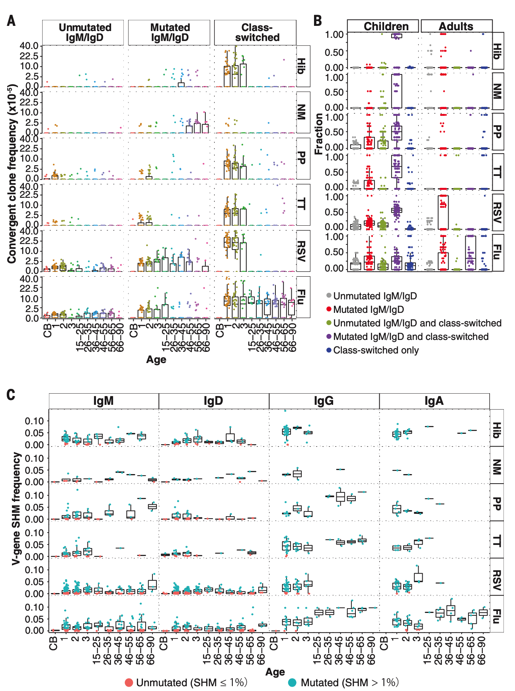
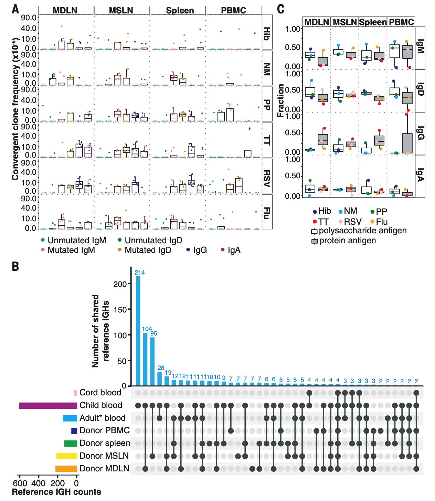
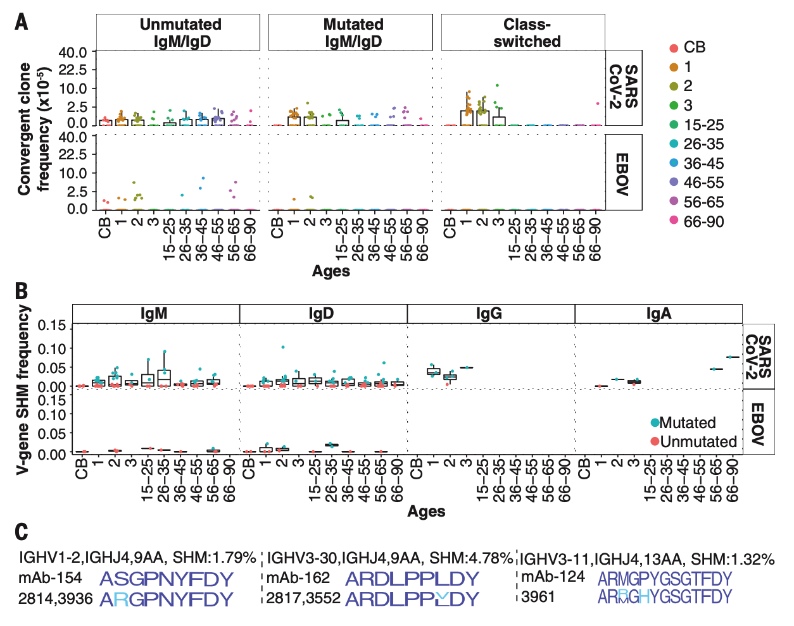
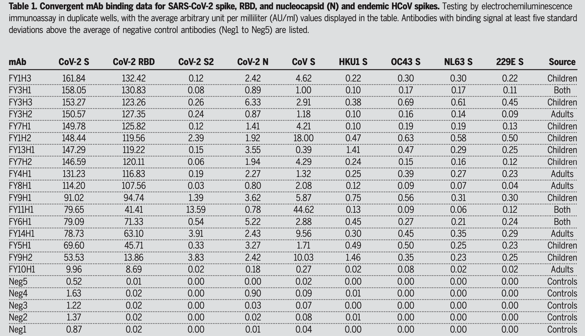

## 人类对冠状病毒和其他病原体的共享B细胞记忆在不同年龄组和组织中各不相同

---

### Abstract

疫苗接种和感染促进了编码体液免疫记忆的B细胞的形成、组织分布和克隆进化。
我们评估了儿童和成人的血液和死亡的成人器官捐献组织，以确定个体之间共享的相似序列的趋同抗原特异性抗体基因。
不同病原体的B细胞记忆能力不同。
多糖抗原特异性克隆并不是脾脏所特有的。
成人在淋巴组织中的克隆频率高于血液，在淋巴组织中有更大的类别转换，而儿童血液中有丰富的类别转换聚合克隆。
与报道的血清学一致，流行期前儿童有与严重急性呼吸综合征冠状病毒2型的类别转换融合克隆，与其他冠状病毒的交叉反应较弱，而成人血液或组织中几乎没有这种克隆。
这些结果突出了儿童早期B细胞克隆性扩张和未来对新病原体的反应的交叉反应性。

### Main

B细胞的克隆性可以通过它的B细胞受体(BCR)序列来追踪，这决定了它的抗原特异性(1)。
免疫球蛋白(Ig)序列是通过不可逆的可变、多样性和连接(VDJ)基因片段重排形成的，并可通过体细胞超突变(SHM)和类切换重组(CSR)而多样化(2)。
在暴露于相同抗原的个体中，具有高度序列相似性的聚合BCR反映了抗性克隆的选择，并在个体之间形成共同的免疫记忆(3-5)。
然而，目前还不清楚B细胞对不同抗原的记忆在人体组织中是如何分布的，以及在人的一生中是如何变化的。

体液免疫反应在儿童和成人之间可能不同；例如，儿童使用更多的B细胞克隆来获得针对HIV-1的中和抗体广度(6)。
儿童感染严重急性呼吸综合征冠状病毒2型(SARS-CoV-2)后的疾病通常比成人轻(7-10例)，可能是由于病毒受体表达和免疫反应的差异(11，12)。
与成人相比，感染SARS-CoV-2的儿童表现出更低的抗体滴度和更高的S蛋白特异性IgG，而不是核衣壳蛋白。
儿童较快的病毒清除和较低的病毒抗原载量归因于这些差异(13)。
目前尚不清楚针对冠状病毒和其他病原体的B细胞克隆在儿童和成人之间是否有所不同。
基于血液的研究只调查了一个人的BCR曲目中的一小部分。
淋巴结、脾脏和胃肠道含有大量的B细胞，是SHM和CSR的主要部位(14，15)。
已经报道了特定组织的特异性反应，例如功能性脾组织中的多糖抗原特异性B细胞(16，17)。

为了研究抗原特异性B细胞记忆在人的一生中和跨组织中的变化，我们在新冠肺炎大流行前的个体中表征了六种常见病原体以及两种参与者没有遇到的病毒-埃博拉病毒和SARS-CoV-2的聚合免疫球蛋白重链(IgH)谱系。
我们分析了12份脐带血样本，51名1-3岁儿童的93份血液样本(18份)，17-87岁健康成人的114份血液样本(18份)，以及8名已故器官捐赠者的血液、淋巴结和脾脏样本(表S1)。
儿童在2、4、6和12-15个月时接种了b型流感嗜血杆菌(Hib)、肺炎球菌(PP)和破伤风类毒素(TT)疫苗，接种了流感病毒(Flu)疫苗，很可能接触到呼吸道合胞病毒(RSV)，但没有接种脑膜炎奈瑟菌(NM)疫苗(19例)。
成人疫苗接种史尚不清楚。
通过使用病原菌特异性参考IgH(表S2)进行聚类，获得了具有IgH可变区(IGHV)和连接区(IGHJ)基因片段、互补决定区H3(CDR-H3)长度和最低85%的CDR-H3氨基酸序列同源性的融合Ig。

B细胞克隆分为三组：(I)仅含有未突变的IgM或IgD的天真克隆(以下简称Unmutic M/D)；(Ii)抗原敏感的IgM或IgD克隆，其SHM中位数大于1%，且不存在类别转换成员(以下简称mutic M/D)；以及(Iii)具有类别转换成员的抗原敏感克隆(以下简称CS)。
正如我们假设的那样，CB样本表现出最低的聚集性IgH频率，这与有限的胎儿病原体或疫苗暴露相一致(图1A)。

> 图1.儿童和成人病原体特异性聚合克隆的频率、类别转换和SHM。
> (A)每个病原体的收敛克隆频率，以平方根标尺绘制。
> 以年为单位给出的年龄。
> 脐带血。
> (B)表达未突变的IgM或IgD、突变的IgM或IgD、类别转换或它们的组合的聚合克隆的一部分。
> 儿童Ig M/Ig D克隆成员突变(呈紫色)的比例显著高于成人[经Wilcoxon-Mann-Whitney检验，Hib、NM、PP、TT和RSV分别为5.0 8×10−32、6.66×10−2 9、2.39×10−2 9、3.45×10−34和1.71×10−41]。
> (C)不同年龄段受试者IGHV基因SHM频率的中位数。
> 儿童表达Ig G或Ig A融合克隆的SHM频率明显低于成人(P=6.5 0×10−13和1.96×10−8；WMW检验)。

儿童和成人的融合克隆主要是突变的M/D或CS(图1A和图S1)。
在成人血液中，Hib、NM和RSV的融合克隆主要是突变的M/D克隆，而PP、TT和Flu克隆主要是CS(图S2A)。
45岁以上的成年人将突变的M/D B细胞克隆频率提高到NM，这可能是由于广泛接种NM疫苗之前的暴露(20)。
出乎意料的是，儿童的Hib、PP、TT和RSV的频率高于CS融合克隆的成人(S2B)，在这些克隆中也发现了突变的IgM或IgD(图1B)。
儿童血液中的聚合克隆频率与疫苗接种时间没有显著关系(图S3至S5和表S3)，表示持续升高的频率。
流感特异性聚合克隆频率在儿童和成人中是相似的(图1A)，与年龄相关的IgG SHM增加可能是由于通过接种疫苗或感染而频繁暴露(图1C)(18)。

为了验证CS融合克隆在成人血液中的低频率是否反映了克隆在淋巴组织中的优先定位，我们分析了8例成人已故器官捐赠者的血液、脾脏、纵隔淋巴结(MDLN)和肠系膜淋巴结(MSLN)。
淋巴结和脾脏之间的克隆共享程度比与血液的克隆共享程度更高(图S6A)，提示淋巴组织克隆较大，再循环受限。
每个组织由不同的克隆所支配(图S6B)，SHM与克隆占用的组织数相关(图S7)，与先前较大的抗原暴露导致更广泛的组织分布一致(21)。
成人淋巴结和脾脏中Hib、NM、PP、TT、RSV和Flu的聚合克隆频率高于血液(图2A)。

> 图2.汇聚的B细胞克隆在组织中的分布。
> (A)成人外周血(PBMC)、MDLN、MSLN和脾脏的集合性克隆频率。
> 频率是在平方根尺度上的。
> 组织中HIb、NM、PP、TT、RSV、FLU的频率高于血液(P=0.00049、0.0037、0.016、6.71×10RS7、0.012、0.00017；WMW试验)；HIb、NM、PP、TT、−和Flu在组织中的分布频率均高于血液。
> (B)在儿童、健康成人(成人*血液)、已故器官捐赠者(捐赠者PBMC)以及捐赠者脾脏、MSLN和MDLN中融合抗原特异性IgH。
> 垂直条：每个样本组合的参考抗原特异性IgH序列。
> 左条：每个组织的总收敛IgH唯一序列。
> (C)在组织中含有指定同型的聚合克隆的一部分。
> 有些克隆包含多个同型。
> 与蛋白抗原特异性克隆相比，多糖特异性克隆表达IgM/D的频率更高，表达IgG的频率更低(P=0.035和0.0058，WMW检验)。

成人淋巴结和儿童血液共享比成人和儿童血液更多的聚合克隆，显示这些克隆在儿童和成人中的不同分布(图2B和图。
S8；P=0.0001181，Fisher's精确检验)。
据报道，针对细菌荚膜多糖的B细胞在脾脏中富集，脾切除患者容易受到这些细菌的感染(16，17)。
然而，淋巴结中Hib、NM和PP的集合性克隆的频率与脾脏相似或更高。
此外，人类淋巴结中估计的B细胞数量大于脾脏(22，23)，这表明脾脏并不是这些克隆的唯一储存库。
多糖的IgH通常为IgM或IgD，在淋巴结和脾脏中有一些PP的CS克隆(图2C)。
因此，对这些抗原的记忆跨越了淋巴组织和同型表达的多样性。

最近的报道描述了流行前期儿童血液中的SARS-CoV-2结合抗体(12，24)。
这种抗体和其他生理差异正在成人和儿童中进行研究(25)，可能会导致儿童患上通常较轻微的新冠肺炎病。
比较未暴露者的SARS-Cov结合的B细胞对一例前SARS冠状病毒感染者、健康人的幼稚B细胞和流行期前献血者的记忆性B细胞进行了分析。
我们在血液或组织中检测到罕见的EBOV融合克隆，如未突变的M/D(图3A和图S9A)。

> 图3.SARS-CoV-2和EBOV的融合克隆。
> (A)以平方根尺度收敛的克隆频率。
> 儿童SARS-CoV-2的CS和MUT M/D融合克隆频率高于成人。
>
> (P=1.2 2×10−13和0.0089；WMW检验)。
> (B)不同年龄(x轴)受试者中各同型收敛克隆的SHM频率。
>
> (C)聚集性IgH与SARS-CoV-2和其他HCoV交叉反应的CDR-H3氨基酸序列。
> 顶行：已报道的抗原特异性克隆的CDR-H3序列标识。
> 第二行：来自儿童的聚合克隆的序列徽标。
>
> (蓝色表示匹配，青色表示序列差异)。

相比之下，SARS-CoV-2的聚合克隆(表S4)在儿童血液中更为常见。
在51名儿童中的37名，这些克隆显示有或没有CS的SHM，表明有过抗原经历(图3，A和B)。
与儿童血液相比，SARS-CoV-2融合克隆在血液和淋巴组织中的成人频率较低，很少有CS实例(图3A和图S9)。
SARS-CoV-2受体结合域(RBD)和其他S结构域的融合克隆具有相似的分布。(S10)。
SARS-CoV-2、EBOV和图1中的病原体的参考抗体使用了IGHV基因的广泛多样性(图1)。
S11)。

在本研究中，来自五名儿童的三个融合克隆，但没有一个来自成人，其IgH序列与从一名流行期前捐赠者分离的SARS-CoV-2S结合克隆高度相似，据报道，这些克隆与其他人类冠状病毒(HCoV)刺突(26)弱结合(图3C)。
来自六个儿童的另外三个克隆具有与已知的SARS-CoV-2结合子相同的Ig(图S12)。
我们用本研究参与者的IgH和参考轻链表达了19个SARS-CoV-2单克隆抗体克隆(表S5)，并鉴定了SARS-CoV-2S区和S区的17个结合子(表1)。
4种RBD结合剂显示血管紧张素转换酶2(ACE2)与SARS-CoV-2S结合的阻断率>90%(表S6)。
单克隆抗体FY11H1显示S2结合的证据，并未阻断ACE2结合。
我们使用一组HCoV尖峰和SARS-CoV-2病毒变异RBDS和尖峰来表征mAb结合的广度。
三个儿童来源的mAb(FY7H1、FY7H2和FY1H2)和一个成人mAb(FY4H1)与B.1.1.7、B.1.351和P.1 S和RBD变体的结合最强(表S7)。
所有mAb与地方性HCoV尖峰的交叉反应结合非常弱或不存在，正如先前从分类的交叉反应B细胞(26)中分离的参考mAb-154(类似于mAb FY13H1)所指出的那样。
儿童来源的单克隆抗体FY13H1和FY9H2具有较高的结合HKU1的信号，但仍然很弱。
因此，儿童汇聚的冠状病毒结合B细胞可能比成人有更大的交叉反应性，而且频率更高。

童年免疫反应在一个人的一生中尤其重要，因为它们形成了塑造未来反应的最初记忆B细胞池(29)。
我们发现，与成年人相比，儿童血液中聚集的B细胞克隆的频率更高，因为他们遇到了病原体。
值得注意的是，流行期前儿童也有与SARS-CoV-2及其病毒变体(而不是EBOV)的类别转换融合克隆，频率比成人更高。
我们假设，以前接触HCoV可能会刺激交叉反应记忆，而且这种克隆反应可能在童年时出现的频率最高。
我们分析的警告是，收敛克隆可能不能完全代表一个个体中所有病原体特异性克隆的特性，而且与体内相关的交叉反应的结合亲和力尚不清楚。
进一步研究交叉反应B细胞群在对相关但不同的病毒的初级免疫反应中的作用，以及更好地理解长寿B细胞记忆和浆细胞形成的决定因素，对于不断改进SARS-CoV-2、其病毒变体和其他病原体的疫苗将是重要的。

> 表1.SARS-CoV-2尖峰、RBD、核衣壳(N)和地方性HCoV尖峰的mAb结合数据。
> 用电化学发光免疫分析法在重复井中进行检测，每毫升的平均任意单位(AU/ml)值如表所示。
> 结合信号比阴性对照抗体(Neg1到Neg5)的平均值高出至少五个标准差的抗体被列出。