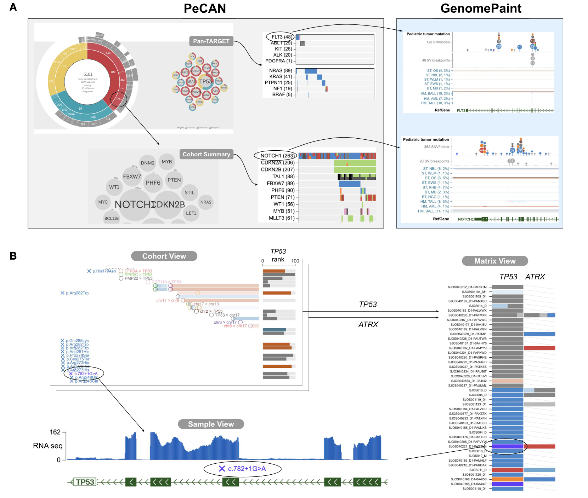
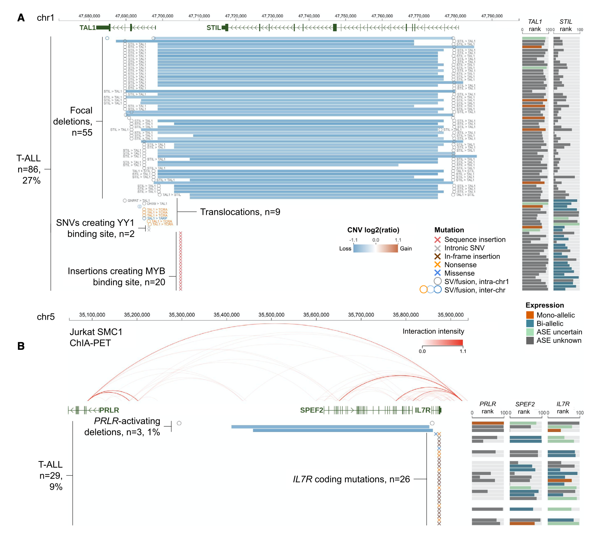
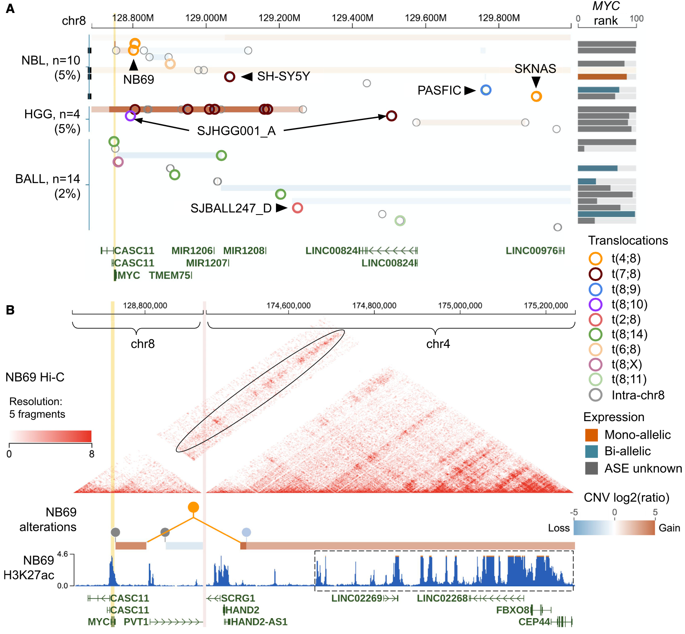
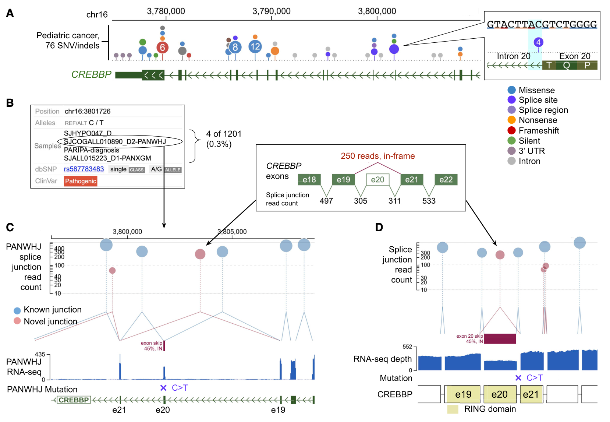

# Exploration of Coding and Non-coding Variants in Cancer Using GenomePaint

Genome Paint主要关注儿童癌症，它通过整合各个癌症基因组的DNA，RNA和表观遗传数据，能够检测癌症亚型中常见和罕见的驱动程序变异，并发现新的致癌事件。

#### Highlights

- 访问来自儿童癌症，PDX和细胞系的多组学数据
- 用RNA剪接数据评估剪接位点突变的作用
- 用肿瘤表达数据评估非编码改变的调节作用
- 支持成年癌症和用户提供的数据

#### Abstract

Genome Paint（https://genomepaint.stjude.cloud/）是一个交互式可视化平台，可用于肿瘤样品的全基因组，全外显子组，转录组和表观基因组数据。它的设计捕获了DNA变异与RNA表达之间的相互联系，支持对单个癌症基因组和整个队列的深入研究。调节性非编码变体可以与编码变体一起进行检查和分析，并且通过检查来自癌细胞系的3D基因组数据可以进一步探索其功能影响。此外，Genome Paint将突变和表达模式与患者预后相关联，并支持自定义数据上传。**我们使用Genome Paint揭示了异常的剪接，该剪接破坏了CREBBP的RING结构域，通过在B谱系急性淋巴细胞白血病中复制NOTCH1-MYC增强子来发现MYC癌基因的顺式激活，并探讨了肿瘤之间和肿瘤内的异质性。成年胶质母细胞瘤中的EGFR**。这些例子表明，通过基因组图谱对单个癌症基因组进行深入的多组学研究，可以为后续验证提供生物学见解。

#### Introduction

近年来，多组学下一代测序（NGS）已成为癌症研究的主流（Hoadley等，2018; Ma等，2018; Rusch等，2018）。虽然全基因组测序（WGS）可以识别体细胞获得的编码和非编码点突变以及结构变异，但结合肿瘤转录组测序（RNA测序[RNA-seq]）对于评估DNA改变对转录失调。 DNA和RNA数据综合分析的应用包括突变等位基因表达状态，由剪接位点突变引起的异常RNA剪接，基因融合以及等位基因特异性表达（Mansour等，2014； Herranz等，2014； Zhang等）等人，2016； Bahr等人，2018； Ma等人，2018）。更重要的是，**为了评估非编码变体的潜在功能作用，需要染色体构象捕获测定法，例如Hi-C和NGS对转录因子和组蛋白标记的染色质免疫沉淀（染色质免疫沉淀测序[Ch IP-seq]）揭示非编码调控变异对3D结构的扰动**（Zimmerman等人，2018; Hnisz等人，2016）。尽管这些**多样化数据之间的相互关系**对于调查基因失调事件至关重要，但现有的癌症基因组浏览器（例如IGV（Robin-son等人，2011）和UCSC Genome Browser（Kent等人，2002））并未解决这一问题。它们的需求主要是基于一种数据类型，一种轨道模型设计的。即使是最近发布的癌症基因组可视化工具Xena（Goldman et al。，2020）也主要专注于描述研究人群的突变发生率或表达谱，并且在探索单个肿瘤基因组方面的功能有限，这对于发现独特的肿瘤至关重要。 1个案例研究中的N-个基因组驱动因素或罕见的癌症亚型。

为了应对这些挑战，我们开发利用基因组漆探索癌症编码和非编码变异。了一种基于Web的动态可视化工具Genome Paint（https：// genomepaint。stjude.cloud/），其设计可以捕获不同人群的癌症组学数据以及各个样本水平的相互关联性。 ，后者使得能够深入探索罕见癌症亚型的基因组，而这些癌症亚型占儿童癌症的50％以上。我们使用Genome Paint展示了3,854个儿科癌症基因组的体细胞DNA变异，RNA表达和临床结果信息，这些基因组主要由圣裘德/华盛顿大学儿科癌症基因组计划（PCGP）或美国国立癌症研究所（NCI）概述。在治疗上产生有效治疗（TARGET）的研究。还包括从小儿白血病和神经母细胞瘤癌细胞系产生的基因组，转录组和表观基因组数据，以评估非编码变体的功能影响。我们提供了丰富的数据可视化功能以及用例，以说明Genome Paint可视化如何超越基本数据查询的范围，从而增强生物学发现的能力。

#### Results

##### 小儿癌症数据集

我们组装了代表16种组织型的3,854例儿科癌症的体细胞变异和RNA-seq基因表达（表S1和S2）。编码区和非编码区的体细胞变体包括810,277个单核苷酸变体（SN Vs）和小的插入/缺失（indels），321,686个拷贝数变异（CN Vs），56,484个杂合性丧失（ LOH）事件，52,142个结构变异（S Vs），65个内部串联重复（IT Ds）和2,990个融合基因。 WGS和配对肿瘤-正常样品的全外显子组测序（WES）分别针对40％（1,546）和48％（1,875）的病例进行分析，而49％（1,890）的肿瘤通过RNA-seq进行分析（请参阅发行说明）。作为TARGET泛癌计划的一部分，分别可获得915个肿瘤和1,102个肿瘤的突变特征和患者结果数据（Ma et al。，2018）。为帮助解释儿童癌症中非编码调控变异体，上载了包括8个儿童癌症细胞系的组蛋白修饰，转录因子Ch IP-seq和Hi-C染色质相互作用的表观遗传数据（Zimmerman等， 2018; Tian等人，2019）及其相应的WGS和RNA-seq数据（表S3）。该数据集主要在GR Ch37（hg19）中可用，而变体和基因表达数据也可以在GR Ch38（hg38）中进行探索。

##### Genome Paint中的导航

为了可视化全面的儿科癌症组学数据，Ge-nome Paint提供了三种交互式且相互关联的视图：群组视图，矩阵视图和样品视图。可以通过（1）从在儿科癌症（Pe Can）知识库门户网站（https://pecan.stjude.cloud，图1 A）上显示的景观图中选择一个显着突变的基因来访问同类群组视图的入口点，（2 ）直接查询感兴趣的基因组区域或基因（图1 B）。景观图可以由小儿全癌症研究之一预先组装（Ma等人，2018;Gröbner等人，2018），也可以通过用户选择癌症亚型动态构建。队列视图显示整个队列的组学数据以及相关的基因组注释。从同类群组视图中，用户可以通过选择感兴趣的样本以启动“样本视图”，或选择感兴趣的基因以启动“矩阵视图”来进一步探索（图1 B）。每个视图的关键功能描述如下，在线用户教程（STAR方法）中完整描述了它们的功能。

##### Cohort View

队列视图在两个并排的面板中显示了用户选择的癌症组织学类型的DNA变体和RNA表达。在DNA变异面板中，特定位置的特定变异（例如SNV / in-dels）和结构变异断点可以使用密集模式汇总显示，也可以使用扩展模式单个样品显示。在扩展模式下，位点特异性变体覆盖在分段变体（例如CNV和LOH）上，从而可以检查同一肿瘤样本不同类型的体细胞变体的共存。此功能与在单独面板上显示的对齐的RNA表达视图结合在一起，整合了从同一肿瘤样品产生的不同数据类型，有助于评估体细胞变异的致病性。例如，TP53点突变与LOH共同发生或拷贝数丢失是大多数（40％的33％）肾上腺皮质肿瘤的发生，这与TP53肿瘤抑制功能的双等位基因丢失是一致的用于癌症发展（在线示例1）。相比之下，在B细胞急性淋巴细胞性白血病中，IKZF1的点突变和拷贝数丢失互斥，这表明IKZF1单倍体功能不足有助于白血病的发生（在线示例2）。同类群组视图的独特功能使您能够探索候选非编码调控变体与其靶基因之间的长期相互作用。例如，调节性CNV导致其位于CNV边界之外的靶基因异常顺式激活（Liu等人，2020; Hnisz等人，2016; Northcott等人，2017; Yang等人，2020）。具体而言，用户可以选择一个或多个基因在表达面板上显示，以鉴定受DNA变异面板检查中顺式-调控变体影响的潜在靶标。为了说明这一特征，我们展示了TAL1和PRLR，这两种癌基因分别在基因组图谱上的T细胞急性淋巴细胞白血病（T-ALL）队列中被常见和罕见的调控变异体分别顺式激活。 TAL1是一种转录因子，通常仅在胸腺细胞发育的早期阶段（例如，造血干细胞）表达，但在T-AL Ls的子集中被激活（O’Neil and Look 2007）。图2A显示了TAL1附近的一个130 kb区域，在316个T-ALL样本中有86个（27％）存在各种体细胞变化（图S1A）。管家基因STIL的体细胞缺失是该区域最普遍的变化。在表达面板中并排检查TAL1和STIL表达，与高度可变的STIL表达相反，TAL1的平均过表达伴随单等位基因表达提示顺式激活。这种模式概括了删除的已知功能影响；即，尽管其基因组定位在STIL，但缺失删除了抑制TAL1表达的绝缘邻域的边界元素（Hnisz等人，2016），导致T1 ALL中的TAL1致癌活化。队列研究还提出了导致TAL1顺式激活的其他机制，包括通过易位劫持T细胞受体调节元件（n = 6）和通过体细胞indel（MYB结合位点）产生从头转录因子结合位点。 ）在上游基因间区域（n = 20）（Mansour等人，2014）或内含子1（n = 2）中的体细胞SNV（YY1结合位点）（Liu等人，2020）。

PRLR是位于IL-R上游> 800 kb的细胞因子受体，IL7 R是T-ALL中的已知致癌基因（Liu等人，2017）。队列视图显示，该区域包含罕见的> 400 kb缺失，通过SNP阵列分析，在30个WGS样品中有1个被检测为SV，在265个样品中有2个检测为CNV（图S1 A）。该缺失去除了外显子1或IL7R的上游非编码区以及整个SPEF2基因（图2B）。表达面板显示PRLR均匀地过表达，与IL7 R和SPEF2中变化的表达水平相反。当使用每百万个映射读段（FPKM）箱形图的每千个碱基的片段检查表达值时，这三个样本在T-ALL队列中显示出最高的PRLR表达，与其余T-AL Ls相比异常（图S1 B） 。值得注意的是，该缺失可导致IL7R表达降低，考虑到26 T-ALL样本中IL7 R中存在复发性功能增高，致癌基因突变，这种表达最初似乎是反常的（Zoxaloxic）（Zhang等，2012）。在该队列中（在图2 B中显示为彩色x）。重要的是，在WGS分析的样品之一中鉴定出高度显着的顺式激活签名（Liu等人，2020年），这表明PRLR可能是该缺失的靶基因。可通过导入染色质相互作用分析和从T-ALL细胞系Jurkat产生的配对末端标签测序（Ch IA-PET）数据来检查缺失对3D基因组结构的影响（Hnisz et al。，2016）作为同类群组视图上的弧形图。这表明该区域包含一个绝缘邻域的多个边界元素，这表明PRLR顺式激活的机制与STIL缺失引起的TAL1激活的机制相似。

群组视图允许用户将临床结果与DNA基因组改变或基因表达水平相关联。可以定义一组突变的肿瘤样本，这些样本在选定的基因组区域内具有多种体细胞变化，并与未受影响的样本进行比较，并在Kaplan-Meier图中可视化其无事件生存率和总体生存率。例如，MYB致癌基因可以通过体细胞变化激活，例如扩增，热点突变（错义变异或符合读框的插入）以及T-ALL队列中的易位，并且具有这些改变的肿瘤组的结果要比非突变组明显更差（Liu等人，2017，在线示例3）。
通过单击RNA表达面板上的样品，可以将不同癌症类型之间的差异基因表达视为箱线图。在每种癌症类型中，基于表达的生存分析会根据目标基因的表达水平将肿瘤样品分为不同的组。 Genome Paint显示，MDM2的高表达与急性髓细胞性白血病的不良预后相关，复制了以前发表的发现（Ko-jima等，2005，在线示例4）。

##### Matrix View

矩阵视图允许用户组装多个基因或基因座，以评估其在一组肿瘤中的突变模式，并将这些模式与临床结果相关联。例如，在成神经细胞瘤中鉴定的驱动基因中，MYCN激活突变的排他性和ATRX中功能丧失的突变是很容易检测到的，而MYCN和ALK的基因对则没有这种模式。通过根据MYCN和ALK的共突变模式将这些患者分为四组，Kaplan-Meier图显示MYCN和ALK的共突变与最差的结果相关（在线示例5）。

##### Sample View

在同类群组视图和矩阵视图中，单击DNA变体将启动样品视图，该视图以感兴趣的变体为中心显示所选肿瘤的详细组学数据。 Sample View支持动态范围内的基因组可视化：用户可以以碱基对分辨率进行探索，并以各种比例放大到整个染色体。

Sample View提供了DNA和RNA的测序范围，可分别手动管理在WGS或WES中检测到的CN V和在RNA-seq中的异常剪接。对于RNA-seq，Sample View还提供了一个剪接图，该图描述了跨越标准或新型剪接的RNA-seq读取计数。可以在剪接点图旁边显示DNA变异，从而使用户能够评估其对RNA转录的潜在作用。选择一个来自骨肉瘤的TP53剪接位点变体NM_000546：c.782-1 G> A，以在Sample View中进行详细检查（在线示例6）。

RNA-seq覆盖图显示内含子7的覆盖范围增加，表明内含子保留，而剪接位点连接图显示，与两个相邻的无聊连接（10个连接点）相比，外显子7和8之间的规范连接读取减少了90％以上读取第7-8外显子，> 100读取第6-7外显子和第8-9外显子）。内含子保留在规范剪接中的优势表明存在第二个DNA击中：这可以通过检查等位基因失衡（AI）图来检查，以检查匹配的肿瘤的变异等位基因分数与正常WGS或WES数据之间的差异来评估。在该示例中，WES AI图的缩小视图揭示了一个包含TP53基因座的39 Mb LOH区域，从而确认了第二次命中，导致肿瘤RNA中异常TP53剪接的单等位基因状态（在线示例6）。体细胞DNA变体轨道的缩小染色体视图对于检查突变特征的整体模式也很有帮助。根据我们先前的分析（Ma et al。，2018），该轨道上的体细胞SN V以最可能的突变特征进行颜色编码（Ma等，2018），以``降雨''图显示，y轴描述了它们的突变距离（在线示例7）。这使得能够检查指示潜在癌症病因的突变簇的模式（即降雨）。例如，在骨肉瘤中S V与带有APOBEC突变特征的SN V簇共存提示kataegis，这是诱变过程，产生与APOBEC活性相关的局部超突变（Nik-Zainal等，2012）。相比之下，同一肿瘤中的非片状区域被带有COSMIC标记3的SN Vs占据主导地位，表明通过同源重组修复DNA双链断裂的缺陷（在线实例7）。

如果可用，Sample View将显示表观遗传和3D基因组数据。当前版本包括从儿科癌细胞系生成的Ch IP-seq，Hi-C和Capture-C数据。在探索结构变异时，将重排的基因组用作参考，以覆盖基因组，转录组和表观基因组数据。此功能极大地促进了由事件（例如增强子劫持）引起的异常转录的发现。使用我们先前发现的在高风险神经母细胞瘤子集中导致MYC激活的增强子劫持的例子（Zimmerman等人，2018），我们展示了该界面如何识别候选的非编码调控S Vs 。从队列的观点来看，MYC上游存在t（4：8）SV，再加上神经母细胞瘤细胞系NB69中异常的MYC表达，表明SV破坏了基因调控（图3 A）。选择“ t（4：8）SV”作为“样品视图”，可以发现HAND2增强子在第4号染色体上并列排列，该染色体由强H3 K27ac峰定义，并与第8号染色体上的MYC启动子区域并排（图3 B）。 NB69 Hi-C数据显示为重排基因组轴上的三角形接触图，揭示了MYC启动子与HAND2增强子在3D基因组领域中的直接接触（图3 B），这证实了以下假设： MYC异常激活很可能是由（4：8）SV引起的。通过检查MYC表达和该区域中染色体间易位的存在，Sample View可能显示出类似的机制可能导致其他儿童癌症亚型（例如，B线年龄的ALL和高级别神经胶质瘤）中的MYC激活。如图3A所示。

### 发现CREBBP RING结构域破坏是一种可能的致病性事件

CREBBP编码转录共激活因子和组蛋白乙酰转移酶（HAT），并且已知参与小儿B-ALL的复发（Mullighan等，2011； Li等，2020）。在队列研究中，我们在TARGET或PCGP分析的四个B-ALLs的CREBBP外显子20的剪接供体位点发现了复发的体细胞SNV（NM _ 004380.2：c.3779 + 1 G> A）（图4A和图4B S2 A）。工具提示显示此变体与鲁宾-斯坦-Taybi综合征的临床病原体变体（图4 B）相匹配（Roelfsema et al。，2005），体外转染实验表明该变体可能导致外显子跳跃（Dauwerse等人，2016年）。在我们的队列中，RNA-seq可用于这四个B-AL Ls（PANWHJ）之一。通过检查-在“样品视图”中剪接连接图，我们证实了白血病在体内发生了外显子20跳跃。该结果基于以下数据：（1）外显子19和21之间存在先前无法识别的剪接点（剪接百分比：55％）； （2）外显子20的覆盖范围减少了约50％。该事件预计会发生在框架内，如新颖接合处的工具提示所示（图4 C）。当显示从基因组坐标切换为m RNA坐标（图4 D）（其中显示了蛋白质结构域）时，显示了剪接点，RNA-seq覆盖率和剪接位点突变的更紧凑视图。该观点揭示了外显子20的跳跃破坏了CREBBP的RING结构域。尽管先前的研究集中于位于HAT域中的CREBBP突变，但这种复发的剪接位点变异表明HAT域的负调控子RING域的破坏（Delvecchio等人，2013年）可能具有相当的删除-不良作用。确实，使用队列研究进行的进一步检查揭示了另外七个B-AL Ls，这些B-AL Ls具有体细胞改变，破坏了CREBBP的RING结构域（图S2）。其中包括2例外显子20和21的错义突变，3例外显子21剪接位点/区域突变和2例外显子20局灶性缺失（图S2）。总的来说，这些数据表明CREBBP RING结构域的破坏是由B-ALL中多种体细胞改变引起的复发性致病事件。