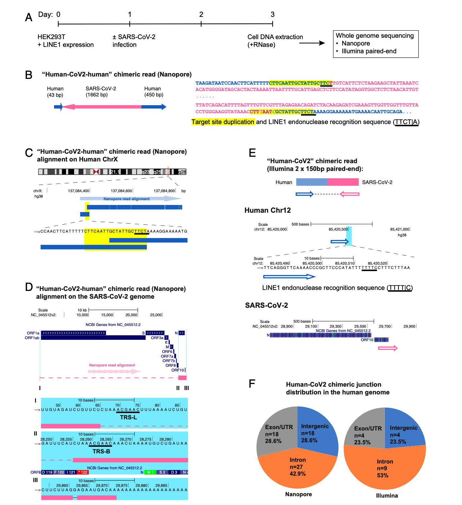
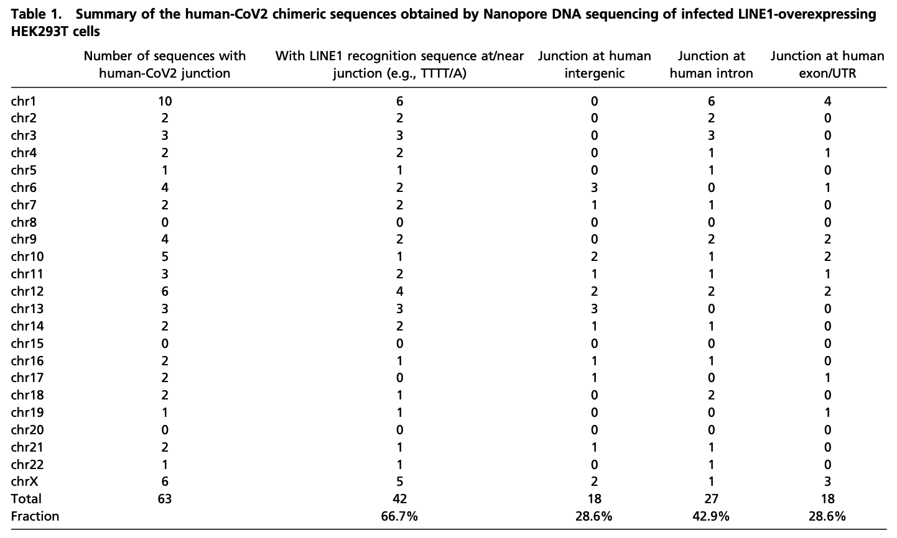
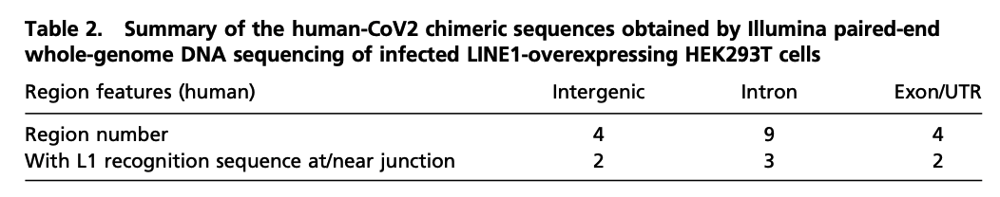
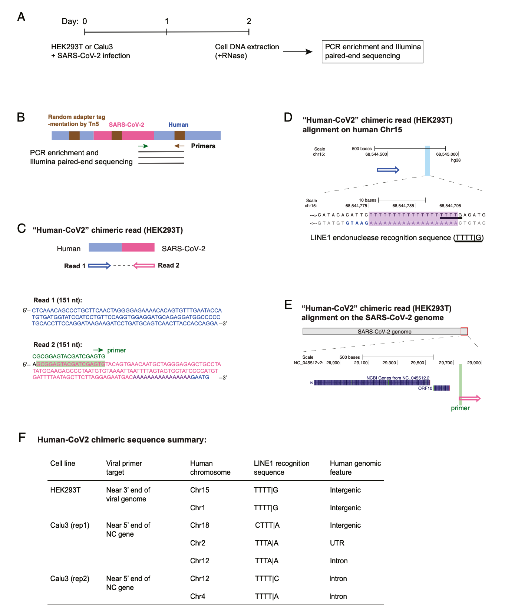
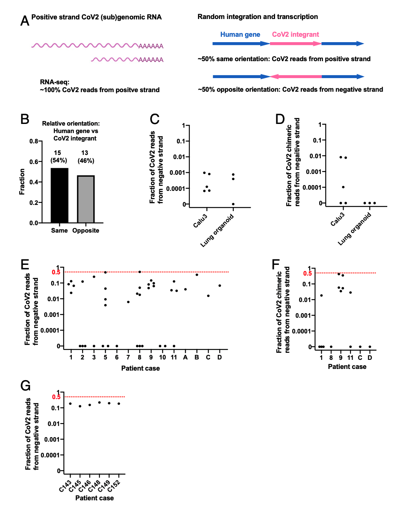

## 反转录的SARS-CoV-2 RNA可整合到培养的人类细胞基因组中，并可在患者来源的组织中表达

Reverse-transcribed SARS-CoV-2 RNA can integrate into the genome of cultured human cells and can be expressed in patient-derived tissues

## Abstract

据广泛报道，严重急性呼吸综合征冠状病毒2型核糖核酸检测时间延长和聚合酶链反应阳性检测复发的患者在从新冠肺炎康复后，但其中一些患者似乎没有排出传染性病毒。我们调查了SARS-CoV-2RNA可以被逆转录并整合到培养的人类细胞DNA中的可能性，以及整合序列的转录可能解释了在患者中看到的一些阳性PCR检测。为了支持这一假设，我们发现SARS-CoV-2序列的DNA拷贝可以整合到受感染的人类细胞的基因组中。
我们在整合位点发现了病毒序列和一致的LINE1核酸内切酶识别序列两侧的靶位点重复，这与LINE1反转录转座子介导的靶启动的逆转录和逆转录机制一致。  我们还发现，在一些患者来源的组织中，有证据表明，很大一部分病毒序列是从病毒序列的整合DNA拷贝转录而来的，从而产生病毒-宿主嵌合转录本。
因此，病毒序列的整合和转录可能有助于患者感染后和临床康复后用PCR检测病毒RNA。由于我们只检测到整合到宿主细胞DNA中的主要来源于病毒基因组3‘端的亚基因组序列，因此不能从整合的SARS-CoV-2亚基因组序列中产生传染性病毒。

## Significance

SARS-CoV-2疾病的一个悬而未决的问题是，在没有病毒复制证据的情况下，患者在首次感染数周后经PCR检测通常仍呈病毒RNA阳性。
我们在这里表明，SARS-CoV-2RNA可以被逆转录并整合到感染细胞的基因组中，并以融合病毒和细胞序列的嵌合转录本的形式表达。
重要的是，这种嵌合转录本在患者来源的组织中被检测到。
我们的数据表明，在一些患者组织中，大多数病毒转录本来自整合序列。
我们的数据提供了对SARS-CoV-2感染后果的洞察，这可能有助于解释为什么患者康复后仍能继续产生病毒RNA。

## Main

据报道，严重急性呼吸综合征冠状病毒2型(SARS-CoV-2)持续或反复阳性PCR检测在首次感染后数周或数月内从患者身上采集(1-17例)。
虽然最近有报道称康复后真正再次感染了SARS-CoV-2(18例)，但对从新冠肺炎康复后接受严格隔离的受试者进行的队列研究表明，至少一些“再阳性”病例不是由再次感染引起的(19、20)。此外，没有从这些PCR阳性患者(1-3，5，6，12，16)中分离或传播具有复制能力的病毒，病毒RNA长时间和反复产生的原因尚不清楚。
SARS-CoV-2是一种正链RNA病毒。与其他beta冠状病毒(SARS-CoV-1和中东呼吸综合征相关冠状病毒)一样，SARS-CoV-2使用依赖RNA的RNA聚合酶来复制其基因组RNA并转录亚基因组RNA(21-24)。在没有病毒复制的情况下继续检测SARS-CoV-2病毒RNA的一个可能的解释是，在某些情况下，病毒亚基因组RNA的DNA拷贝可能通过反转录机制整合到宿主细胞的DNA中。
整合的DNA拷贝的转录可能是最初感染清除后很长一段时间内PCR检测呈阳性的原因。
事实上，非逆转录病毒RNA病毒序列已经在许多脊椎动物物种的基因组中被检测到(25，26)，有几个整合显示出与病毒mRNAs的DNA拷贝通过古老的长时间散布的核元件(LINE)反转录转座子整合到生殖系中的信号一致(参见参考文献)。
27)。
此外，非逆转录病毒RNA病毒，如水泡性口炎病毒或淋巴细胞性脉络膜脑膜炎病毒(LCMV)，可以通过内源性逆转录酶(RT)反转录成DNA拷贝，并且病毒序列的DNA拷贝已被证明整合到宿主细胞的DNA中(28-30)。
此外，细胞RNA，例如人类的APP转录本，已经被证明是由神经元中的内源性RT逆转录的，由此产生的APP片段整合到基因组中并得到表达(31)。
人类LINE1元件(占人类基因组的17%的∼)是一种自主反转录转座子，或与与其他非自主元件(如Alu)逆转座，是细胞内源性RT(32-34)的来源。
内源性LINE1元件已被证明在老年人组织中表达(35)，LINE1介导的体细胞逆转座在癌症患者中很常见(36，37)。
此外，内源性LINE1和其他反转录转座子在宿主细胞中的表达通常在病毒感染时上调，包括SARS-CoV-2感染(38-40)。

在这项研究中，我们发现SARS-CoV-2序列可以通过LINE1介导的逆转录机制整合到宿主细胞基因组中。
我们提供的证据表明，整合的病毒序列可以转录，在一些患者样本中，大多数病毒转录本似乎来自整合的病毒序列。

## Results

#### SARS-CoV-2序列在培养宿主细胞DNA中的整合

我们使用了三种不同的方法来检测整合到感染细胞基因组中的SARS-CoV-2基因组序列。这些方法是纳米孔长读长测序、Illumina WGS测序和基于Tn5标签的DNA整合位点富集测序。这三种方法都提供了SARS-CoV-2序列可以整合到宿主细胞基因组中的证据。
为了增加检测罕见整合事件的可能性，我们在感染SARS-CoV-2之前用LINE1表达质粒转染HEK293T细胞，并在感染后2d从细胞中提取DNA(SI附录，图。
S1a)。

我们用PCR方法检测了感染细胞中SARS-CoV-2核衣壳(NC)序列的DNA拷贝(SI附录，图3)。
S1B)，并克隆了完整的NC基因(SI附录，图1)。
S1D)从凝胶纯化的大片段细胞基因组DNA中分离出来(SI附录，图1)。
S1C)。
病毒DNA序列(NC)经Sanger测序(数据集S1)确认。
这些结果表明，SARS-CoV-2RNA可以被反转录，由此产生的DNA可以整合到宿主细胞的基因组中。

为了直接证明SARS-CoV-2序列已整合到宿主细胞基因组中，从感染LINE1过表达的HEK293T细胞中提取DNA用于纳米孔长读测序(图1A)。
图1B-D显示了整合到细胞X染色体上的全长病毒NC亚基因组RNA序列(1662bp)的一个例子，两边都有宿主DNA序列。
重要的是，侧翼序列包括一个20bp的直接重复序列。
此靶位点复制是LINE1介导的逆转录整合的特征(41，42)。
另一种病毒整合体包括部分NC亚基因组RNA序列，两侧是复制的宿主细胞DNA靶序列，如图SI附录所示。
在两种情况下，S2A-C的侧翼序列都包含LINE1内切酶(43)的共同识别序列。
这些结果表明，SARS-CoV-2序列可以通过LINE1介导的逆转录机制整合到培养的人细胞基因组中。
表1总结了所有恢复的SARS-CoV-2-宿主序列。
在几乎所有的人类染色体中都发现了部分病毒基因组的DNA拷贝。
除了图1和SI附录中给出的两个例子外，图1还说明了图1和图3中所示的两个例子。

S2，我们还恢复了61个整合子的细胞序列，这些整合子只检索到了两个宿主-病毒连接中的一个(SI附录，图.。
S2 D-F和表1；包含数据集S2中总结的嵌合序列的纳米孔读数)。
重要的是，大约67%的侧翼人类序列包括一致的或变异的LINE1核酸内切酶识别序列(如TTTT/A)(SI附录，图4)。
S2 D-F和表1)。
这些LINE1识别序列要么位于与病毒序列3'端(PolyA尾巴)直接相连的嵌合接头，要么位于与病毒序列5’端相连的接头8~27bp的距离内，后者在潜在的靶点重复范围内。
这两个结果都与LINE1介导的逆转录提供了一种将SARS-CoV-2亚基因组片段的DNA拷贝整合到宿主基因组DNA中的机制是一致的。
大约71%的病毒序列由内含子或基因间细胞序列组成，29%由外显子组成(图1F和表1)。
因此，病毒序列与外显子的关联性比随机整合到基因组[人类基因组：1.1%的外显子，24%的内含子，75%的基因间DNA(44)]的预期要高得多，这表明优先整合到外显子相关的靶位点。
虽然以前的研究表明LINE1没有被逆转为外显子(45，46)的偏好，但我们的发现表明，LINE1介导的其他一些RNA的逆转可能是不同的。
我们注意到病毒-细胞边界经常靠近细胞基因的5‘或3’非翻译区(UTR)，这表明在我们的实验系统中，人们更倾向于整合到靠近启动子或聚(A)位点的位置。为了直接证明SARS-CoV-2序列已整合到宿主细胞基因组中，我们使用从感染LINE1过表达的HEK293T细胞中提取的DNA进行纳米孔长读测序(图1A)。
图1B-D显示了整合到细胞X染色体上的全长病毒NC亚基因组RNA序列(1662bp)的一个例子，两边都有宿主DNA序列。
重要的是，侧翼序列包括一个20bp的直接重复序列。
此靶位点复制是LINE1介导的逆转录整合的特征(41，42)。
另一种病毒整合体包括部分NC亚基因组RNA序列，两侧是复制的宿主细胞DNA靶序列，如图SI附录所示。
在两种情况下，S2A-C的侧翼序列都包含LINE1内切酶(43)的共同识别序列。
这些结果表明，SARS-CoV-2序列可以通过LINE1介导的逆转录机制整合到培养的人细胞基因组中。
表1总结了所有恢复的SARS-CoV-2-宿主序列。
在几乎所有的人类染色体中都发现了部分病毒基因组的DNA拷贝。
除了图1和SI附录中给出的两个例子外，图1还说明了图1和图3中所示的两个例子。
S2，我们还恢复了61个整合子的细胞序列，这些整合子只检索到了两个宿主-病毒连接中的一个(SI附录，图.。
S2 D-F和表1；包含数据集S2中总结的嵌合序列的纳米孔读数)。
重要的是，大约67%的侧翼人类序列包括一致的或变异的LINE1核酸内切酶识别序列(如TTTT/A)(SI附录，图4)。
S2 D-F和表1)。
这些LINE1识别序列要么位于与病毒序列3'端(PolyA尾巴)直接相连的嵌合接头，要么位于与病毒序列5’端相连的接头8~27bp的距离内，后者在潜在的靶点重复范围内。
这两个结果都与LINE1中介的模型一致。

为了通过另一种方法证实SARS-CoV-2序列整合到基因组DNA中，我们对从LINE1转染和SARS-CoV-2感染的HEK293T细胞中提取的DNA进行了Illumina配对末端全基因组测序，使用基于TN5的文库构建方法(Illumina NextEra)来避免连接伪影。
病毒DNA读取集中在SARS-CoV-2基因组的3‘端(SI附录，图.。
S3)。

我们通过绘制人-病毒嵌合DNA序列(图1E和表2，数据集S3中总结的嵌合序列)恢复了17个病毒整合子(两个重复之和)；7个(41%)的接头在接头附近的细胞序列中包含一致或变异的LINE1识别序列(图1E和表2)，这与LINE1介导的逆转录机制一致。
与纳米孔测序获得的结果类似，大约76%的病毒序列两侧有内含子或基因间细胞序列，24%的病毒序列由外显子组成(图1F和表2)。
约32%的SARS-CoV-2序列(纳米孔中6/21的整合事件，Illumina数据中的4/10)在线状、短散布的核元件或长末端重复元件上整合，而没有LINE1识别位点的证据，这表明可能存在另一种逆转录/整合机制，可能与报道的急性感染LCMV的细胞的机制相似，后者导致整合的LCMV序列融合到脑池内的A型颗粒(IAP)序列(29)。

为了评估SARS-CoV-2序列的基因组整合是否也可以发生在没有过表达RT的感染细胞中，我们从没有转染RT表达质粒的病毒感染的HEK293T和Calu3细胞中提取DNA(图2A)。
Tn5标签介导的DNA整合位点富集测序(47，48)(图2B和SI附录，图。
S4A)在这些细胞中总共检测到7个与细胞序列融合的SARS-CoV-2序列(两个细胞系的三个独立感染的总和)，所有这些序列都显示了接近人-SARS-CoV-2序列接头的LINE1识别序列(图2C-F和SI附录，图2)。
S4B-D，数据集S4中总结的嵌合序列)。

#### 病毒-细胞嵌合转录本在感染培养细胞和患者来源组织中的表达

