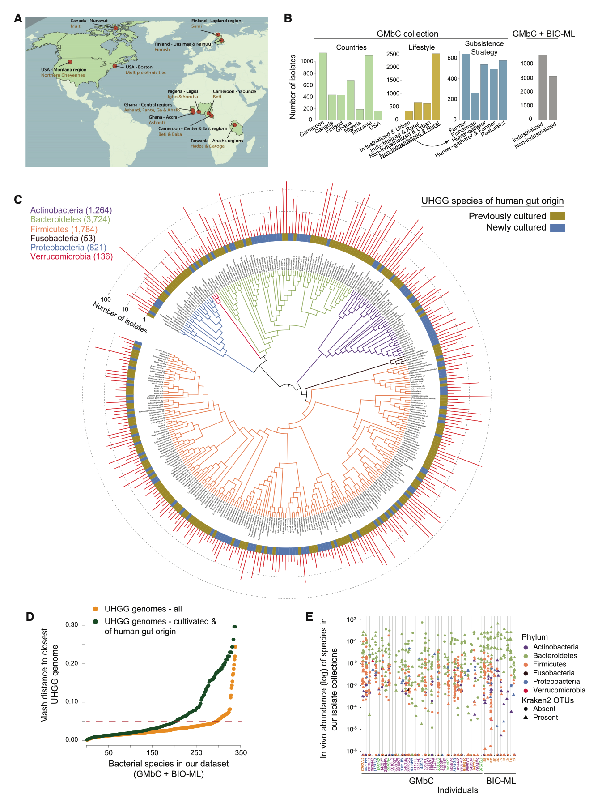
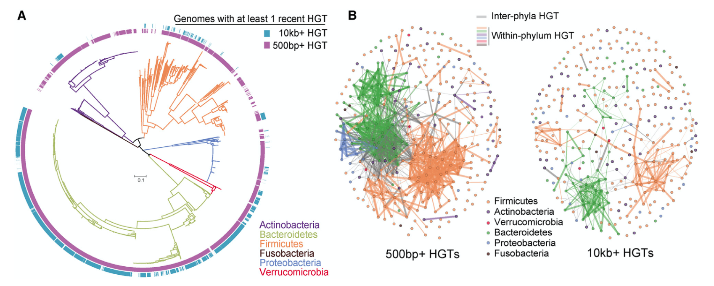
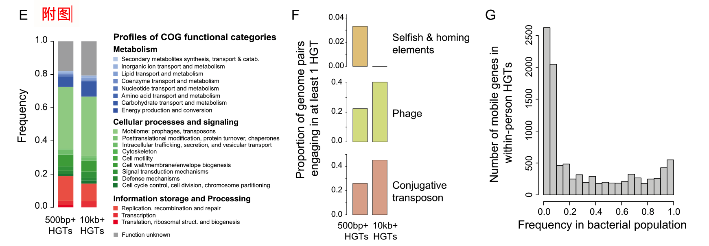
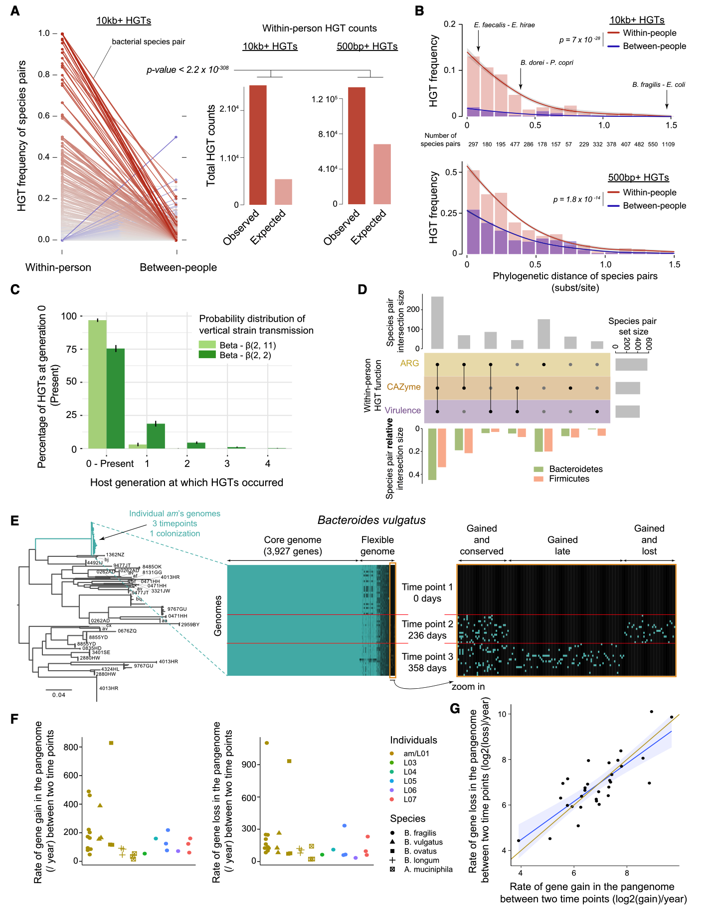
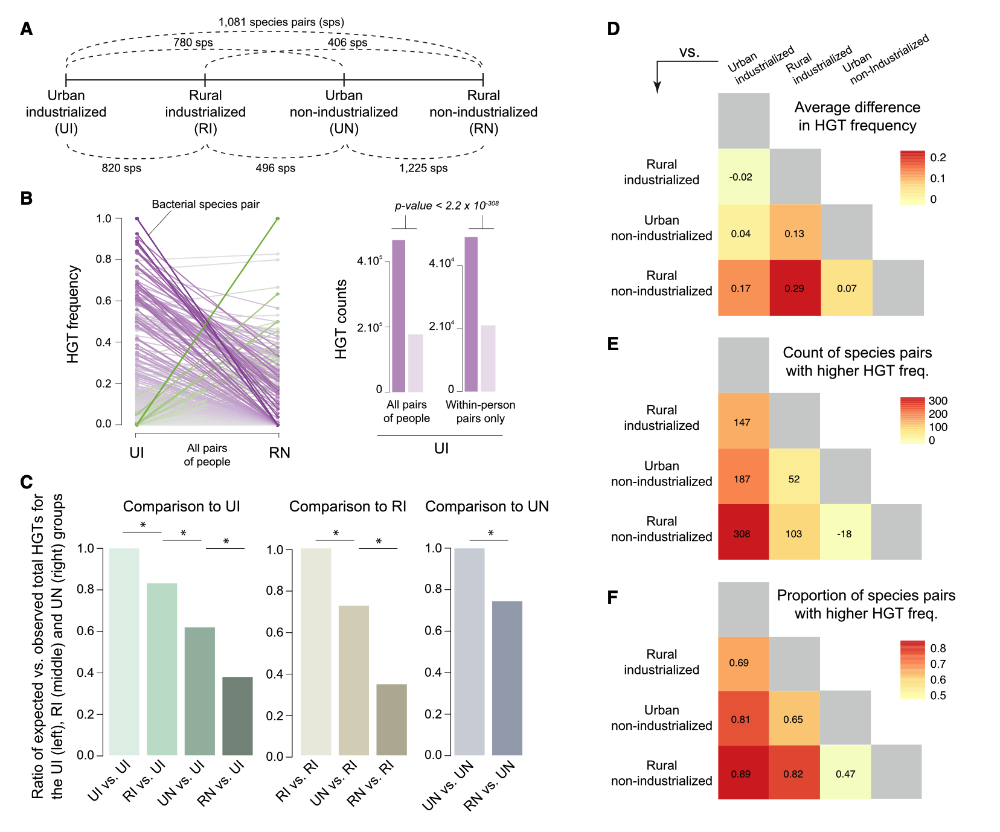
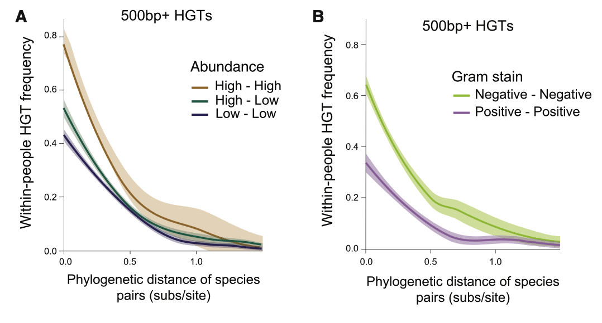
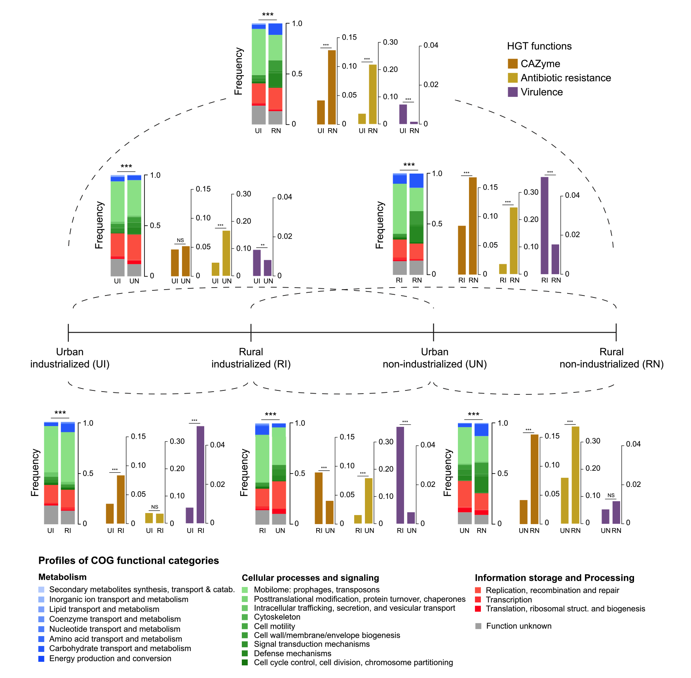

## Elevated rates of horizontal gene transfer in the industrialized human microbiome

来自全球15个种群的沿工业化梯度分布的微生物组分析表明，水平基因转移发生在短时间范围内，微生物群根据宿主的生活方式不断获得新的功能。

### Highlights

- 对来自全球人类的数千个肠道细菌基因组进行了测序
- HGT在每个人的肠道微生物组中高频率发生
- HGT在工业化和城市人口的微生物组中更常见
- 微生物组中转移的基因功能反映了宿主的生活方式

### Summary

工业化已经影响了人类肠道生态系统，导致微生物组组成和多样性发生了变化。细菌基因组是否也可以适应其宿主种群的工业化仍需大量研究。在这里，我们研究了水平基因转移（HGT）的速率和目标在不同工业化范围内的15个人群中成千上万个细菌菌株中变化的程度。我们显示，HGTs在最近的宿主世代中已在微生物组中积累，并且HGT在个体内以高频率发生。人群之间的比较表明，工业化的生活方式与较高的HGT率有关，而HG T的功能与宿主工业化水平有关。我们的结果表明，肠道细菌会根据宿主的生活方式不断获得新功能，而高水平的HGT可能是人类历史上与工业化相关的最新进展。

### Introduction

从非工业化生活方式向工业化生活方式的转变与肠道微生物组组成的变化和细菌物种多样性的降低有关。尽管这些变化的确切原因尚不清楚，但与工业化社会发展相关的因素，例如卫生，加工食品的消耗，剖腹产的频率更高以及抗生素的使用增加，可能在肠道微生物组的重塑中起着关键作用（Sonnenburg和Sonnenburg，2019a）。在个体从非工业化地区过渡到工业化地区后不久，肠道生态系统中的这些扰动就会发生并持续数年（Vangay et al。，2018），进一步证实-生活方式强烈影响着我们肠道微生物群系的功能。但是，与工业化生活方式相关的宿主和环境因素对单个肠道细菌基因组的影响尚不明确。

细菌可以使用水平基因转移（HGT）通过获取新功能来快速适应不稳定的环境。哺乳动物肠道细菌在数百万年的进化过程中经历了频繁的HGT事件（Hehe-mann等，2010； Smillie等，2011）。先前对特定细菌物种的研究表明，HGT可以在单个个体内的肠道微生物组中发生并保守（Coyne等人，2014; Garud等人，2019; Munck等人，2020; Yaffe和Relman， 2020年； Zhao等人，2019年； Zlitni等人，2020年），尤其是在针对目标功能（例如抗生素抗性）的选择强烈的情况下（Forsberg等人，2012年； Lopatkin等人，2017年； Modi等人） 。，2013）。然而，目前尚不清楚HGT是否会在个体的一生中广泛发生以影响肠道微生物组功能，例如对生活方式的重大改变，或者微生物群是否主要通过获取新菌株而获得新功能。以前曾观察到，单个细菌菌株可以在宿主微生物组中驻留数十年（Faith等，2013）。如果基因转移的速度足够快，那么就细菌种群而言``稳定''的微生物组（Faith等人，2013; Gibbons等人，2017; Mehta等人，2018）仍然可以进化通过HGT应对宿主-特定的环境干扰，也许是响应宿主生活方式的变化。

在先前的研究中（Smillie等人，2011），我们发现人类微生物组中高水平的HGTs涉及> 500 bp-长度序列，且> 99％的相似性。这些结果缺乏解决时间尺度和寄主生活方式所必需的时间分辨率和人口多样性。在较短的进化时间尺度上，许多细菌物种的替代率通常在~1 SNP /基因组/年的范围内（Didelot等人，2016; Drake，1991; Ducheˆne等人，2016; Zhao等人。 ，2019）。假设分子时钟近似，基因组大小为10^6 bp，则我们使用这些标准（> 500 bp，相似度> 99％）检测到的HGT与0到10,000年前发生的转移事件一致（请参见STAR方法）。跨物种和基因组区域的分子时钟变化可能会缩短或扩展此时间间隔。无论如何，我们以前的结果并不能约束HGT发生的日期，而不是发生在18-19世纪的现代工业化兴起之前（de Vries，1994）。为了回答共生菌株是否可以通过个体内的HGT频繁获得新功能的问题，以便在当代细菌基因组中检测到对工业化的最新适应性变化，需要对HGT的速率和程度进行更精确的估计。

现有参考分离株基因组（Browne等人，2016; Faith等人，2013; Forster等人，2019; Goodman等人，2011; Zou等人，2019）几乎完全来源于工业化种群，并且对于来自不同个体的绝大多数菌株，使得无法进行人内HGT的研究。在这里，我们介绍了全球微生物保护区（GMbC）分离物集合，该集合由来自各种工业化和非工业化种群的4,000多种培养，分离和测序的肠道细菌组成，包括来自单个个体的丰富菌株。我们使用这些基因组来研究人类历史上最近发生的基因转移的速率和模式。我们表明，HG Ts可以在个体内以高频率和异构频率发生，并且我们报告了工业化人群中基因转移的速率升高。

### Results

#### 来自全球肠道菌群的细菌分离基因组的多样化集合

我们对来自14个不同人群的37个个体的4149个肠道细菌进行了培养，分离和全基因组测序，它们分别具有不同的工业化水平（图1A和1B）。使用先前发布的方案，在厌氧条件下从粪便样本中分离细菌（Poyet等人，2019）。我们将这些G Mb C基因组与来自Broad Institute-开放生物群落微生物库（BIO-ML）的3,632个分离基因组进行了整合，我们最近从11个美国城市捐赠者那里获得了这些基因组（Poyet et al。，2019），产生了7,781个分离基因组的数据集。然后，我们根据两个不同的参数划分了48位个人的队列，我们将其定义为：“城市”与“农村”（基于当地人口密度）（SEDAC人口估算服务，2015年）和“ “工业化”与“非工业化”（基于国家一级的人类发展指数[HDI]）（联合国开发计划署，2020年）。为了进行此分析，我们将HDI用作工业化的代理，因为它反映了与健康和微生物组有关的参数，例如加工食品的消费，非传染性疾病的发病率，卫生基础设施和健康支出（联合国开发计划署，2020年）。该分类系统产生了四类不同的生活方式：农村非工业化-已试用，城市非工业化，农村工业化和城市工业化（有关人口元数据和微生物组com的描述，请参见图1 A，1 B，S1 A和S1 B和表S1） -职位）。非工业化的农村人口包括具有不同生存策略的人口，包括猎人，牧民，牧民，渔民和农民（图1 B）。

我们根据基因组相似性将7,781个分离基因组分组为物种簇，使用Mash距离作为平均核苷酸同一性的代理（请参见STAR方法）。该细菌鉴定出横跨6个门的339种细菌，分为73个已知属和88个未知属（有关培养数据和基因组装配统计信息，请参见图1 C和表S2）。将我们的基因组集合与统一的人类胃肠道基因组（UHGG）数据库进行比较（请参阅STAR方法； Almeida等人，第2021条），该数据库包含最大的人类肠道细菌基因组，我们发现我们的集合中有13％的物种在所有特征性UHGG物种（仅包括从宏基因组学数据定义的物种）中没有代表，并且41％在先前培养的人类肠道物种中没有代表（图1 D）。我们对每个人的93个分离基因组和17个物种的中位数进行了采样，涵盖了广泛的人内细菌分类法和体内丰度（图1 E；表S1），为HGT的高分辨率研究提供了人内基因组和生态多样性。

#### 个别肠道微生物群包含大量近期的HG T

我们首先检测并量化了人类历史上最近发生的HGT事件。。我们对所有基因组进行了筛选，筛选出了不同物种任何对基因组之间共享的100%相同的DNA大块，保留了大于500bp(以下称为“500bp+ HGTs”)或大于10kb(“10kb+ HGTs”)的DNA大块。与垂直遗传相比，HGT是对这些观察结果的最佳解释，因为不同物种高度保守和垂直遗传的核糖体基因之间的预期突变数远远超过了我们用于保留候选HGT的启发式阈值(0 SNP)(图S1C)。不包含任何突变的10-kb+ HGTs对应于发生在0到100年前的事件(参见星型方法)。因此，这些10kb+的HGTs很可能发生在最近的两到三代人类中，包括在抽样的个体中。我们通过过滤掉相对测序覆盖率较低的高通量基因组(即与考虑的两个基因组的覆盖率相比)，从分析中去除假定的污染物;(见星号法)，得到一组HGTs，中位数相对覆盖率为1.13(图S1D)。我们发现，90%(7,031/7,781)和53%(4,096/7,781)的基因组分别涉及至少一个500bp+ HGT和一个10kb+ HGT(图2A;表S3)，涵盖了分类群的多样性(图2B)。HGTs包括参与多种细胞、代谢和信息功能的基因(图S1E)，其中500bp+ HGTs和10kb+ HGTs分别富含自私元素和噬菌体/共轭转座子功能(图S1F)。人体内10kb+ HGTs携带的许多基因在每个宿主的细菌种群中以高频率分离，这表明潜在的固定(图S1G)。然而，大多数转移基因的发现频率较低，反映了它们最近在人群中获得(图S1G)。

为了测试这些HGTs最近是否发生，我们比较了从单个个体分离的细菌与从不同个体分离的相同细菌之间观察到的10kb+ HGTs的频率和数量(参见STAR方法)。我们假设，如果在单个微生物群系中频繁发生转移，那么我们将观察到从单一宿主分离的菌株之间更高水平的转移。或者，如果转移很少发生(即，速度慢于菌株转换)，那么我们就会观察到，无论是否从同一宿主分离，细菌间的HGT水平是相似的。重要的是，人体内和人与人之间的HGT都包括一些更古老的HGT的背景水平(例如，进化非常缓慢的基因组区域，但在超过10kb以上的区域内仍然100%相似)，这并不是由目前微生物群系中共存物种之间的直接共享所导致的。然而，直接共享基因的细菌物种，只能在人与人之间的比较中发现。人内部和人之间的HGT的差异反映了个体内部最近发生的HGT，因此可以量化。我们发现个体内取样的细菌物种对比从两个不同的人身上取样的相同物种对更有可能共享最近转移的DNA;利用泊松分布，我们将个体内采样的成对物种的高通量事件观察计数与基于个体间相同物种配对高通量事件频率的期望值进行了比较(图3A;p值< 2.2 3 10308)。这种比较使我们能够纠正两种类型(个人内部与个人之间)的基因组和个体配对的数量差异(参见STAR方法中的统计分析)。我们也随机,采样的不平等的采样数据,进一步控制基因在个体对(看到明星统计分析方法),证实了观察HGT计数在个人高于预期高度数(100个随机复制,威尔士t测试,t = 259.56, df = 102.44,p值= 3.3 3 10146;见表S4)。

接下来，我们控制了系统发育对这一结果的影响，因为更近缘的物种更有可能参与HGT (Smillie et al.， 2011)，并且可能在人内和人之间的类别中不均匀分布。在我们的数据中，系统发育相关性与HGT频率(广义线性混合效应[GLME]模型;n (spe- cies pairs) = 3,667;优势比[OR] = 0.02;95%置信区间- val [CI] = 0.01-0.06;结合似然比检验([LRT]， c2 = 62.96;p值= 2.1 3 1015)，但不混淆我们的结果;人内HGT显著高于人间HGT (Fisher 's method;对于10kb+ HGTs, c2 = 204.5, p值= 7 3 10-28;c2 = 149.1, p值= 1.8 3 10-14 500bp+ HGTs(图3B)。此外，当观察较大的500bp+ HGTs集时，也可以观察到较高水平的人体内HGTs(泊松分布，p值< 2.2 3 10308)(图3A和S2J)。我们还调查了我们在总体水平上观察到的较高的人体内HGT是否也存在于个体人群中。我们对每一个抽样的国家或种族群体分别进行分析，发现这一观察结果在每一个个体群体中都得到了重复(图S2A-S2I)。

此外，我们控制了细菌体外培养对HG Ts定量的影响，因为在同一平板上或在存在抗生素的情况下共同培养的细菌可能会遇到不能反映体内事件的HG Ts。对于在同一平板上或在存在抗生素的情况下生长的基因组对，我们没有发现HGT的任何显着增加（有关所有统计比较，请参见STAR方法和表S4）。

与预期值相比，个体内部HGT富集的信号表明，近来从事HGT的细菌种类繁多，而HG Ts可以在细菌全基因组中迅速积累。严格来说，我们仍无法区分原籍国发生的个别转移与原籍父母甚至祖父母的转移。但是，必须观察到与过去的HG T有关的物种之间的宿主代际共传，才能观察到当今微生物组中的古老HGT事件。要在我们的分析中计算，这些HG T也必须不经历任何突变。我们使用一种模拟方法来量化起源宿主（第0代，目前已采样）中的HG Ts数量，这些数量代表过去的HGT事件起源于前几代，并且没有经历任何突变（请参见STAR方法）。我们使用先前公布的母婴传播率，估计为16％（Ferretti et al。，2018），以在我们的模拟中固定代际物种传播率。我们还使用跨世代的物种传播的50％的更极端比率来模拟数据。我们发现，HG Ts的数量在几代人之间迅速衰减（图3 C）。总体而言，目前世代观察到的源自远古世代的100％相似HG T的量为3％，垂直物种传播的概率为16％，而考虑到50％物种传播的极端概率，则为25％。这些结果有力地表明，在人与人之间的比较中发现的绝大多数HG T发生在这一代（即每个被采样个体的一生中）。

接下来，我们调查了在人类内部，细菌是否参与了可能影响细菌代谢或宿主生理的基因功能的转移。为了测试这一点，我们研究了人内转移的基因，这些基因涉及抗生素抗性（抗生素抗性基因[AR Gs]），碳水化合物降解（碳水化合物活性酶[CA Zyme]）和毒力。我们发现数百种物种对参与了这三种功能中至少一种的转移，大多数物种对交换了多种功能（图3 D），这一观察结果与Firmicutes和Bacteroides物种对都相关（图3 D）。

#### 细菌物种在个体中以高频率和异源频率获取基因

接下来，我们假设，如果细菌在每个人中频繁获取新基因，那么其泛基因组应随时间显示出强烈的基因含量变化。为了直接测量人内基因获取的速率，我们分析了先前的两项研究中在$ 6–18个月的过程中纵向采样的分离基因组的基因谱：五个物种的198个分离基因组（脆弱拟杆菌，细菌-oides在一个个体（Poyet等人，2019）中取样的寻常型，卵形拟杆菌，长双歧杆菌和黏性阿克曼氏菌和另外五个样本中的191个脆弱类拟杆菌分离基因组（Zhao等，2019;图3E和S3;表S5）。由于时间点之间的菌株替换可以促进基因组多样性，因此我们使用了SN Ps和系统发育重建，将我们对基因库动态的定量分析仅限于紧密相关的基因组进化枝，这些基因组在肠道最初定居后在其宿主内发生了分化。 （参见STAR方法，图3 E和S3，以及在Zhao等人，2019中重建的系统树）。我们还控制了时间点之间的基因组集大小和基因组覆盖率的差异（请参见STAR方法和图S3 J），并考虑了单个基因水平的已读覆盖率信息，以得出最终的基因存在/不存在情况。给定的基因组（请参阅STAR方法）。我们首先对在任何两个时间点之间这五个物种的基因组中新基因的获得率进行了定量。对于单个个体中的每个物种，我们发现全基因组中的基因获取率随着时间的推移是异质的（图3 F），每年的基因获取量从几十到数百不等。这表明基因转移不会像时钟一样累积，可能是因为一个HGT事件可能包含单个基因或大质粒。我们的结果进一步表明，全基因组每年的平均基因获得率在不同物种之间是异质的。与长双歧杆菌和黏液曲霉相比，拟杆菌属物种在其基因组中获得新基因的频率更高（寻常双歧杆菌为238±132个基因/年，卵形双歧杆菌为353±412个基因/年，以及161±124个基因/年与脆弱双歧杆菌相比，长双歧杆菌为74±25个基因/年，粘液曲霉为34±20个基因/年（图3 F；表S5）。这些速率是根据纵向数据直接估算的，与根据我们在图3 A中的横截面推论得出的速率相似。使用一组人内HG Ts，我们计算了涉及B的所有基因组对的平均HGT频率寻常型，卵形芽孢杆菌，脆弱芽孢杆菌，长芽孢杆菌和粘液芽孢杆菌。我们证实，与长双歧杆菌和黏液曲霉相比，拟杆菌属细菌在HGT中的参与频率更高，对于10 kb +寻常型B. HG Ts，HGT的平均HGT频率分别为2.2％，2.3％，0.85％，0.04％和0.06％。卵形芽孢杆菌，脆弱芽孢杆菌，长双歧杆菌和粘液芽孢杆菌分别对500bp + HG Ts分别为8.6％，10.1％，6.0％，0.81％和1.64％。不出所料，基因获得率与基因丧失率密切相关（图3 G； Spearman相关，S = 1,188，rho = 0.76，p值= 2.3 3 10 6），最终保持了总体蛋白质组大小（Mira）等人，2001）。总而言之，我们的结果表明，每个个体宿主的肠道微生物组中各种基因功能的水平交换速度可能很高，足以在个体的一生中重塑肠道细菌种群的功能。

#### HGT在工业化人群的肠道微生物群中以较高的频率发生

发现HGT在个人中频繁发生后，我们接下来研究了HGT速率和功能在具有不同工业化水平的人群中变化的程度。为此，我们研究了数据集中沿工业化和城市化梯度由人口群体对共享的细菌物种对，其中包括四个生活方式类别（图4 A；表S1和S6）。这种方法使我们能够比较生活方式差异较大和差异较小的人群。该分析还将HGT比较限制在两个宿主种群之间共享的物种对中。因此，我们在分析中使用了更为广泛的HGT定义（500bp + HG Ts集合），以弥补由于一次比较两个种群而造成的统计能力的损失。

我们发现，与在农村非工业化群体中发生的情况相比，在城市工业化种群中采样的物种对交换基因的频率更高。根据农村非工业化种群中相同物种对的HGT频率，将城市工业化物种对中观测到的HG Ts与预期事件数量进行比较（p值<2.2 3 10 308） ）（图-4 B）。这些结果表明，是对人内HG T和人间HG T进行平均，还是仅对人HG T进行平均（图4 B）。。我们还对数据进行了随机下采样，以控制各个对之间不平等的基因组采样（请参阅STAR方法中的统计分析），这证实了在城市工业化组中观察到的HGT计数高于预期的HGT计数（100次随机重复，威尔士t测试，t = 225.04，自由度[df] = 154.8，p值= 1.2 3 10 196；请参见表S4）。为了检查这些影响是否是由离群的个体而不是人口水平的差异所驱动的，我们对各个群体的成员进行了混洗（通过混洗个体或成对的个体的生活方式），然后重新进行了分析。真正的城市工业化队列的HGT率仍然明显高于随机创建的组（每个组1,000个排列，p值<0.001；见图S4）。当将分析仅限于农村非工业化队列中的每种生存策略（例如，猎人-采集者，牧民或农民）时，这种效果也保持不变，我们将其与城市工业化群体进行了单独比较（图S5 A–S5 D）。

沿着我们的生活方式梯度（图4 A），我们始终发现，在所有成对分组的比较中，工业化和/或城市人口中HG T的发生频率要高得多（图4 C和S5 E）。在不同的比较指标（例如HGT频率的平均差异以及具有较高HGT频率的物种对的数量和比例）中观察到了这种效果（图4 D–4 F）。

然后，我们控制了可能混淆生活方式对HGT频率影响的不同微生物和生态因素，例如细菌系统发育，细菌细胞壁结构，更重要的是，队列之间物种丰富度的差异。我们假设在给定生态系统中，成对的高度丰富的物种与涉及至少一种低丰度物种的物种相比，具有更高的基因交换概率，而与它们的系统发生距离无关。该假设从未得到过直接检验，因为尚不存在将深度基因组采样与准确的丰度估计值配对的数据集。为了检验丰度假设，我们计算了每个人中每种细菌物种的平均丰度（请参阅STAR方法和图1 E）。为了测试细胞壁结构的效果，我们将每种细菌的参考革兰氏染色数据用作细胞壁结构的代理。我们在完整的数据集上使用GLME模型和LR Ts来衡量宿主生活方式对HGT频率的影响，同时也考虑了上述因素（请参见STAR方法）。我们证实生活方式与HGT频率之间存在显着关联（n（物种对）= 10,104；工业化生活方式的OR = 1.99； 95％CI = 1.96–2.03； LRT，c2 = 6629.4，p值<2.2 3 10 308） 。我们还发现，物种丰富度是HGT的重要决定因素（n = 10,104；对于低丰度物种而言，OR = 0.40； 95％CI = 0.39–0.43； LRT，c2 = 3225.4，p值<2.2 3 10 308） ，即使考虑了GLME模型中其他因素的影响（图5 A）。丰富的细菌更有可能与其他丰富的细菌一起参与HGT，这与HGT的经典机制（例如，缀合，转化和转导； Thomas和Nielsen，2005）一致，涉及细胞间的接触或获取环境中的自由DNA。此外，我们发现革兰氏阴性细菌比HG阳性细菌参与HG Ts的频率更高（N = 10,104； OR革兰氏阴性细菌= 9.2； 95％CI = 6.6-12.8； LRT，c2 = 166.3，p值＝ 4.7 3 10 38；图5B）。这个有趣的结果激发了进一步的研究，以了解驱动肠道革兰氏阴性菌之间HGT发生率增加的机制。

#### 最近的HGT的功能反映了主人的生活方式

我们认为，如果HGT可以响应宿主生活方式的变化而迅速发生，那么被转移的基因类型应该反映与不同种群相关的选择压力（Brito等人，2016）。我们首先使用跨不同生活方式发现的物种对，比较了广泛定义的功能类别中的HGTs概况。我们发现HGT功能存在显着差异，与其他生活方式相比，农村非工业化人群具有最不同的特征（图6； c2良好度-适应度检验，p值<0.001）。

然后，我们重点研究了可能在不同人群中具有关键功能的基因，例如抗生素抗性，CA Zyme和毒力基因。我们还研究了涉及移动遗传系统功能的基因（例如噬菌体，质粒和转座子）。我们发现，工业化种群中的肠道细菌倾向于对涉及质粒和转座子的基因进行更高的基因交换率（图S6 B；两个比例的Z-测试，校正后的p值<0.001）。这一发现与我们在这些个体的肠道微生物组中观察到的HGT升高率一致（图4）。在几乎所有比较中，非工业化人群通常消耗大量不易消化的纤维（Makki等人，2018年; Smits等人，2017年），其肠道细菌交换CA Zyme基因的频率高于工业化和/或或城市地区（图6）。在城市和农村非工业化人群的肠道菌群中也发现了抗生素抗性基因的高转移率，这与中低收入国家AR Gs的较高环境流行率相关（Hendriksen等人，2019年; Pehrsson等人。等人，2016年）。这与研究表明来自中低收入地区的牲畜的抗菌素耐药性正在增加的研究进一步一致（Van Boeckel等人，2019）。

