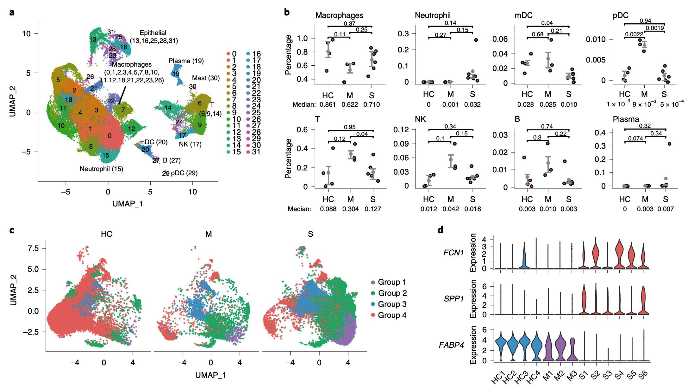
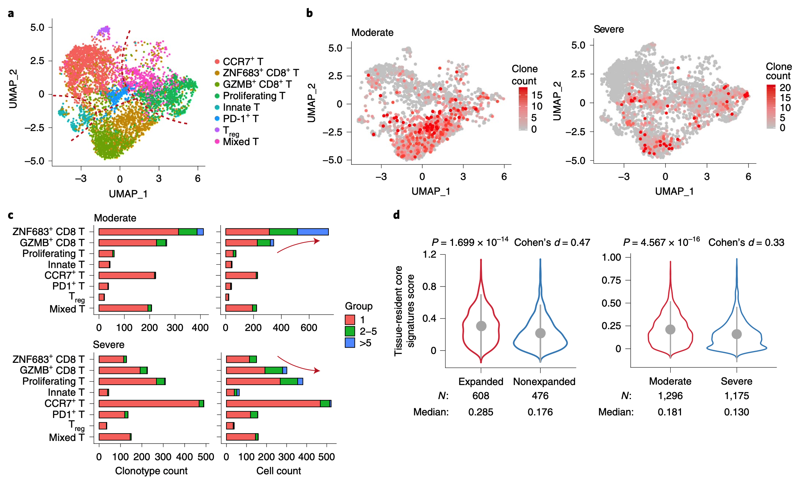
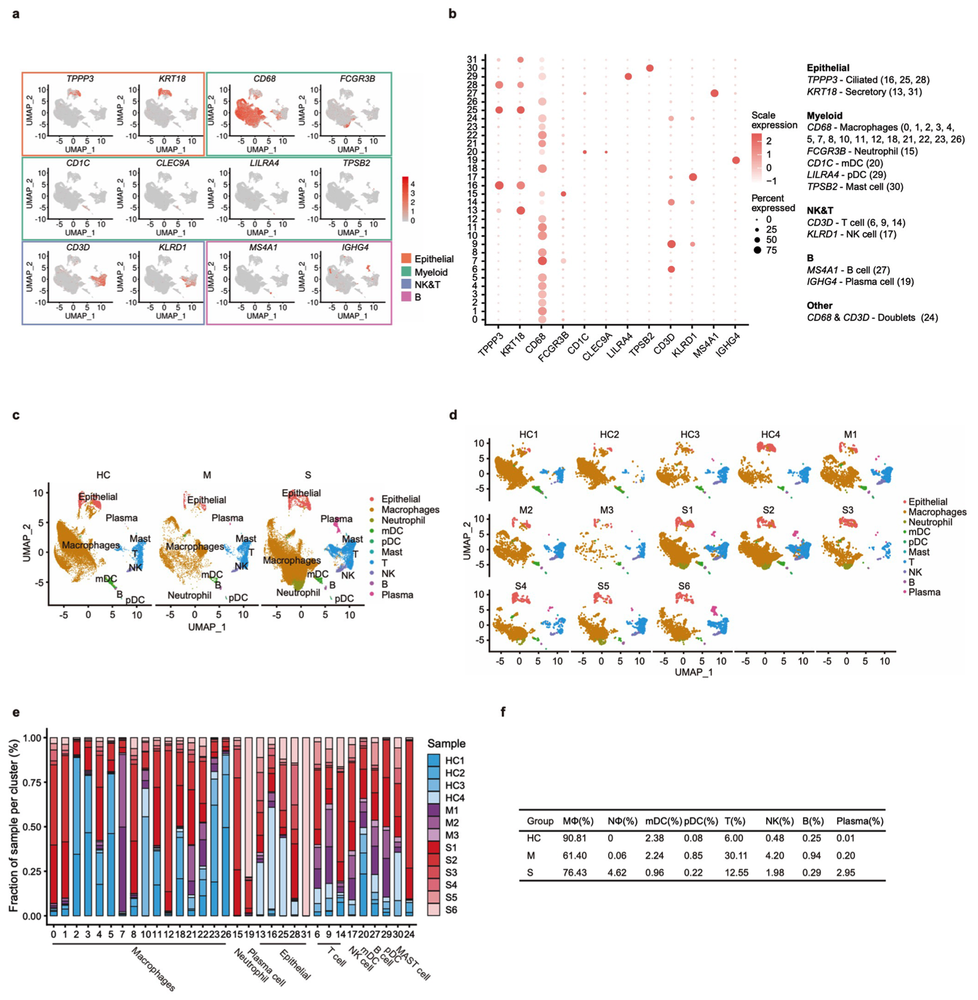
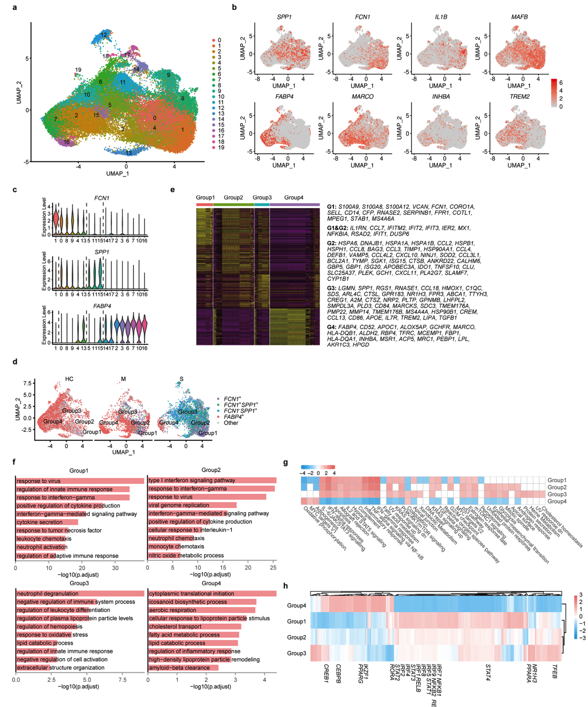
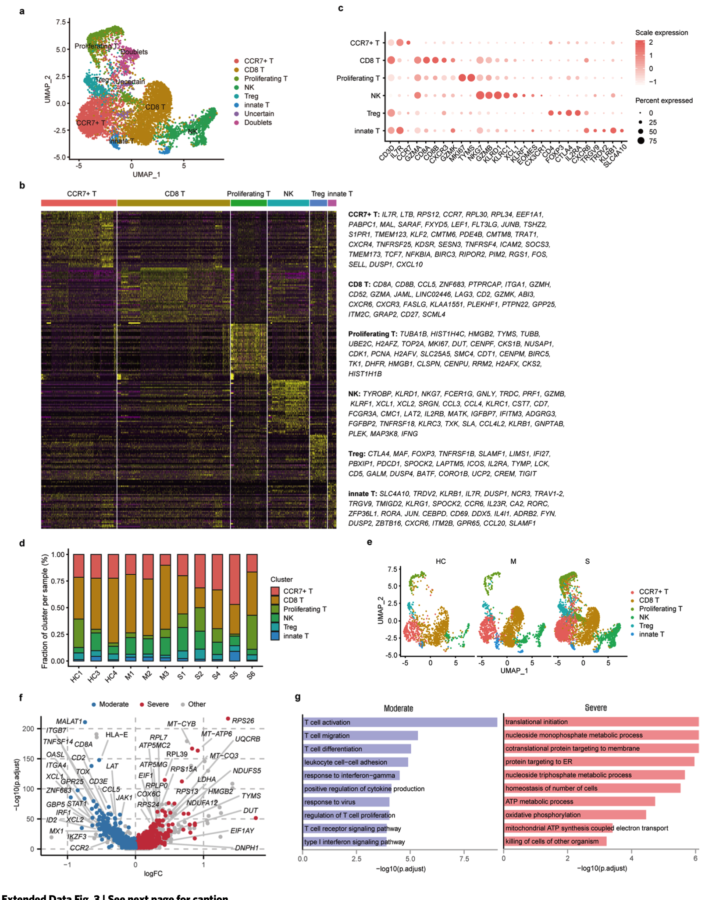
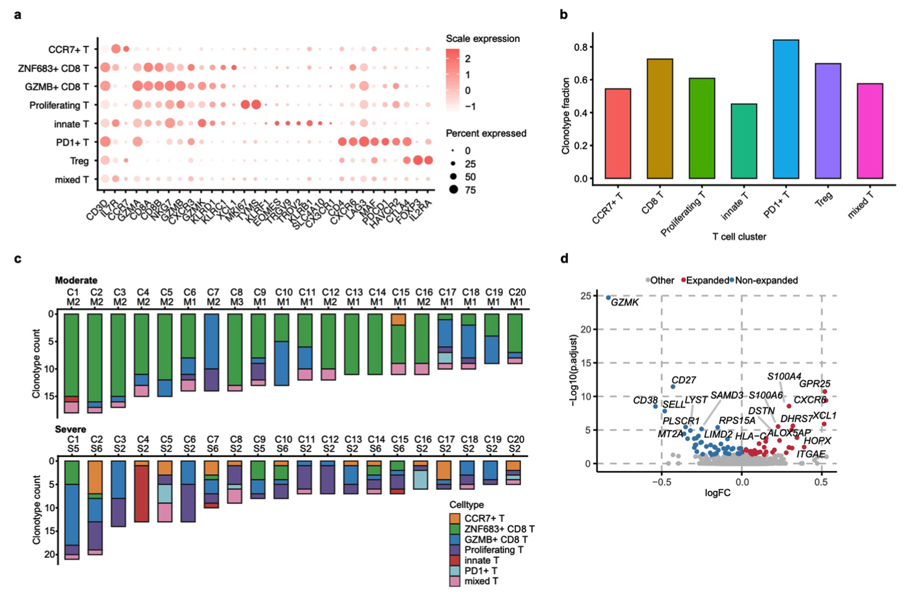
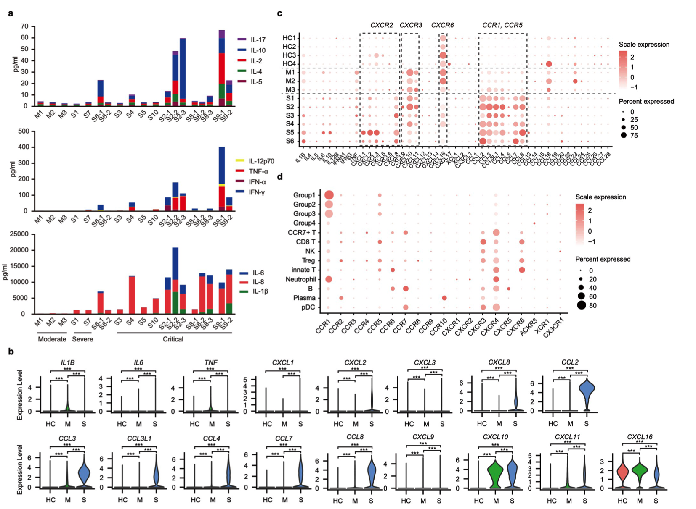

## 新冠患者的支气管肺泡免疫细胞单细胞景观

### Abstract

目前尚不清楚与2019年冠状病毒病（COVID-19）严重程度相关的呼吸道免疫特征。通过使用单细胞RNA测序，我们对COVID-19严重程度不同的患者和健康人的支气管肺泡灌洗液免疫细胞进行了表征。严重COVID-9患者的支气管肺泡灌洗液中存在促炎性单核细胞衍生的巨噬细胞丰富。中度病例的特征是存在高度克隆扩增的CD8 + T细胞。该支气管肺泡免疫微环境图集提示了COVID-19发病机理和恢复的潜在机制。

### Main

尚不清楚对严重急性呼吸道综合征（SARS）-CoV2的潜在免疫反应。在冠状病毒动物感染模型1,2中已经报告了异常的免疫反应，而淋巴细胞减少症是严重COVID-19的突出特征（参考文献3）。支气管肺泡灌洗液（BALF）包含有关细支气管和肺泡的微环境信息。在这里，我们对三名COVID-19（M1-M3）中度患者，六名严重/危重感染（S1-S6），三名健康对照（HC1）的BALF细胞进行了单细胞RNA测序（sc RNA-seq） –HC3）和可公开获得的BALF（HC4）4样品（补充表1和2）。聚类分析显示31个不同的簇，由巨噬细胞（CD68），嗜中性粒细胞（FCGR3 B），骨髓树突状细胞（m D Cs）（CD1 C，CLEC9 A），血浆-巨噬细胞树突状细胞（p D Cs）（LILRA4），天然由特征基因鉴定的杀伤（NK）细胞（KLRD1），T细胞（CD3 D），B细胞（MS4 A1），浆细胞（IGHG4）和上皮细胞（TPPP3，KRT18）（图1a）（Extended Data Fig 1a，b）。主要的细胞类型，包括m D Cs，p D Cs，肥大细胞，NK细胞，T细胞和B细胞，都包含来自大多数样品的细胞，而巨噬细胞在不同的组中表现出特异性富集（扩展数据图1c-e）。与中度感染患者相比，重度/严重COVID-19感染患者的BAL Fs包含更高比例的巨噬细胞和中性粒细胞，以及更低比例的m D Cs，p D Cs和T细胞（图1b和扩展数据图1f）。

我们重新聚类了20个巨噬细胞亚簇，以进一步剖析它们的异质性（Extended Data图2a）。根据最近的分类标准4和典型标记（扩展数据图2b），巨噬细胞按FCN1，SPP1和FABP4表达模式分组，包括FCN1hi组1，FCN1lo SPP1 +组2，SPP1 +组3和FABP4 +组4巨噬细胞（扩展数据图2c）。在不同的细胞组中，巨噬细胞区室在FCN1，SPP1和FABP4的组成和表达上都存在很大差异（图1c和图2d的扩展数据）。对照组和中度感染患者优先表达FABP4，而重症/重度感染患者则高度表达FCN1和SPP1（图1d）。我们在细胞组之间进行了差异表达基因（DEG）分析（扩展数据图2e），基因本体论（GO）分析和基因集富集分析（GSEA）（扩展数据图2f）。第1组表达外周单核细胞-类似于标记S100 A8，FCN1和CD14，第2组表达高水平的趋化因子CCL2，CCL3，CXCL10和其他基因。两组均具有暗示经典M1-巨噬细胞的基因表达模式。第3组表达免疫调节基因A2M，GPR183和CCL13以及促纤维化基因TREM2，TGFB1和SPP1，提示替代性M2-巨噬细胞是一种修复但具有纤维化的子集5。第4组表达肺泡巨噬细胞（AM）基因FABP4，APOC1，MARCO和与脂质代谢功能相关的基因6，并且在对照组和中度病例的BAL Fs中富集，但在严重病例中不丰富（扩展数据图2f，g）。使用SCENIC，我们发现第1组和第2组中转录因子基因NFκB，STAT1，STAT2和干扰素（IFN）调节因子的表达增强，M2促进了第3组中的TFEB，NR1 H3，PPARA和CREB1活性，以及AM-第4组巨噬细胞中的特定PPARG和CEBPB（扩展数据图2h和方法）。这些发现表明，重度COVID-19患者的肺部存在高度促炎的巨噬细胞微环境，这与以前在稳态，炎症和恢复过程中对巨噬细胞种群的认识一致。在SARS8患者中已观察到记忆性T细胞反应，这对于解决小鼠SARS-Co V感染是必要的9,10。我们根据规范基因的表达（扩展数据图3b，c）确定了T和NK淋巴细胞的六个主要簇（扩展数据图3a）。与中度感染患者相比，重度/严重感染患者的CD8 + T细胞含量较低，而增殖性T细胞的比例较高（扩展数据图3d，e）。这些CD8 + T细胞表达较高水平的GZMA，GZMK和FASLG以及组织-驻留标志物ITGA1，CXCR6和JAML（扩展数据图3f），并在中等水平上激活，活化和迁移及细胞因子相关途径的相关基因。严重情况下的翻译和翻译起始，细胞稳态和核苷代谢途径（扩展数据图3g）。

我们使用来自COVID-19患者的BALF的七个T细胞簇的单细胞T细胞受体测序（sc TCR-seq）进一步评估了T细胞克隆扩增（图2a和扩展数据图4a）。每个患者的T细胞中66.9％（26.6–87.3％）的TCR克隆型和每个T细胞簇中60.9％（45.2–84.2％）的细胞可获得TCR克隆型（补充表2和扩展数据图4b）。在均匀流形逼近和投影（UMAP）上，克隆扩展的T细胞的投影显示出聚集分布，表明中度感染患者的转录均一性与扩散分布表明严重/严重感染患者的转录异质性（图2b）。 ）。中度感染与重度/严重感染患者的CD8 + T细胞簇之间的细胞数量和克隆扩增不同（图2c）。来自中度感染患者的ZNF683 + CD8 + T细胞超过50％属于扩增的克隆，显示出比具有严重/严重感染患者的ZNF683 + CD8 + T细胞更高的扩增指数（> 5个细胞）（图2c）。在排名前20位的单个克隆中（补充表3），中度感染患者的大多数细胞属于ZNF683 +簇，但在重度/重度感染患者中表现出多种表达模式（扩展数据图4c）。 ZNF683 +-在中度感染患者中富集的扩增克隆可能代表SARS-Co V-2-特异性CD8 + T细胞。这些扩展的克隆优先表达组织-驻留基因，包括XCL1，CXCR6和ITGAE（扩展数据图4d）。在中度感染患者中，CD8 + T细胞扩增组和未扩增细胞中的核心组织-驻留基因得分较高，而中度和重度/重度感染患者中CD8 + T细胞总数更高（图2d）。总体而言，我们的数据表明，来自重症/重症感染患者的BAL Fs中CD8 + T细胞的扩增较少，增殖性和表型异质性更高，而在组织中存在较大比例的具有组织-驻留和高度扩展特征的CD8 + T细胞效应子。中度感染患者的BAL Fs。最后，我们在COVID-19的患者的BALF中测量了几种细胞因子和趋化因子（补充表1和4）。与中度COVID-19感染的患者相比，重症/重度感染患者的BAL Fs中炎性细胞因子水平高得多，尤其是白介素（IL）-8，IL-6和IL-1β（扩展数据图5a）。严重感染的三名患者（S1，S8和S9）表现出持续高水平的细胞因子。在sc RNA-seq数据中，来自严重COVID-19感染患者的肺巨噬细胞中IL1 B，IL6，TNF和各种化学因子（CCL2，CCL3，CCL4和CCL7）的表达水平较高。在两个COVID-19组中，CXCL9，CXCL10和CXCL11的水平均比健康人高得多，但其产品与CXCR6结合的CXCL16在中度感染而非重度感染的患者中表达更高（扩展数据图5b，c）。我们还检查了COVID-19患者中其他上调趋化因子的相应受体（扩展数据图5d）。这些数据表明，重度COVID-19感染患者的肺巨噬细胞可能通过CCR1和CXCR2募集炎性单核细胞和中性粒细胞，从而促进局部炎症，而中度COVID-19感染患者的巨噬细胞通过参与吸引更多的T细胞吸引趋化因子。 CXCR3和CXCR6。

连同先前的研究[3,12–14]，我们的数据表明细胞因子风暴与COVID-19中的疾病严重程度有关。感染。此外，由于细胞数少，无法分析B细胞反应。年龄，既存疾病和免疫调节疗法的影响尚无法完全评估。然而，这种支气管肺泡免疫细胞的情况揭示了在COVID-19中潜在的免疫巨噬细胞巨噬细胞和T细胞应答异常。

#### Extended Fig

1

2

3

4

5

