# 有助于复杂性状和疾病遗传力的多聚腺苷酸化定量性状位点图集

---

全基因组关联研究已经鉴定出数千种与人类特征和疾病相关的非编码变异。然而，这些变体的功能解释是一个重大挑战。在这里，我们构建了人类3'UTR替代多腺苷酸化（APA）定量性状基因座（3'aQTLs）的多组织图谱，其中包含与靶基因APA相关的约40万个常见遗传变异，在46中进行了鉴定。从467个个体（基因型-组织表达计划）中分离出的组织。从机制上讲，3'aQTLs可以改变poly（A）基序，RNA二级结构和RNA结合蛋白结合位点，从而导致数千次APA变化。我们基于CRISPR的实验表明，此类3'aQTLs可以改变APA调节。此外，我们证明定位3'aQTLs可以识别APA调节剂，例如La相关蛋白4。最后，3'aQTLs与大约16.1％的性状相关变体共定位，并且与其他QTLs截然不同，例如表达QTLs。在一起，我们的研究结果表明3'aQTLs很大程度上有助于人类复杂性状和疾病的分子机制。

## Main

全基因组关联研究（GWAS）已鉴定出数千种与数量性状和常见疾病有关的遗传变异。然而，绝大多数变体发生在非编码区，从而在试图阐明这些变体通过何种机制促成疾病和表型的分子机制时面临重大挑战。为了提供GWAS基因座的功能解释，研究人员建议采用几种分子QTL分析，包括表达QTLs（eQTLs）1，这是与一个或多个基因表达相关的遗传变异。尽管这些遗传变异可以提供信息，并且在许多情况下被认为会影响附近基因的转录，但仍无法解释大部分性状相关非编码变异所起的作用2。

在大多数人类基因的转录后调控中，APA起着重要作用。通过使用不同的聚腺苷酸化（poly（A））位点，基因可以缩短或扩展包含顺式调控元件的3'UTR，例如微RNas（miRNA）或RNA结合蛋白（RBP）结合位点3。因此，APA可以影响靶信使RNA的稳定性和翻译效率以及蛋白质的细胞定位4。聚（A）位点的多样化景观会极大地影响正常的发展和疾病的发展，例如癌症5。胶体母细胞瘤6和特发性肺纤维化等疾病中，关键的APA调节剂NUDT21的表达改变，很好地说明了可替代的聚腺苷酸化的广泛重要性。最近，我们的工作揭示了对APA的细微差别，因为乳腺癌中3'UTR缩短通过破坏竞争性内源性RNA串扰来反式抑制肿瘤抑制基因8。

除了与基因表达相关外，遗传变异还被认为是某些细胞系中单个基因的APA9,10的关键调控因子。此外，APA相关的遗传变化与多种疾病状态的发展相关，包括癌症11，α-地中海贫血12，面肩肱肱肌营养不良症13，骨脆性14，新生儿糖尿病15和系统性红斑狼疮16,17。作为这些研究的主要例子，IRF53'UTR中的一个SNP（rs10954213）可以改变3'UTR长度并影响mRNA的稳定性17，这可能进一步导致系统性红斑狼疮易感性。除了少数几个孤立的例子之外，尚未系统地研究影响人类各种组织中APA的遗传决定因素的广泛含义以及它们与表型特征和疾病的关系。

先前的研究使用3'-末端分析法确定了APA相关的SNP，但尚未广泛采用。因此，这些方法仅适用于小样本量9,18。相反，在eQTL研究期间，RNA测序（RNA-seq）已被广泛使用。但是，只有少数RNA-seq数据以系统地识别和定量APA事件的方式进行了分析19。为了深入了解人体组织中APA调控的遗传基础，我们使用了动态分析-RNA-seq（DaPars）算法对APA进行了动态分析20，使用8,277RNA-seq数据集，加上来自46个组织的全基因组测序基因型数据，并通过基因型组织表达计划（GTEx）1从467个个体中分离出来。我们总共鉴定了403,215个与APA相关的顺式作用遗传变异体（3'a变异体），它们在至少1个组织中与16.1％的性状相关变异体共定位。总体而言，我们的研究结果表明3'aQTLs揭示了一种新兴的分子表型的遗传结构，可用于解释在编码区以外发现的人类遗传变异的重要部分。

## Results

### Anatlasofhuman3′aQTLs

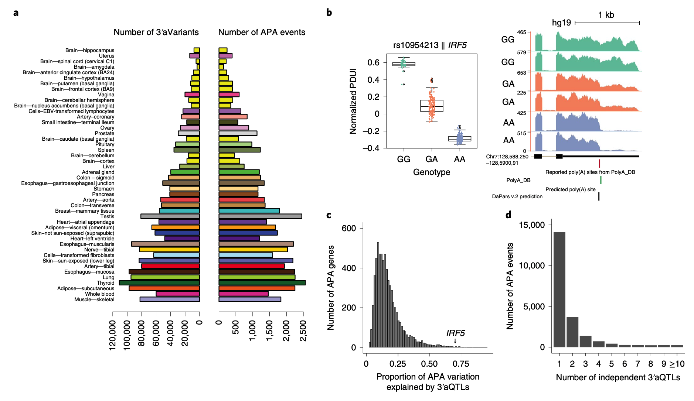

为了检测主要人类组织中的全球APA事件，我们使用了DaParsv.2.0算法，追溯性地直接鉴定了来自GTExv.7项目的46种组织中的8,277个标准RNA-seq样本。多样本DaParsv.2回归框架计算每个样本中每个基因的远端poly（A）站点使用指数（PDUI）值的百分比年龄（补充图1）。然后，在校正了包括性别，测序平台，群体结构，RNA完整性数和推断的技术协变量在内的已知协变量后，可以使用表达残差（PEER）因子对PDUI值进行进一步的标准化21。推断的PEER因子与每个样品和供体的几个已知协变量密切相关（扩展数据，图1-3）。然后，我们使用MatrixeQTL来识别与每个组织中差异3'UTR用法（3'aQTLs）相关的常见遗传变异（方法）。具有3'aQTL的基因称为3'a基因，相应的显着变异体称为3'a变异体。使用5％的错误发现率（FDR）阈值，我们确定了遍及46个组织的11,613个3'a基因相关的403,215个3'a变体，约占注释基因的51％（图1a）。在所有组织中，我们发现在至少1个组织中检测到56.7％的蛋白质编码和26.1％的长非编码RNA基因（补充图2）。具有最高3'aQTL数量的组织倾向于具有更大的样本量（补充表1）。3'aQTL数量与样本量之间的这种强关联表明，随着可获得的其他RNA-seq数据集，将继续发现其他APA事件和3'aQTLs。此外，我们对近期饱和诱变数据的整体分析23显示，3'aQTLs在导致更显着的APA变化的变体中更富集（扩展数据，图4）。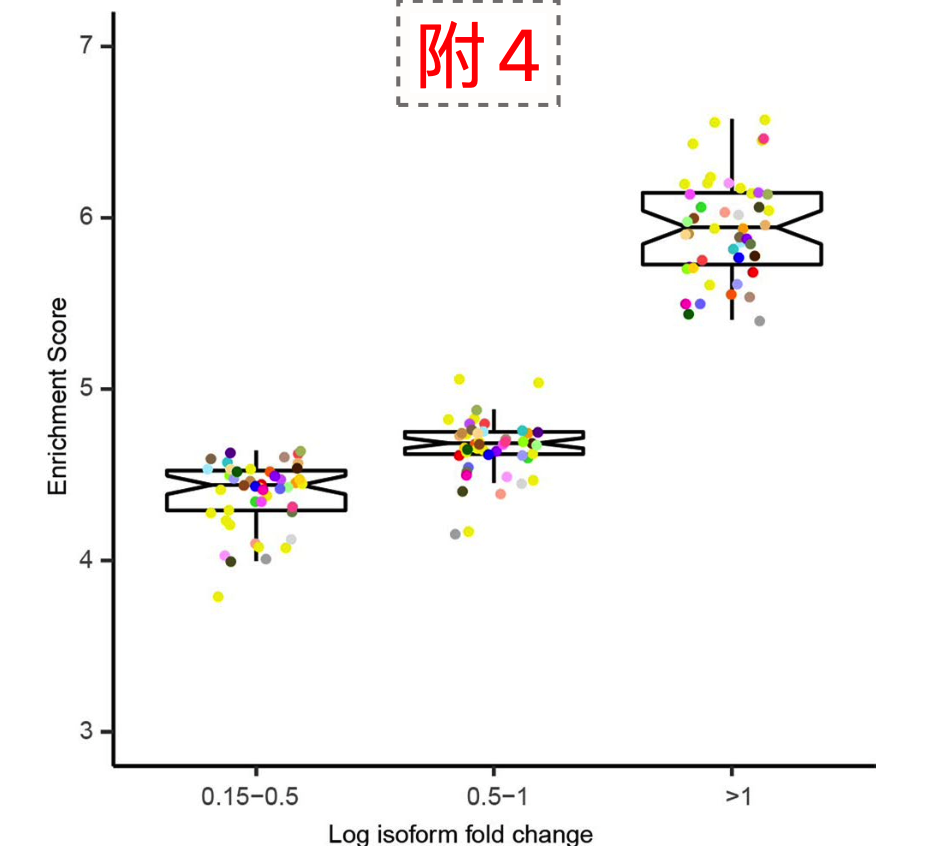

为了评估使用当前样本量的3'aQTL检测方法的性能，我们将检测到的3'aQTLs与先前报告的与3'UTR使用中的变化相关的SNPs进行了比较。尽管先前对APA事件的研究仅限于几种细胞类型，例如淋巴母细胞，但我们的方法重新捕获了许多“经过实验验证”的3'aQTL。例如，在全血3'aQTL分析中复制了SNPrs10954213与IRF5的3'UTR的强关联（参考文献17），该关联编码参与多个免疫过程的转录因子。1b）。有趣的是，我们还发现了对IRF5的这种遗传效应在其他22个组织中共有，这表明该基因座的多组织背景分析可以帮助进一步研究IRF5变体如何导致自身免疫性疾病（补充图3）。在淋巴母细胞系9、10、24-26中鉴定出的15个先前报道的SNP相关APA基因中，我们的3'aQTL分析能够捕获13个（87％）爱泼斯坦-巴尔病毒（EBV）-转化的淋巴-吞噬细胞（补充图4）。该观察表明，当前可用的数据集可用于捕获人体组织中大多数已知的APA相关的SNP。

为了研究3'aQTLs在人类基因组中的全球分布，我们使用了曼哈顿图来可视化3'aQTLs的位置及其相关的P值（补充图5a）。显着的3'aQTLs分布在每个染色体上。重要的是，以前报道的APA基因很容易被检测到，包括IRF5（参考文献17），ERAP1（参考文献10），THEM4（参考文献10），EIF2A和DIP2B9；然而，据我们所知，大多数检测到的3'aQTL基因代表着新的事件。这些新的3'aQTL基因中的几个特别值得注意，包括CHURC1（补充图5b）和TPSAB1（补充图5c），其中CHURC1编码在神经元发育过程中很重要的锌指转录激活因子27。α-类胰蛋白酶，据报道在基础血清类胰蛋白酶水平升高引起的多系统疾病（如肠易激综合征）中起作用28。

我们应用遗传力估计和遗传精细定位，阐明由3'aQTLs引起的APA基因变异的遗传结构。具体而言，我们在基因组（基于复杂性状分析基因组）的有限最大似然程序中使用了线性混合模型，以估算每个基因在1兆碱基（Mb）内由所有3'a变体贡献的APA变异的遗传力。顺式区域。我们观察到3'aQTLs平均可以解释25.2％的APA变化（图1c）。在单个组织水平上，3'aQTL可以解释APA变化的15.5％至51.2％（补充表2）。此外，3'aQTLs可以解释2.2％的APA基因中50％以上的APA变异，这些变异丰富了抗原加工和对干扰素-γ（IFN-γ）介导的信号通路的响应（补充图6）。例如，IRF5APA变化的72.7％可以用3'aQTLs来解释。我们还发现3'aQTL可以平均解释APA基因表达变化的16.2％（补充图7）。为了解决由于连锁不平衡（LD）导致的3'aQTLs之间的相关性，我们使用单一效应之和（SuSiE）回归30来精细映射独立关联（汇总为95％的单一效应可信集）对于每个组织中的每个APA成绩单-提起诉讼。SuSiE产生关联信号簇，每个信号被设计为精确捕获一个因果SNP，而与其他簇所捕获的无关。由于LD，每个信号簇内的SNP高度相关。ALDH16A1是APA的一个示例，其中SuSiE揭示了两个独立的3'aQTL信号簇（3'aQT的前导序列为rs1006938和rs73582462）。与2个群集分开获取的任何2个SNP之间的最大R2非常小（0.03），这表明确实检测到2个独立信号。IRF5是另一个APA示例，其中SuSiE仅检测到一个信号簇（引线3'aQTL为rs10954213）。总共有35％的组织-转录本与1个以上独立的3'aQTL相关，这表明3'aQTL效应具有广泛的等位基因异质性（图1d）。我们确定的大约40万个3'aQTLs广泛展示了常见的遗传变异与跨多个人体组织的3'UTR使用情况如何相关，并且将已知的3'aQTLs的数量相比增加了几个数量级。以及所有先前报告的APA相关的SNP。

### 3'aQTLs的组织特异性模式

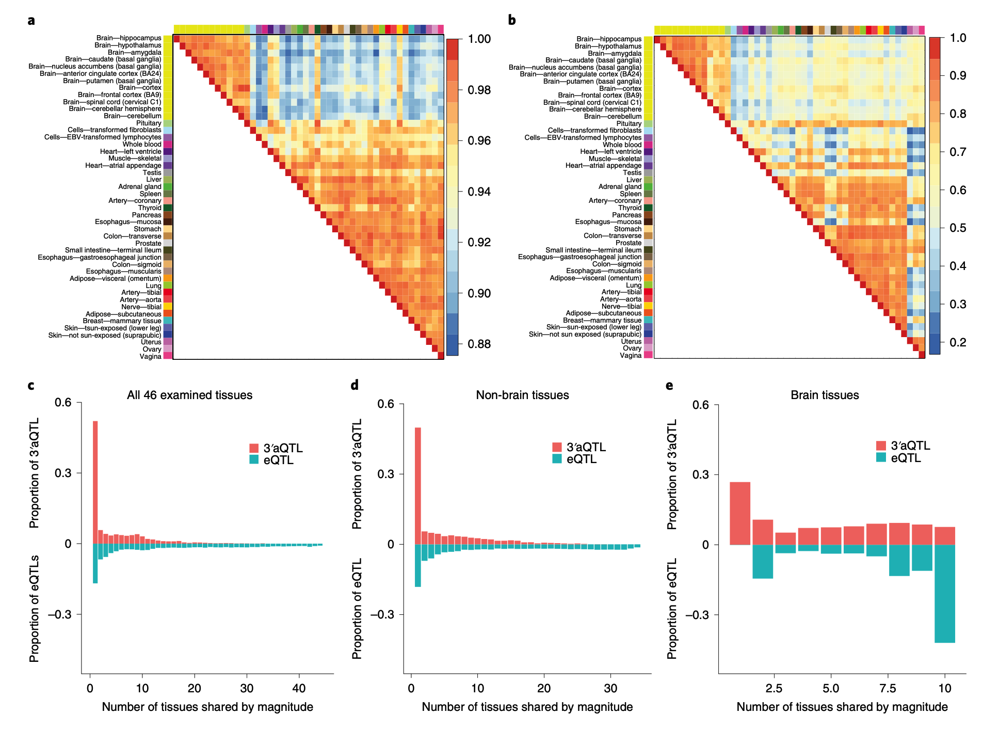

为了研究顺式调控元件如何以组织特异性或共享方式（AHP）促成APA事件（补充图8）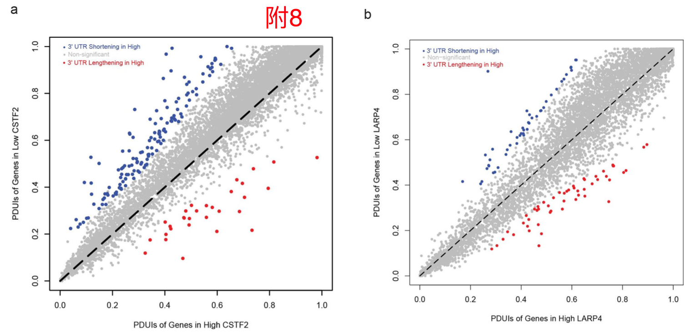，我们使用了多变量适应性收缩（MASH）31来评估所有46个因子共享的3'aQTLs的作用大小。组织，同时控制非遗传相关关系，例如样品重叠。跨组织效应的异质性是根据3'aQTLs之间的信号共享（相同方向的效应）和大小（相同方向上的效应以及两倍效应大小变化）评估的。该分析表明，人类组织使用具有完全关联性的层次聚类，分为脑组织和非脑组织两大类（图2a）。我们还注意到，一些与生物相关的组织归类于“非脑”组织中，例如子宫/阴道/卵巢和结肠/胃组（图2b）。这些模式揭示了由于APA调节而在不同组织之间的发育和功能相似性。此外，我们发现，尽管78.4％的组织具有相同标志的3'aQTLs，但只有13.9％的共享3'aQTLs表现出相似的幅度。与组织中共有的eQTL相比（按符号在组织中共有的占85％，在数量上在组织中共有的占36％）31，3'aQTL表现出相似的标志效应（补充图9和图10)，

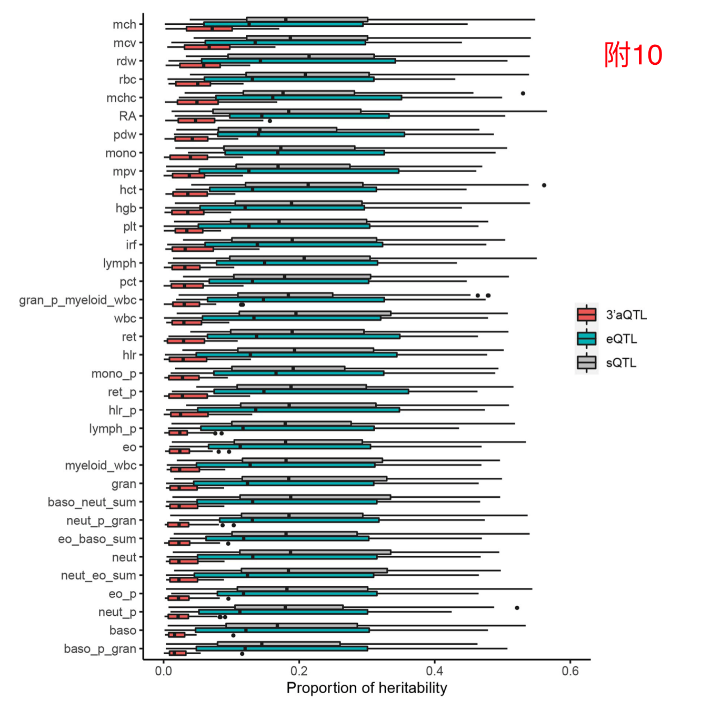但是其共享幅度效应程度要低得多。（图2c-e，补充图11和扩展数据图5）。一种可能的解释是APA事件比基因表达更具组织特异性（补充图12)。综合考虑，这些观察结果表明3'aQTL效应大小比eQTLs具有更大的组织特异性。

### 3'aQTL具有明显的分子特征。

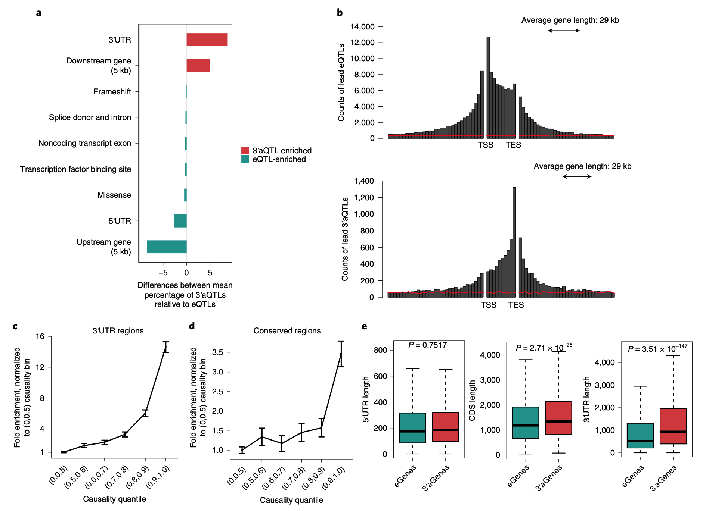

为了表征不同QTLs之间的关系，我们根据SnpEffv.5.0（参考文献32）中定义的功能类别，对46种组织类型的Lead3'aQTLs和LeadeQTLs进行了分类。正如预期的那样，我们发现3'aQTLs在3'UTRs中显着富集（P=2.68×10-30）或位于基因下游5kb（kb）以内（P=9.43×10-08），而在基因启动子/上游区域（P=1.11×10-34）或5'UTRs（P=1.42×10-32）中，QTLs显着富集（图3a）。该观察结果与包括3'aQTLs和eQTLs在其相关基因上的相对位置分布的元基因分析一致（图3b）。3'aQTLs大致对称地分布在3'UTR区域周围，而3'aQTLs的34％位于下游基因区域，这可能是由于LD效应引起的1,33（方法）。3'aQTLs也与剪接QTLs（sQTLs）33显着不同，后者主要在基因体和剪接区域内富集（扩展数据图6）。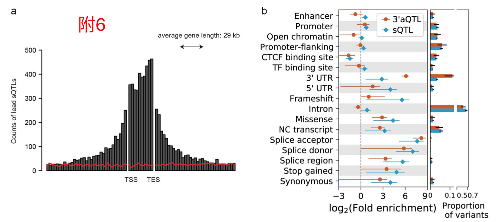我们还交叉引用了最近的549蛋白质QTLs34（pQTLs)与3'aQTLs铅和eQTLs铅。我们发现154个多组织3'aQTLs是1个或多个组织中同一基因的pQTLs，而78.5％的pQTL-重叠3'aQTLs不是eQTLs。这些数据表明一些3'aQTLs可以影响独立于基因表达的蛋白质表达水平。

为了进一步确定3'aQTLs的基因组背景，同时还考虑了LD的影响，我们根据其后因果概率检查了3'aQTLs的富集。基于因果关系分位数，将精细映射的3'aQTLs分配到六个bin中。我们发现，最有因果区间（大于第90个分位数）中3'aQTLs的27.4％与3'UTR区的14倍富集相关，而最小因果区间中的3'aQTLs较少（较少）比第50位）（图3c）。有趣的是，3'aQTLs也高度富集于保守区域（加利福尼亚大学圣克鲁斯分校（UCSC）phastCons保守评分>0.8）（图3d），而不是转录因子结合位点（补充图13）。

此外，3'a基因和eQTL相关基因（e基因）的结构也有很大差异。与e基因相比，3'a基因具有可比的5'UTR，但编码序列（CDS）（P=2.71×10-26）和3'UTR长度（P=3.51×10-147）长得多（图3e）。此外，在3'a基因中观察到的与poly（A）位点近端的富含腺苷酸-尿苷酸的元素数量明显高于在e基因中（P=7.61×10-198），这表明3'a基因具有更大的潜藏潜力控制APA事件的调节元素（补充图14）。3'a基因也丰富了与免疫和环境反应有关的本体，例如IFN-γ介导的信号通路。这与e基因相反，后者在与环境响应有关的基因中代表性不足。综合考虑，这些分析的结果表明3'aQTLs和受其影响的基因与其他先前定义的QTLs及其调节基因具有不同的分子特征。

### poly（A）模式的变化与APA相关

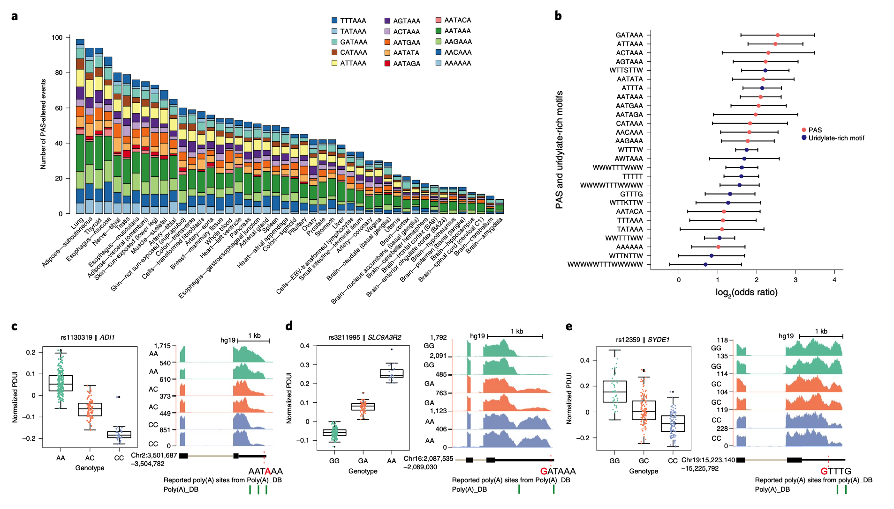

接下来，我们研究了遗传变异促成APA事件的潜在机制。我们假设一些3'aQTLs改变了对转录本3'-末端加工很重要的基序。聚腺苷酸化信号（PAS）的改变可产生截然不同的mRNA同工型，其3'UTR的长度不同。但是，从有限数目的细胞系中仅报道了少数病例9,35。为了系统地检查人类中PAS改变3'aQTLs的普遍性，我们从Poly（A）数据库中提取了位于注释的poly（A）位点上游50个碱基对（bp）内的重要3'a变异体（PolyA_DB）36，UCSC，Ensembl和RefSeq基因注释，并基于15个常见的PAS主题变体进行了主题搜索。总共，我们确定了2135个3'a变体，这些变体改变了PAS，并在46个人类组织的相关基因中产生了替代的3'UTR长度（图4a和补充表3）。共有991个3'a变体破坏了规范的PAS（AATAAA）或将其他PAS变体更改为规范的PAS（P=2.827×10-10）（图4b）。例如，从参考A等位基因到C等位基因的rs1130319SNP的变化会损害规范的PAS，即AATAAA，这与在ADI13'UTR中优选使用隐蔽的poly（A）位点有关（图4c）。我们使用最近的饱和诱变数据23验证了我们的发现，其中ADI1典范poly（A）基序的相同3'a变异干扰导致长异构体的丰度降低了20倍（扩展数据图7a）。。在另一种情况下，rs3211995中的G>A变化导致SLC9A3R2的3'-端具有较强的PAS（AATAAA）而不是较弱的非规范GATAA基序，这与向mRNA亚型的转化有关更长的3'UTR（图4d）。再次，饱和诱变证实，这种3'a变体导致长同工型的丰度增加了42.52倍（扩展数据图7b）。我们还发现3'a变体很容易改变那些靠近带注释的poly（A）位点的PAS变体（图4b）。除PAS之外，我们还研究了3'a变体是否可以改变富含尿嘧啶的元素，这对于3'末端加工也很重要4。有趣的是，富含腺苷酸-尿苷酸，鸟苷酸-尿苷酸和尿苷酸-的基序也经常被3'aQTLs改变（图4b和补充图15）。例如，位于基因SYDE1的近端poly（A）位点附近的富含鸟苷酸-尿苷酸-基序的3'a变异体GTTTG可能导致3'UTR显着缩短（图4e）。先前已经描述了APA上富含尿嘧啶的基序变异[37]。总的来说，这些结果表明，一小部分可检测的APA事件是3'aPAS或富含尿苷酸基序的变体变化的结果。

### APA-相关的RBP结合位点和RNA二级结构。

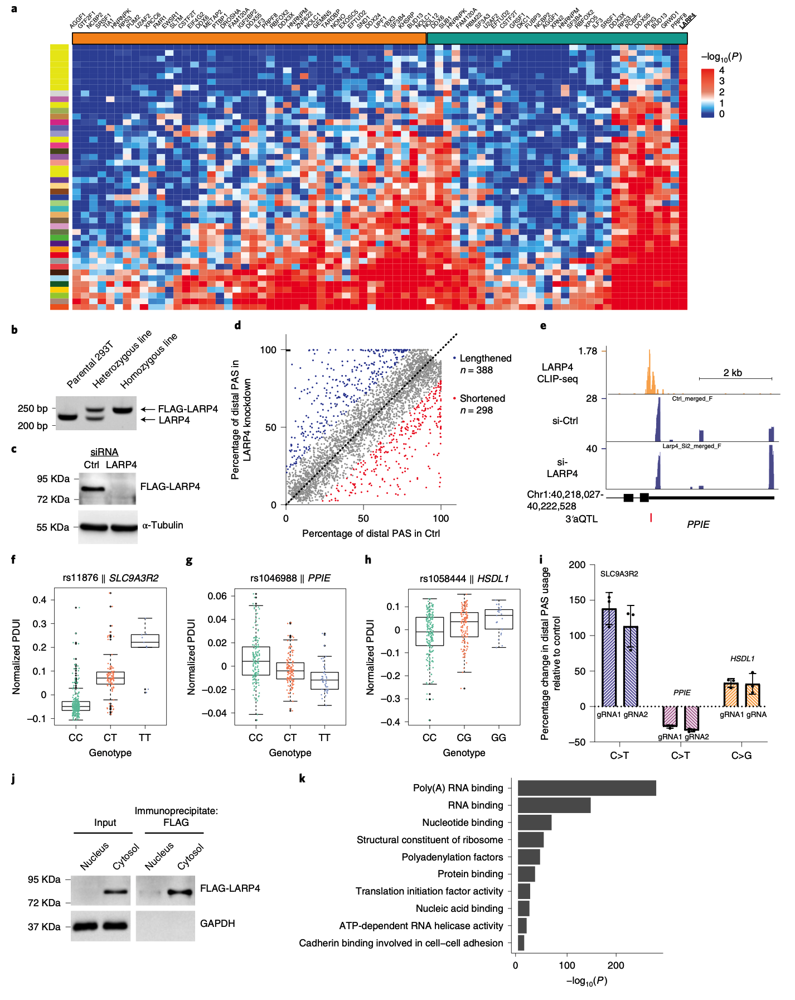

聚腺苷酸化信号的改变只能解释3'aQTL的一小部分，这表明大多数3'aQTL可以通过其他机制影响APA。为了验证这一假设，我们分析了3'aQTL干扰靶基因转录或转录后调控的程度。首先，我们使用DeepBindv.0.11（参考文献38）评估3'a变异体在每个组织中在538个DNA结合蛋白和RBPs的927个结合基序中的富集程度，并使用随机混洗的3'a变异体作为控制组。我们鉴定出125个在3'a变异中显着丰富的基序，其中至少17％的组织中有17个是常见的（补充图16）。与这17个常见基序相关的蛋白质富含已知的poly（A）因子（如PABP39，CPEB4（参考文献39,40），SRSF7（参考文献41））（P=1.06×10-5；超几何检验），RBFOX1（参考资料42）和HNRNPC，最近被描述为APA调节器43。

然后，我们分析了166个RBP交联免疫沉淀测序（CLIP-seq）数据集，这些数据集可从《DNA元素百科全书》（ENCODE）项目获得。这些数据集特别有用，因为深度绑定资源中不包含81.2％的RBP。与随机序列数据集相比，我们检查了3'aQTLs是否在每个RBP的CLIP-seq结合峰内显着富集。我们进一步集成了一种新的计算策略，以预测APA的反式调节剂（方法和扩展数据图8），并确定了73个RBP，它们优先结合到包含3'aQTLs的区域，包括多个poly（A）因子除了许多剪接因子外，还包括CSTF等（图5a和补充表4）。与潜在的功能意义相一致，这些剪接因子先前已与替代的3'UTR用法联系在一起40,41。

为了评估3'aQTL与RNA结构特征之间的关联，我们决定使用riboSNitch数据45，该数据被定义为通过RNA结构实验的平行分析而影响RNA二级结构变化的DNA变异体。我们将这些riboSNitch数据与我们的前导3′aQTLs交叉引用。对于相同的转录本，重叠事件定义为导联3'aQTL与核糖SNitch之间的高LD（R2≥0.8）。我们发现10.6％的核糖SNitch数据与3'aQTLs重叠（补充图17），表明3'aQTLs与RNA二级结构之间存在很强的相关性。

### 3'aQTL分析有助于识别APA调节剂，例如LARP4

在73个富含3'aQTL的RBPs中（图5a），我们发现有1个肿瘤抑制因子La-相关蛋白4（LARP4），其结合位点主要位于3'UTR区域内（补充图18）。选择性结合到大多数组织中包含3'aQTL的区域。LARP4是一种RBP，可与mRNA分子46的poly（A）尾部结合并调节mRNA翻译。然而，据我们所知，尚未报道其在APA法规中的作用。我们关于LARP4结合涉及3'aQTLs富集区域的观察表明，LARP4可能是APA调节剂。重要的是，我们的方法无法区分LARP4APA调控是通过影响细胞核中的poly（A）位点选择还是通过调控细胞质中短/长mRNA亚型的差异稳定性来介导。为了检验LARP4调节APA的假说，我们首先进行CRISPR工程改造的293T细胞在内源LARP4基因的两个拷贝中都带有单个FLAG表位标签（图5b）。然后，我们用对照小干扰RNA（siRNA）或靶向LARP4的siRNA转染了这些细胞，并观察到了FLAG-LARP4的强劲消耗（图5c）。从对照和敲除细胞中分离RNA，并使用3'-末端测序（poly（A）-ClickSeq（PAC-seq））进行分析47。使用PAC-seq，我们观察到敲除LARP4后poly（A）网站使用情况发生了广泛变化，这与LARP4在APA调节中的作用一致（图5d）。重要的是，还发现了一些包含3'aQTL的基因，这些基因预计会改变LARP4的结合，从而对LARP4敲低反应显示出稳健的APA（图5e和图9的扩展数据）。为了进一步测试LARP4可以调节APA的模型，我们重点研究了三个基因，这些基因在LARP4敲低后表现出APA的变化，并在其LARP4结合位点内包含3'aQTLs，如使用LARP4CLIP-seq数据评估的（图5f）-H）。我们设计了基于CRISPR的同型gous重组模板，该模板可将LARP43'aQTL引入293T细胞（补充表5）。选择用Cas9，同源重组模板和两个独立的单向导型RNAs（sgRNAs）转染的细胞，并使用定量逆转录PCR（RT-qPCR）评估APA。在所有这三种情况下，我们都可以检测到远端poly（A）部位选择的显着变化，这与3'aQTLs的预期效果相符（图5f–i），表明3'aQTL足以更改APA规定。最后，我们从FLAG-LARP4细胞生成了核和细胞质提取物，纯化了LARP4（使用FLAG亲和树脂），并使用质谱分析了纯化的复合物（图5j和补充资料）。
表6）。与以前的报道一致，LARP4主要但并非唯一地是细胞质的，我们可以可靠地检测到与poly（A）结合有关的相关蛋白。出乎意料的是，我们还检测到了与LARP4相关的裂解和聚腺苷酸化机制的许多成分，表明在APA调节中可能具有直接作用（图5k）。总之，这些结果支持LARP4在APA调节剂中的功能，并进一步验证了3'aQTLs作为APA调节剂的发现工具的用途。

### 3'aQTLs可以解释很大一部分疾病遗传力。

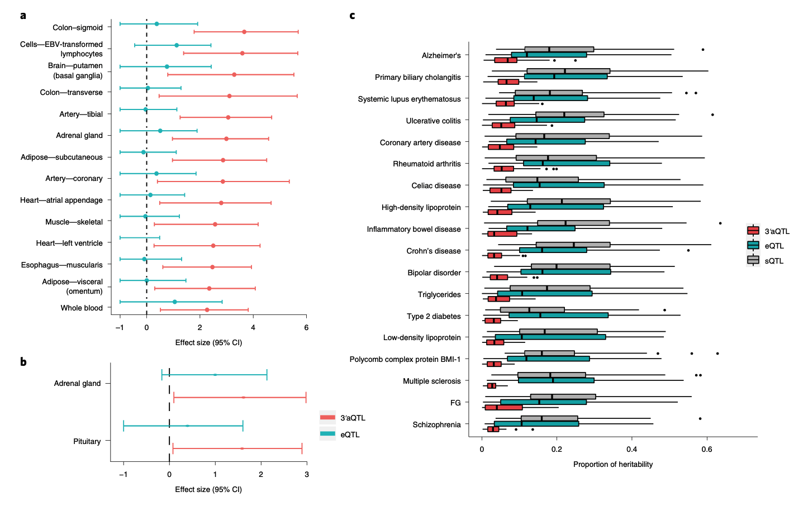

GWAS方法通常用于将遗传变异与复杂的人类特征和疾病相关联。但是，很难解释这些遗传变异，特别是非编码变异如何导致特定表型。我们假设3'aQTLs可以用来解释GWASnoncoding变体，特别是位于3'UTRs附近的（补充图19和20）。评估了使用功能基因组-广泛关联分析-sis48对每个组织的性状相关的GWASSNPs中3'a变体的富集。我们在组织-性状对的11.5％内鉴定了3'a变体的富集。当与已知的富含这些性状的e变体进行进一步比较时，我们观察到，总体而言，对于所检查的26.5％的组织－性状对，eQTLs的效果比3'aQTLs大。但是，在9.8％的配对中，我们发现3'aQTLs与eQTLs（包括与阿尔茨海默氏病和类风湿性关节炎有关的QsLs）相比，其GWASSNPs的富集度增加了（补充表8）。值得注意的是，许多3'a变体富含与其各自患病状态相关的组织，例如阿尔茨海默氏病的脑壳核（基底神经节）和类风湿性关节炎-tis的垂体（图6a，b）。值得注意的是，3'a变异体也富集于生物学上较不相关的组织，这可能代表了跨许多组织或与新特性相关的组织的常见3'a变异体2。

为了量化与每个性状的遗传力相关的调节变异的比例，我们使用LD评分回归进行了分区的遗传力分析49。在特质检查中，可以用3'aQTLs，sQTLs和eQTLs来解释的SNP遗传力中值范围分别为每个特征3-7％，13-25％和10-19％。值得注意的是，3'aQTLs对于解释与几种自身免疫性疾病（如溃疡性结肠炎，原发性胆管性胆管炎和阿尔茨海默氏病）相关的遗传力特别有效。对于多发性硬化等某些疾病，3'aQTLs对遗传力的贡献很小（图6c和扩展数据图10）。综上所述，尽管已经在单基因水平上研究了APA在调节这些疾病中的作用，例如阿尔茨海默氏病中的tau50和2型糖尿病中的TCF7L251，但我们的结果表明3'aQTLs可以解释与疾病有关的显着比例的变异。

### 许多性状-共定位3'aQTLs与基因表达无关

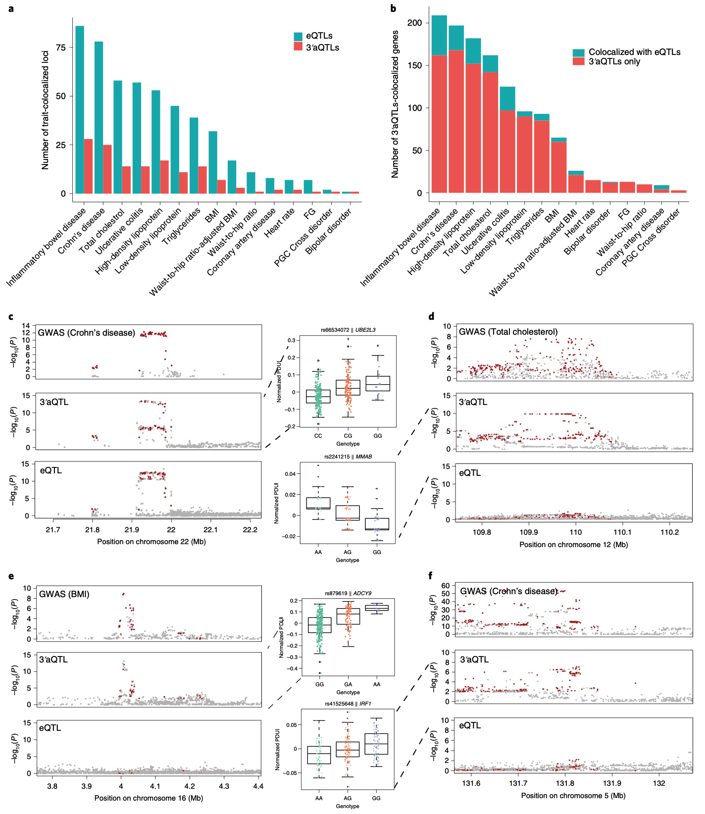

疾病相关位点内3'aQTLs的富集为3'aQTLs的整体影响提供了疾病特定的知识，但不一定暗示因果关系。因此，我们研究了3'aQTLs可能作为人类表型的因果变体发挥作用的程度。我们使用共定位分析52，通过鉴定具有相同特质相关性状和特征相关信号的3'aQTLs，以已知的次要等位基因频率（MAFs）检查了15种复杂疾病和性状。值得注意的是，共定位模型对每个基因的多个因果变体的识别能力有限。总共有801个与性状相关的变体与eQTL或3'aQTL信号共定位。与先前的结果一致1，与性状相关的变异中有57％与eQTLs共定位于1个或多个组织中。有趣的是，在至少1个组织中，有16.1％的性状相关变异与3'aQTLs共定位（图7a）。值得注意的是，该3'aQTL共定位仍然可以由一个或多个QTLs驱动（补充图21）。我们发现14个共定位3'aQTLs与pQTLs34重叠。例如，rs503366不仅是MTRF1L的pQTL，而且还是与双相情感障碍GWAS变体共定位的前导3'a变体（具有一个共享因果变量（PP4）的模型的后验概率=0.922）。我们还发现83.7％（1,218个中的1,019个）的3'aQTL共定位基因不是eQTL共定位基因（图7b和补充表9）。根据它们是否与eQTLs重叠，我们将所有3'a基因分为两组。在每个组中，我们分析了不同3'aQTL等位基因在APA用法和基因表达上的差异。我们没有观察到eQTL-重叠3'a基因与非eQTL-重叠3'a基因之间的APA使用差异（P=0.06；补充图22a）。我们进一步发现，eQTL-重叠的3'a基因倾向于具有显着的基因表达变化（P<2.2×10-16）（补充图22b），而非eQTL-重叠的3'a基因几乎没有相关性。基因表达改变。为了探索潜在的调控机制，我们将3'a基因的3'UTR区与TargetScan人v.6.2（参考文献53）miRNA结合位点和ENCODERBPCLIP-seq峰进行了交叉引用。我们发现，与非eQTL-重叠3'a基因相比，eQTL-重叠3'a基因总体上具有更大的miRNA结合位点密度（P=5.695×10-5；补充图22c）。。我们没有发现RBP结合位点的任何富集。这些结果表明，eQTL-重叠的3'a基因倾向于通过miRNA介导的调控而不是RBP调控影响基因表达。UBE2L3是与3'aQTLs和eQTLs共定位的基因的16.3％的代表性示例。

UBE2L3是与3'AQTLS和EQTLS共聚合的16.3％的基因的代表性示例。UBE2L3是E2泛素-缀合酶，其在免疫应答期间促进核因子KappaB信号的激活。UBE2L3中的RS66534072基因座与基因表达水平有关，赋予自身免疫疾病的风险55。然而，这些遗传变异影响基因表达的机制是未知的。我们确定UBE2L3可以受APA的影响，并且可以在不同的人中表现出动态3'UTR使用。此外，引线3'aQTLSNP，RS66534072与UBE2L3中的3'UTR使用显着相关（图7C）。具体地，C等位基因与UBE2L3MRNA3'UTR的缩短相关，而G等位基因与3'UTR的延长有关。我们检查了RS66534072用作UBE2L3的3'AQTL的组织，并且发现大多数人被众所周知受到自身免疫疾病的影响。

大多数3'aQTL性状-共定位基因对特定于3'aQTLs，而不是eQTLs。例如，MMAB编码一种参与腺苷钴胺素形成的酶，该酶对胆固醇的降解至关重要。发现总共有288个3'aQTL与MMAB3'UTR的使用相关，并与12号染色体上的总胆甾醇水平GWAS基因座直接相关（图7d）。同样，16号染色体上与体重指数（BMI）相关的变体也与3'aQTL共同定位，这些QTL调节ADCY9中3'UTR的长度变化（图7e）。我们还观察到IRF1中3'aQTLs与重要的GWAS基因位点之间存在着很强的共定位模式，这些疾病是多种自身免疫性疾病，包括溃疡性结肠炎，克罗恩病和炎性肠病（图7f）。IRF1由IFN-γ信号传导诱导，并促进先天和后天免疫应答57。相反，除了在肌肉骨骼组织中，未观察到eQTL与IRF1表达之间的强关联。肌肉骨骼组织的共定位分析显示，疾病相关位点与IRF1eQTLs之间没有共定位模式。相反，在包括转化的成纤维细胞（PP4=0.97）在内的多个组织中发现了IRF13'aQTLs和自身免疫疾病的共定位模式。这些结果表明，IRF1相关的3'aQTLs大于IRF1相关的eQTLs可以解释与这些疾病相关的IRF1变异的大多数影响。总体而言，我们的数据表明，许多3'aQTLs都与人类疾病和性状有关，而与它们在基因表达调控中的作用无关。

## Discussion

我们定义了3'AQTLS作为遗传基础，导致了3'UTR的变化。通过使用我们的DAPARSV.2算法进行重新分析大规模GTEX数据，我们在46个人组织中鉴定了11,613个APA基因和大约40万个3'AQTLS。发现3'AQTLS足以改变APA调节，如Crispr基础实验和饱和诱变数据所证明。与其他分子QTLS相比，例如EQTLS，3'AQTLS在3'UTR范围内高度富集。机械地，通过调节聚（a）信号图，RNA二级结构或RBP结合位点的强度来诱导3'AQTLS的可能诱导。在基因转录区域之外的3'AQTLS可能涉及更复杂的机制基础，这是由最近的工作揭示DNA甲基化，基因循环和APA调节58,59之间的连接。EQTLS是与人类表型变化相关的重要分子特征。在这项研究中，我们证明，3'AQTLS代表分子特征，其在意外类似水平中有助于人群的表型变化，如EQTLS。此外，我们还使用3'aqtls作为识别APA调节器的发现工具，例如LARP4。