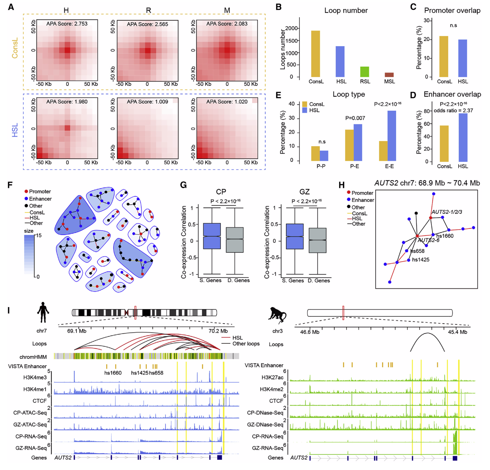

# 3D Genome of macaque fetal brain revealsevolutionary innovations during primatecorticogenesis

### abstract

结构发育图揭示了人类特有的染色结构和影响树突发育的调节变化。

### Highlight

- build a hic map
- use cross-species 3D genome uncover human chromatin structures
- The subplate lamina shows human-specific regulatory changes during corticogenesis
- 人类特异性环路调控EPHA7影响神经树突发育

### Summary

阐明人脑进化的调控机制对于理解人类认知和精神障碍是至关重要的。
我们生成了多组学图谱，并构建了恒河猴皮质发育过程中三维基因组结构的高分辨率图谱。
通过比较人类、猕猴和小鼠脑的3D基因组，我们发现了许多人类特有的染色质结构变化，包括499个拓扑相关结构域(TADS)和1266个染色质环。
人类特有的环在增强子-增强子的相互作用中显著丰富，受调控的基因在亚板上显示出人类特有的表达变化，亚板是发育中的大脑的一个过渡区，对神经回路的形成和可塑性至关重要。
值得注意的是，许多人类特有的序列变化位于人类特有的TAD边界和环锚，这可能在人类中产生新的转录因子结合位点和染色质结构。
综上所述，这些数据突出了比较三维基因组分析在剖析大脑发育和进化的调节机制方面的价值。

### Introduction

与非人类原生动物(NHPs)相比，人脑显示出独特的组织原理和发育模式(Sousa等人，2017年)。

发育中的人脑具有扩大的增殖区、外室下区和更多样化的神经前体细胞类型，这是人脑大小扩大的原因(Lui等人，2011年；Wilsch-Bräuninger等人，2016年)。

与NHPs相比，原始人的神经元成熟时间似乎更长，神经网络更复杂(Marchetto等人，2019年；Sherwood和Gómez-Robles，2017年)。

携带人类版本的MCPH1(大脑发育的关键基因)的转基因猴子推迟了神经元的分化和成熟，改善了短期记忆，模拟了人类大脑发育的新阶段(史等人，2018年)。

亚板下神经元形成了胎儿大脑发育过程中最早的功能性皮层回路之一，并可能与人类神经回路的独特发育模式有关，尽管其潜在的分子机制仍不清楚(Hoerder-Suabedissen和Molnár，2015年；Judas等人，2013年)。

比较基因组分析的最新进展提供了越来越多的证据，表明自人-黑猩猩分化以来，我们的进化主要是由基因调控驱动的(Bird等人，2007；Bush和Lahn，2008；Gittelman等人，2015；King和Wilson，1975；Pollard等人，2006；Reilly等人，2015；Xu等人，2018)。

长距离的染色质相互作用可能调节人类特有的大脑基因，表达与衰老相关疾病，如阿尔茨海默病(Chen et al., 2018;de la Torre-Ubieta et al., 2018;Won et al., 2016,2019)。

**因此，可以假设人类特有的染色质结构变化可能导致基因调控改变，最终导致独特的人脑表型。**
为了测试这一假说，**我们需要生成关键发育阶段的NHP的脑3D基因组数据，以便识别人类特有的基因调控变化。**黑猩猩胎脑获得困难，选用恒河猴胎脑。

通过对人、恒河猴和小鼠的多重进化分析，我们发现了许多**人类特有的染色质结构变化，包括拓扑相关结构域(TADS)和环。**
我们还研究了人类特有的TADS和环的基因组特征和功能富集，以揭示人脑发育和退化的遗传学基础。

### Result

##### Generation of a high-resolution 3D genome map of rhesus macaque during corticogenesis（1）

将大脑皮层分为两个主要区域：(1)皮质板(CP)，主要由有丝分裂后神经元组成；(2)生发区(GZ)，主要由神经前体组成(图1A），使用hic、RNA-seq、DNase-seq、CTCF ChIP-seq。

检查神经前体(SOX2、PAX6和FOXG1)和神经元(Fezf2、SYP和NEU-ROD1)的已知标记基因的表达，验证了分区的准确性(图1B)

1.5千碱基对(Kb)的超深分辨率(表S1；星形方法)，这使得我们能够在不同的尺度上探索大规模3D基因组结构，包括区段、TADS和环(图1C)

CP和GZ中分别识别了8,399个和15,048个Loops，3C实验表明，86.6%(26/30)的环路可以被验证，这表明我们的Hi-C结果是可靠的；CP相对于GZ的环路数量较少(减少44%)，人类神经元相对于神经前体细胞的环路减少(减少40%到50%)

分别观察到SOX2(在GZ中高表达)和BHLHE22(在CP中高表达)的区带特异性染色质相互作用(图1D和S1I)。

为了证明使用我们的超深接触图识别的环在检测基因组中的调控事件方面是有信息的，作为原则的证明，我们检查了两个假定的增强子与FOXP2(图1E)启动子之间的相互作用，FOXP2是一种在人类言语和语言发育中发挥重要作用的著名基因，这两种推定的增强剂也是有效的。

为了评估在FOXP2周围检测到的环路的外显性，我们用胚胎猴的脑组织切片进行了3D-DNAFISH(星形法)，结果与Hi-C数据一致，即调节FOXP2的环路在CP(69.0%，49/71)和GZ(76.7%，66/86)中都存在，频率相似(Fisher‘s精确检验，p=0.284)(图1F，1G）

这些案例表明，我们的Hi-C数据可以有效地捕捉皮质生成过程中的调控事件。接下来，我们在多个尺度上进行了跨物种的Hi-C分析，这使得我们能够表征3D基因组组织中人类特有的模式

##### Cross-species analyses uncover human-specific TADs（2）

TADS是基本的调控染色质结构，在组织和物种中相对保守(Dixon等人，2012年；Rao等人，2014年)。

我们比较了人、猕猴和小鼠TADS的特点。物种间TADS的数量和大小在CP和GZ中相似(图S2B)。发现了499个hsTADs，包括410个人类获得的TADs(HgTADs)和89个人类丢失的TADs(HlTADs)

HgTADs的中等大小为640kb，小于保守的TADS(900kb)(图S2C)，因此hgTADs很可能是活性调控结构域。

我们比较了不同物种之间的TAD边界(STAR方法)。
结果表明，55%(n=1513)的TAD边界在物种间是保守的，14%(n=385)的TAD边界是hgTAD边界(图2A和2B；表S3)。

进一步探讨了保守TAD边界和hgTAD边界的特征。保守的TAD边界比hgTAD边界具有更强的绝缘性(图2C和S2D)，虽然大多数保守的和hgTAD边界都被CTCF结合富集，但hgTAD边界的富集水平(63%)低于保守的TAD边界ARIES(77%)，这表明hgTAD边界对CTCF的依赖性低于保守的TAD边界(图2D)。

最后检查了组织和细胞类型的保守率(Schmitt等人，2016年)，发现保守的TAD边界在组织和细胞类型之间具有更高的保守率，而hgTAD结合区域更具组织和细胞类型特异性(图2E和S2F)。

总体而言，通过跨物种比较，我们能够识别出人类特有的TADs，特别是hgTADs，它们在大小、CTCF结合强度和组织/细胞特异性方面表现出不同的特征，这是这些新进化的TADs在人类大脑进化过程中的一种暗示功能专门化。

##### The hgTAD boundaries are enriched with evolutionarily young transposable elements

我们对人类基因组中的TEs进行了富集分析，并比较了hgTAD边界和保守的TAD边界之间的模式。

我们发现，进化上古老的TEs，包括MIR、LINE-2(L2)、Charlie和MaLR，保守的TAD边界被丰富了(图S2G)。相反，hgTAD边界在进化早期的TES中丰富，特别是，与保留的边界相比，hgTAD边界显著富集了灵长类动物中最年轻的Alu元素AluY(Kapito-Nov和Jurka，1996)，而在相对古老的Alu元素(Aluj和ALUS)中没有检测到明显的富集(图2G)，这意味着年轻的Alu元素可能积极参与了人类特有的接触模式的形成(Cour-Nac等人，2016年)。同样，在L1亚家族中，进化年轻的L1PA显著富集了hgTAD结合的ARIES，但没有相对较老的L1PB(图S2H)。

然后，我们检查了与保守的和hgTAD边界相关的基因，发现与hgTAD边界相关的基因在不同物种之间的表达差异与保守的TAD边界相比略有显著差异，保守的TAD边界在管家基因中更加丰富，而hgTAD边界在大脑发育相关基因中更加丰富(图S2J和S2K；表S3)。

一个例子是CNTN5周围的hgTAD边界，CNTN5是一个参与神经元回路形成和自闭症谱系障碍(ASD)的基因(Ashrafi等人，2014年；Poot，2014；Toyota oshima等人，2009年；van Daalen等人，2011年)。
这一hgTAD边界含有Alu Y元件，并与CNTN5在人类中比在猕猴中的表达增加相关(图2H)

##### The human-specific chromatin loops are enriched in enhancer-enhancer interactions（3）

与TADS相比，染色质环是更动态的跨发育阶段，可能会影响基因表达(Bonevet等人，2017年)。我们使用Hiccups管道在10kb的分辨率下识别了这三个物种中的环(Rao等人，2014年)(图S3A；STAR方法)。聚合峰值分析(APA)证明了循环调用的准确性(图S3B)。循环的表观遗传特征进一步支持了这一点(图S3C)

我们在三个物种中鉴定出1904个保守环(ConSL)和1266个人类特异性环(HSL)(图3A和3B；表S4)，这些环被APA验证(图3A和S3D)。与TAD界的结果类似，物种特定的环锚在CTCF芯片序列信号中的含量低于ConsL锚(图S3F)。

为了探索不同环类的功能，我们将它们与反映增强子潜力的人胎脑H3K4me1信号(Kundajeet等人，2015年)整合在一起。值得注意的是，与ConsL相比，HSL的增强子显著富集(Fisher‘s Exact test，p<2.2310，16)，而没有检测到启动子的富集性(图3C和3D)。几乎80%的HSL锚点含有至少一个增强子，相比之下，ConsL锚点的增强子-启动子相互作用不到60%(图3D)。

就环类型而言，只有27%的HSL是增强子-启动子相互作用，近40%的HSL是增强子-增强子相互作用，这与ConSL相比是一个显著的丰富(Fisher‘s Exact test，p<2.2310，16)(图3e)。
在猕猴/小鼠特异性环中没有看到增强子-增强子相互作用的丰富(图S3G和S3H)。

为了识别受增强子-增强子相互作用调控的靶基因，我们使用Hi-C环生成了一个间接图，并使用快速贪婪算法(Phanstiel等人，2017年)检测了群落(STAR方法)。

在许多社区，多个增强剂管理一个或几个启动子(图3F)。同一群落中的基因在CP和GZ中的共表达相关性都高于不同群落中的基因(图3G)，这表明被检测的群落可能代表协同调节单元。一个显著的例子显示了人-人特异性相互作用的调节特征，涉及AUTS2(自闭症易感候选者2)基因，其中一个显著的例子涉及AUTS2(自闭症易感候选者2)基因，这是一个值得注意的例子，表明人类特异性相互作用的调节特征涉及AUTS2(自闭症易感候选2)基因。

值得注意的是，在人类胎儿大脑中有一个复杂的相互作用中枢来调节AUTS2。包含14个增强子，集合中超过一半的环路是特定于人的(图3H、3I和S3I)。两个人类增强子(hs1425和hs658)在小鼠胚胎中显示了中脑和神经管特异的表达(Visel等人，2007年)(图S3J)。相比之下，在猕猴中只检测到一个环，在小鼠的同源区域内检测到三个环(图3I和S3I)。

在CP区，人类AUTS2的表达明显高于猕猴(图S3K)。
此外，与猕猴相比，人类在该区域有更多的CTCF结合位点，其中一些靠近HSLanchors(图3i)。
CTCF结合位点的差异可能是人类和猕猴大脑染色质结构和基因表达差异的原因

##### Genes associated with HSLs are preferentially expressed in the subplate lamina of the developing brain （4、5）

为ConsLs和HSL定义了1,411和1,079个靶基因，人类的HSL靶基因往往比ConsL靶基因和猕猴特异性环的靶基因表达更高(图S4A和S4B)，这表明与HSL相关的基因调控变化。

令人惊讶的是，与ConsL靶基因相比，HSL靶基因在内皮层(CPI)和亚板(SP)中显著富集(图4A)。例如，NR4A2和TMEM178A这两个SP优先表达的基因受HSL调控(表S4)。

我们然后检查已发表的人胎脑单细胞RNA序列数据，有趣的是，HSL靶基因在皮层深层的兴奋性投射神经元中富集，这种富集在SP的兴奋性神经元中最为突出(图4B)。相反，猕猴专一性环的靶基因没有在任何叶片中富集(图S4C)。此外，人-猕猴共用环的靶基因在兴奋性SP神经元中略有丰富，但在统计学上没有显著性(图S4D)。

然后我们探索了HSL靶基因的功能。
首先，我们利用上一份报告(Miller等人，2014)中确定的模块进行了基因共表达模块富集分析，发现HSL靶基因在5个模块(M6、M16、M26、M34和M38)中显著富含(图S4E和S4F)。
最丰富的模块是M16，它富含SP，M16的功能与突触传递和突触发生有关(图4C)，与已知的SP功能一致(Judastal，2013)。值得注意的是，在M16中有许多受HSL调控的突触相关基因，例如NLGN1，它是介导突触形成的突触细胞粘附分子之一(图4C)。

其他四个丰富的模块涉及转录调控(M6)、长期抑郁(M26)、DNA复制(M34)和细胞周期调控(M38)(图S4F)。
这些数据表明，HSL在几个功能模块中调节基因，特别是SP神经元的突触发育。

接下来，我们进行了基因本体论(GO)富集分析，结果表明HSL靶基因与轴突引导、神经元迁移和突触组装等生物过程相关(图S4G和S4H；表S4)。

许多参与轴突引导通路的基因都受到HSL的调控，特别是编码关键引导分子(肾上腺素和信号素)的基因，如EPHA7和SEMA3A(图4D)。人类特有的染色质相互作用在人类皮质发育中起着关键作用，特别是在早期神经回路发育过程中SP板层中人类特有的变化。

一个很有前途的HSL靶基因是EPHA7。
与ma-caque相比，它在人类中优先表达和上调(图4E-4G)，并可以影响皮质树突的发育和脊柱的成熟(Clifford等人，2014年)。

我们发现了一个人类特有的环路，显示了人类胎儿大脑中的增强子-启动子相互作用(图4H)。
与之一致的是，猕猴的增强子活性比人弱得多(图4H)。此外，与其他人类胎儿组织相比，HSL锚中的增强子是脑特异的(Kundajeet等人，2015年)(图5A和5B)。

我们用荧光素酶测定来验证不同物种之间的增强子活性，结果表明人类的增强子活性明显高于黑猩猩和猕猴(图5C)。
我们比较了不同物种之间的增强子序列，发现了6个进化上保守的位点，这些位点只在人类谱系中发生了变化(图5D)。
这六个人类特异的单核苷酸改变(SNC)在人类中形成了新的潜在转录因子(TF)结合位点(图5D)。
因此，我们推测新的TF结合位点可能引起人类特异的染色单体相互作用的改变，导致人类和猕猴之间的表达差异(图4g)。

为了探索调控HU-MAN EPHA7的增强子的功能作用，我们用CRISPR-Cas9方法干扰了增强子序列(图5e)。
在增强子位点引入了3个缺失，导致从人NPC分化的神经元中EPHA7的表达减少了50%(图5F和5G)。
接下来，我们评估了受干扰的增强子是否影响神经元树突的发育。
我们观察到，与对照(图5H和图5I)相比，有干扰的增强子的神经元的树突长度明显延长(图5H和图5I)。
这些数据表明，SP-优先表达的EPHA7基因的人类特异性增强子在早期神经回路发育中起着重要作用，这可能有助于人类大脑的独特特征

##### HSL anchors are enriched in motifs of transcriptionfactors regulating SP neuron specialization

TFs可以与基因调控元件中的特定DNA基序结合，并影响染色质3D构象，以决定细胞在发育过程中的命运(Stadhouders等人，2018,2019年)。
为了探索TF如何与人脑3D基因组相互作用并调控SP细胞的命运决定，我们使用来自CP的ATAC-SEQ图谱(STAR方法)在HSL和ConsL锚的开放染色质区域进行了基序结合位点分析。

HSL和ConsL之间的一些基序在锚定中的结合百分比和富集的意义显示出明显的变化(图6A和6B)。

与ConsL相比，结构蛋白(CTCF和CTCFL)在HSL锚点中的富集程度较低，这与我们之前的发现一致，即HSL对CTCF的依赖程度低于使用CTCF芯片序列的ConsL(图6B and S3F)。
相反，与神经细胞类型相关的TF比ConsL更富含HSL。
值得注意的是，我们发现三种NFI因子(NFIA、NFIC和NFIX)富集在HSL锚点中，它们可以抑制神经干细胞的自我更新，并激活与神经元和星形胶质细胞分化相关的基因的表达(Harris等人，2015年)。
当使用GZ的atac-seq图谱(图S5b)和不同的基序富集方法(图S5c)时，我们在基序结合分析中获得了类似的结果

接下来，我们想知道这些HSL偏好的绑定的一部分是否是序列驱动的，在这些具有HSL结合偏好的TF中，约有65%(11/17)显著富集于人类特异的SNC(图6C)(错误发现率<0.001)，如TGIF1、EOMES和TBR1(图6D)。
在具有HSL结合偏好的TF集合中，人固定的SNC富集率(65%)比所有TF(30.3%)和没有结合偏好的TF(33.7%)(图S5E，Fisher‘s Exact检验，p=0.0056和p=0.016)要高得多。

产生新结合位点的人特异性SNC的一个例子是调节AUTS2的增强子(图3K)，它包含一个人特异性SNC结果，在人类中产生一个新的TGIF1结合位点(图6E和6F)。TGIF1在调节神经元形态发生中起着重要作用(Nakashima等人，2018年)。

然后我们询问这些转录因子调控了多少个HSL靶基因，显示了ConsL和HSL之间的富集差异。
通过启动子基序结合分析和基因-转铁蛋白共表达(STAR法)确定转铁蛋白的靶基因。
我们为具有HSL结合偏好的TF生成了TF靶基因网络(图6G)。
事实上，一些TF本身就是HSL的靶基因，如TBR1、NFIA、NFIX和TCF4，它们在表达数据中表现出不同的片层特异性。TBR1和NFIA富含SP，而NeUROG1/2、EOMES和TGIF1富含终末层(图6H)。
值得注意的是，TBR1具有最多的靶基因，并且大多数都显示CPI/SP富集(图6G和6I)。
以前的一项研究表明TBR1基因缺失影响SP的形成和丘脑-皮质的连通性(Hevner等人，2001)，提示TBR1可能是调节SP神经元特化的关键因子之一。综上所述，我们认为TBR1和NFIA是决定人SP神经元命运的HSL调节基因表达的候选因子。
我们的结果也呼应了最近的一项研究，在这项研究中，他们证明NFIA可以作为FOXP2辅激活剂，促进染色质解缩并调节早期兴奋性SP神经元的成熟(Hickeyer等人，2019年)。

##### Genomic basis of the human-specific chromatinstructure changes

我们继续探索检测到的人类特异性染色质变化的序列基础。
结果表明，与黑猩猩和马卡克相比，HSL锚定的保守性不如ConsL锚定(图S6A)，种间序列的差异可能有助于HSL的形成。
我们还检查了HARs(人类加速区域)是否富含HSL(Pollard等人，2006年；Doan等人，2016年)。结果表明，HSL锚定对HARs有显著的富集作用(图7A)。

特别是，我们确定了位于HSL锚点内的45个HAR，包括增强子或启动子(图7B)。
在某些情况下，一个HSL的两个锚都包含HAR，而另一些情况显示一个HAR与多个HSL相关联(图7B)。
有趣的是，我们发现一个HAR(ANC584)位于人类染色体12上的HSL锚点内(图7C)。
ChIP-seq(H3K4me1)和ATAC-seq数据都表明ANC584与增强子重叠，在人类中表现出比猕猴更高的活性。Hi-C数据表明ANC584可能调节SP优先表达的基因-SOX5(图7C)，这为HARs如何通过发育中的大脑Splamae中的空间染色质相互作用引起人类特有的调节变化提供了一个例子。Hi-C数据表明，ANC584可能调节SP优先表达的基因-SOX5(图7C)，这为HARs如何通过空间染色质相互作用导致人类特有的调控变化提供了一个例子。

接下来，我们研究了人类特异性结构变体(SVS)在人类特异性染色质结构形成中的作用。

从已发表的数据(Denniset等人，2017年；Kronenberg等人，2018年；McLean等人，2011年)中获得了人类特有的SV图谱(人类与类人猿)，我们检查了人类特有的SV与HSL之间的关系。

我们发现165个人类特异的SVS与161个HSL锚点重叠(图7D)。
我们调查了人类特有的SVS是否会导致TAD水平的变化。
我们发现60个人类特异的SVS位于48 hgTAD边界，74个人类特异的SVS位于57个HlTAD边界(图7D)。
与背景相比，SV重叠的hgTAD和hlTAD边界附近的基因表达没有显著差异，也没有丰富神经相关功能(图S6B和S6C)。
然而，与猕猴相比，在SV重叠的hlTAD边界中，人类上调基因的比例高于SV重叠的hgTAD边界(图S6B)。
例如，人特异性插入(316bp)与MAP4K3基因附近的hlTAD边界重叠(图7E和7F)。
有趣的是，这个hlTAD边界是特定于组织的。
它缺少人类胎儿大脑(Won等人，2016年)、成人海马和前额叶皮质，以及神经前体细胞(Schmittet等人，2016年)(图S6D和S6E)。
然而，它存在于人的小肠和脾脏，以及黑猩猩和矮黑猩猩(Zhang等人，2019年)(图S6E和S6F)。
更重要的是，与这种人类特有的TAD边界的丧失有关，TMEM178A基因(也是一种SP标记基因)获得了猕猴和小鼠中不存在的HSL(图6Fand S6G)，这可能解释了通过“增强子劫持”在人类胎儿大脑中观察到的TMEM178A比猕猴更高的表达(Northcott等人，2014年)(图7G)。

### Discussion

我们构建了猕猴胚胎脑的超深3D基因组图谱，并在3D基因水平上对人、猕猴和小鼠进行了进化比较分析。
我们发现了HSL的一个显著特征(即，增强子-增强子相互作用的丰富)。
通过增强子-启动子的相互作用，它们形成了调节群落。
以前的一项研究发现，在细胞分化过程中出现的环在增强子-增强器相互作用中比静态环更丰富(Phanstiel等人，2017年)。
我们的数据表明，不仅细胞类型特定的环，而且物种特定的环也可能直接介导增强子-增强子的相互作用。
与启动子相比，增强子具有时空特异性，在发育过程中可能会不断变化(Nord等人，2013年)。
在人类大脑发育过程中，对基因表达的精确控制可能需要更复杂的增强子-增强子相互作用，以组织或细胞类型特异性的方式进行。
此外，由多个增强子调控的基因可能具有更大的表达谱，因为打开和关闭一个增强子对基因表达的影响可能是有限的，而当涉及两个或更多增强子时，表达变化可能相当大(Kieffer-Kwan等人，2013年)。
因此，这种多增强子调控很可能是人类大脑发育微调的后天机制。

SP是人胎脑中最大的过渡区，其厚度约为妊娠中期皮质板的4倍(Kostovic and Molliver，1974；Kostovicand Rakic，1990)。
P物质在丘脑皮质连接的建立中起重要作用，并通过向皮质深层迁移而促进皮层分层(Kanold等人，2003年；Ozair等人，2018年)。
最近的一项研究报道，人类加速的保守非编码序列调节富含SP的基因，这可能参与人类特定的神经发育(Miller等人，2014年)。
我们发现HSLs的调节类别主要集中在SP层，这意味着在人脑发育过程中，SP神经元在神经回路的形成和可塑性中起重要作用。我们研究了HARs和人类特异的SVS在人类特有的染色质结构中的作用。
然而，与先前的研究显示42%的HAR与侧翼基因启动子作用不同(Doan等人，2016年)，我们观察到HARs可能发生在增强子-增强子介导的HSL锚点内，这表明HARs可以以不同的方式调控发育中的人脑中的基因表达。
另一方面，尽管染色质景观限制了人类内部和灵长类进化中的SVS(Fudenberg和Pollard，2019年)，但我们发现了134个人类特有的SVS，位于人类特有的TAD边界上。
重要的是，我们发现SVSO与hlTAD边界重叠可能有助于在SP发育过程中检测到的调控变化。
为了全面了解人类特异性基因改变(如HARs和SVS)的贡献，还需要更多的组学和功能实验。我们发现四个TE家族在hgTAD边界上富集，特别是两个年轻的TE亚家族(AluY和L1PA)，这可能有助于hgTAD的形成和影响人类大脑发育过程中的基因表达。目前，TES如何调控TAD边界的形成仍然是一个悬而未决的问题。
已经提出了两种可能的机制：(1)TES的转录活性可以决定TAD边界的形成(Zhang等人，2019年)；(2)其他蛋白质可以与CTCF竞争结合TES形成TAD边界(Kaaij等人，2019年)。
(2019)报道了ChAHP复合体(CHD4、ADNP、HP1)能与Sine B2转座元件结合，并与CTCF竞争形成TAD结合白羊座。
因此，我们推测那些富含在hgTAD边界中的TES可能为hgTAD边界的neural-development-relatedTFsandpromoteformationof提供了结合位点。

值得注意的是，在进行跨物种分析时，我们使用了Liftover来获得TAD边界和环锚的相应位置。 因此，在这一过程中，大部分非共线区域被排除在外，这可能夸大了3D基因组结构的整体保守性。 我们发现大多数人的TADS和环都位于共线区域(图S7A和S7B)，由于非共线区域的保守性较低，所以共线区域的TADS和环的保守水平被略微高估了(图S7C和S7D)。 非共轭TADS和环与进化过程中不同类型的基因组结构变化有关，如转位、倒置和大间隙(图S7E)。 我们举例说明这些非共线区域如何影响人类染色质结构的进化(图S7F和S7G)。 为了更好地理解非共轭区域与3D基因组结构之间的关系，需要更准确的基因组图谱(如高质量的猕猴参考基因组)(He等人，2019年)。综上所述，我们生成了NHP在皮质发生过程中的高分辨率3D基因组文件，这使得我们能够通过跨物种分析来揭示人类特有的3D基因组变化。 比较三维基因组分析是破解大脑发育和进化调控机制的有力途径