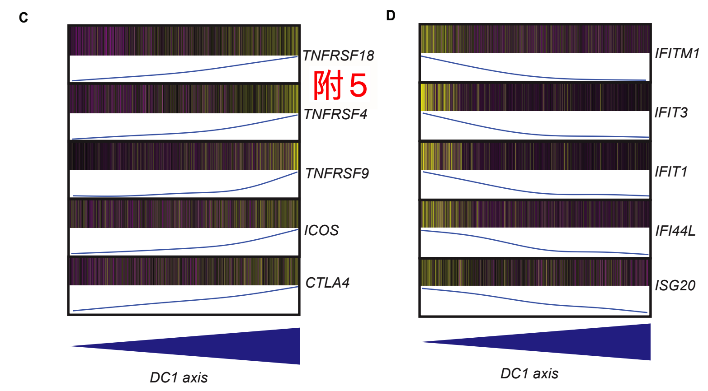

# Immune landscape of viral- and carcinogen-driven head and neck cancer

---

## Highlights

scRNA-seq显示HPV-和HPV+HNSCC的不同免疫学特征。

高维分析显示B细胞、myeloid细胞和CD4+Tconv细胞分化

多光谱成像发现与HPV+疾病相关的免疫结构(TLSs)

T滤泡辅助标志与TCGA患者的良好存活率相关

## Summary

头颈鳞状细胞癌（HNSCC）通过HPV致癌或恶性转化产生。在这里，我们评估了来自HPV-和HPV+ HNSCC和健康供体的患者的外周和肿瘤免疫群的131,224个单细胞的转录谱。 HPV-和HPV + HNSCC肿瘤内的免疫细胞显示出一种转录签名的光谱，具有辅助CD4 + T细胞和B细胞是相对不同的，CD8 + T细胞和CD4 +调节T细胞相对相似。通过多光谱免疫荧光分析和评估基于空间接近的调查细胞间通信的转录结果。这些分析确定了与CD4+T滤泡辅助细胞相关的基因表达特征，该特征与HNSCC患者较长的无进展生存期相关。本文的数据集和分析方法为进一步研究免疫细胞对病毒和致癌物诱导的癌症的影响提供了资源。

## Introduction

头颈部鳞状细胞癌(HNSCC)在全球每年的发病率接近60万例(Ferlay等人，2015年)，大多数患者都患有局部晚期疾病(Argyis等人，2008年；Seiwert和Cohen，2005年)。
HNSCC是由暴露于致癌物(即酒精和/或烟草)或高危人类乳头瘤病毒(HPV)感染后的恶性转化引起的基因改变引起的(Carvalho等人，2005年)。
尽管大多数HNSCC与烟草使用有关，但在西方，HPV+HNSCC的发病率已大幅上升(Brown等人，2011,2012；Colevas，2014；LeHew等人，2017；Weatherspoon等人，2015)，目前美国多达一半的HNSCC病例是由感染高危HPV(主要是HPV-16，但也有-18，-31和-33)引起的(Fakhry和D‘Souza，2013。
临床上，与HPV疾病患者相比，HPV+HNSCC患者的总体存活率更高(Ang等人，2010年)。
在HNSCC中也观察到了肿瘤浸润免疫群体的差异，HPV+HNSCC中肿瘤内B细胞出现的频率更高(Russell等人，2013年；Wood等人，2016年)，HPV-HNSCC中功能失调的CD8+T细胞出现频率更高(Kansy等人，2017年)。致癌物诱导的癌症和病毒诱导的癌症的二重性是HNSCC的一个独特方面，它提供了一个机会来评估发生在相似解剖位置的两种不同癌症病因的免疫状况的差异。

传统上，HPV-和HPV+HNSCC都采用手术、化疗和放疗相结合的方法进行治疗(Bourhim等人，2006年；Pignon等人，2009年)。
这些疗法通常与显著的发病率有关，许多患者在3-5年内复发，导致预后较差，缺乏额外的治疗选择(Jayaram等人，2016年；Vermorken等人，2008年)。
免疫疗法创造了治疗癌症的新范式，最近的临床试验证明了以免疫检查点为靶点的疗效(Brahmer等人，2012年；Toparian等人，2012年)。
治疗HNSCC的免疫疗法同样带来了患者的生存益处，表明免疫系统可以有针对性地在HNSCC中实现临床益处(Burness等人，2019年；Ferris等人，2016年)。
尽管取得了这些临床上的成功，但只有大约20%-30%的HNSCC患者在程序性死亡1(PD-1)或程序性死亡配体1(PD-L1)阻断后获得了生存益处(Burness等人，2019年；Ferris等人，2016年)，这突显了更好地了解HNSCC肿瘤微环境中免疫系统状态背后的复杂生物学的必要性。对免疫细胞状态的深入了解将有助于确定与对当前可用的免疫疗法的反应性(或相反，缺乏反应性)相关的特征，并将为临床上开发单剂和多剂免疫疗法提供信息。
同样，比较HPV-和HPV+HNSCC中的免疫图谱也是优先选择哪些细胞类型和分子作为新免疫疗法开发目标的先决条件。

在这里，我们通过单细胞RNA测序(scRNA-seq)分析和多光谱免疫荧光(IF)分析比较了治疗初期HNSCC中突变癌症和病毒驱动癌症的免疫格局，以表征肿瘤微环境(TME)中的空间定位模式和细胞邻域。
我们的分析提供了对HPV+和HPV免疫谱系的洞察。
HNSCC，这些细胞的转录状态和分化轨迹，以及与肿瘤进展潜在相关的细胞串扰。
此外，我们的分析定义了一个在临床上具有预测潜力的基因集。
总之，这些数据集和分析方法为进一步研究免疫对病毒和致癌物诱发癌症的作用提供了资源。

## Result

#### HNSCC免疫谱系的单细胞调查

我们分析了手术后立即从18名HPV-HNSCC患者和8名HPV+HNSCC患者的原发肿瘤中获得的配对血液和组织中所有血液学来源的活细胞(即CD45+细胞)的单细胞转录本，这些患者都是免疫治疗的初学者(图1A；表S1)。
作为比较，从5例独立睡眠呼吸暂停患者(即非癌症患者)的扁桃体组织和6例健康献血者的外周血单核细胞(PBMC)中分离出活性CD45+细胞也可产生单细胞转录本。
总体而言，我们回收了131,224个通过质量控制措施的个体免疫细胞(图S1A)，平均表达了1262个基因(图1A；STAR方法)。

> 图1.患者间转录图谱整体变化的评估和单细胞的整体聚集和鉴定从63个样本中总共回收了131,224个单细胞。
>
> (A)从PBMC中分离活CD45+细胞，并从组织样品中制备单细胞悬液，进行scRNA-seq。
>
> (B)通过假瘤表达谱对样本进行聚类显示，PBMC和TIL之间有很强的分离性，TIL样本按来源组织有明显的聚集模式。
>
> (C)所有单个细胞的FItSNE可视化和Dragon聚类在所有样本中确定了26个独特的簇。
>
> (D)与(C)相同的FItSNE图，但确定了所有免疫细胞类型。
>
> (E)与(C)和(D)中相同的FItSNE包埋，显示每种样品类型的所有细胞。
> 细胞密度在PBMC、扁桃体和TIL样本之间有明显的变化，反映了PBMC和组织之间转录谱的差异。
>
> (F)量化HPV-TIL和HPV+TIL主要免疫谱系之间的差异。
> 对于HPV-和HPV+TIL，每个点代表来自主成分分析(PCA)空间的500个细胞的子样本，或者代表与样本类型(即随机)无关的500个细胞的样本，并且条的高度是子样本的平均值。
> 所有的比较都有统计学意义，因为有100次重复检测，但HPV-和HPV+TIL与随机样本之间的平均倍数变化从3.9倍(B细胞)到1.1倍(CD8+T细胞)不等。
> P值来自Wilcoxon秩和检验，比较HPV-
> VS HPV+TIL到每种细胞类型的随机选择。

根据我们的scRNA-seq数据构建的Pseudobulk表达矩阵(图1B；STAR方法)显示样本按PBMC和组织来源分离，以及肿瘤浸润性白细胞(TIL)和扁桃体样本的分离簇。
我们恢复了PBMC和TIL之间的预期差异，如PBMC中的髓样细胞(LYZ和FCGR3A)和TIL中的免疫调节细胞因子(图S1B)。

在TIL的簇之间(图S1C)，我们发现簇3和簇4与来自扁桃体组织的样本(簇1)共享部分表达模式，包括B细胞(MS4A1和CD19)和激活的T细胞基因(CD3D和HLA-DRB5)，但也表达一小簇不同于TIL的细胞毒基因(如GZMB)。
基于这些假障碍数据，我们进行了自举后能量分析(STAR方法)，发现在平衡研究设计中需要9名患者才能达到在TIL中发现差异表达基因的80%的能力(图S1D)。
总体而言，这种假瘤RNA-seq分析揭示了PBMC和TIL样本之间基因表达的巨大变化，并提示了与HPV-和HPV+TIL之间的差异浸润和转录状态相关的亚结构。

我们接下来开发并实施了确定性退火高斯混合模型聚类算法（DRAGON；图 S2A；STAR 方法）来识别我们数据集中存在的细胞簇（图 1C；表 S2）。 DRAGON 是用于 scRNA-seq 的确定性退火 (Rose, 1998, 1990a, 1990b) 的新实现，它使用类似于物理退火过程的过程执行聚类。简而言之，DRAGON 通过在各种“温度”下逐步“冷却”系统来执行聚类，这有效地限制了与温度成正比的系统的最小无序。使用 DRAGON，在连续降低的温度下的轮次期望和最大化会导致最终解决方案处于全局最小值，但也会在生成集群时提供温度降低的中间解决方案（图 S2B）。该模型与其他聚类算法相比有几个优点，为集群发生提供统计原则的标准，通过连续轮次期望/最大化逐步减少无序来避免局部最小值，将每个集群参数化为高斯混合模型的一个组成部分，以及可扩展性通过对算法的关键组件使用并行处理（STAR 方法）来处理大型数据集。此外，常用的 Louvain 聚类算法有几个已知的限制，包括分辨率限制（Fortunato 和 Barthe ́lemy，2007）和检测断开社区的潜力（Traag 等，2019）。 DRAGON 与 Louvian 聚类（在 Seurat 中实施；STAR 方法）的基准测试表明，这两种算法在广泛的模拟 scRNA 上都实现了高精度（Louvian，90.3%；DRAGON，90.6%；通过双样本 t 检验 p = 0.88）由 splatter (Zappia et al., 2017) 生成的 seq 数据（图 S2C）。总体而言，DRAGON 和 Louvian 聚类的性能相似，但基于不同的框架。由 DRAGON 确定的 26 个簇通过基于快速傅立叶变换加速插值的 t-分布式随机邻域嵌入 (FItSNE) (Linderman et al., 2019) 可视化，这是一种基于快速插值的 t-分布式随机邻域嵌入 (tSNE)（图 1C)。

我们接下来使用 DRAGON 在 45 度相对较高的温度下的聚类解决方案（图 S2B）来识别主要的免疫谱系。

发现这四个簇之间的差异基因表达与 CD4+ T 细胞、B 细胞、细胞毒性细胞（CD8+ T 细胞和自然杀伤 [NK] 细胞）和骨髓细胞密切相关（图 S2D）。接下来，我们从这 4 个谱系中的每一个中通过生物信息学分离和重新聚类细胞，以根据规范基因表达模式识别细胞类型（图 S2E)。

推断的细胞类型与通过流式细胞术对来自一组患者的配对样本鉴定的细胞类型密切相关（图 S2F-S2I）。然后将这些推断的细胞类型投影到完整数据集的 FItSNE（图 1D；表 S2）。我们还进行了第二次事后功效分析，发现需要 60,000 美元的细胞才能有 80% 的机会检测到一组 300 美元的细胞（即最稀有群体肥大细胞的大小；图 S1E)。

接下来，我们通过观察相同的FItSNE投影(细胞按样本类型着色)来评估患者样本中转录谱的变化(图1E)。为了量化HPV -和HPV+ TILs中主要免疫谱系之间的转移，我们使用Bhattacharyya距离测量了每个tu- mor型免疫谱系之间的距离(图1F;星方法)。为了比较，我们通过取样独立于tu- mor型的细胞来生成每个主要谱系的背景分布。这种方法通过对相同数量的细胞进行次采样来控制每个样本中存在的细胞数量，因为观测到的入渗数值差异这很重要(图S1F)。引人注目的是，该分析揭示了HPV -和HPV+ TILs之间的B细胞、髓系细胞和常规CD4+ (Tconv)细胞之间的巨大差异(图1F)。相比之下，HPV -和HPV+ til之间的CD8+ T细胞和CD4+调节性(Treg)细胞更为相似。总的来说，我们描述了PBMCs和TILs之间(以及TIL样本组之间)转录谱的广泛变化，鉴定了主要免疫细胞系的细胞类型，并量化了HPV -和HPV+ TILs中常见的主要细胞系的差异。

#### CD8 + T细胞具有连续的分化轨迹

为了解决VIRALVERSUS致癌物质引起的HNSCC中CD8 + T细胞的转录状态，我们生物信息分离和重新聚集CD8 + T细胞。在Dragon Clustering之后，总共8个群集（图2A;表S3）。来自Ti LS的CD8 + T细胞在簇1-4中最常见，而来自PBM CS和扁桃体的人在簇5-8中更常见（图2b），尽管PBMC和TIL群体之间也有一个值得注意的重叠在一些簇中。我们接下来进行了鉴别基因表达分析，并发现了治疗每个簇的不同基因组（图2c）。具体地，簇1与循环细胞（例如，MKI67）相关;簇2与干扰素（IFN）响应基因有关（例如，ISG15）;簇3和4表达与耗尽相关的检查点标记（例如，PDCD1 [PD-1的PDCD1]和CTLA4和HAVCR2 [TIM3基因]）;簇5通常是静态的，表达低水平的效应分子（例如，GZMH和KLRD1）;簇6表达与幼稚或记忆单元相关联的标记（例如，CCR7和CD27）;簇7表达与早期激活相关的基因（例如，JUNB和FOSB）;并且簇8表达与效应函数（例如，KLRG1和GZMH）相关的基因。我们接下来评估了通过我们实验室（星形方法）开发的新R包单个SEQ GSET中实施的竞争基因集浓缩试验与这些簇相关的生物学功能。有趣的是，我们发现含有用尽的CD8 + T细胞的簇以若干方式不同，例如在簇3中的共模和缺氧信号传导和簇4中的缺氧信令和额外反应（图2d;表S4）。

> 图2。CD8+T细胞在HPV-和HPV+TIL之间共享共表达抑制性受体的分化轨迹。在所有样本中总共回收了32,734个CD8+T细胞。
>
> (A)Dragon对CD8+T细胞的聚类显示，所有样本中共有8个聚类。
>
> (B)根据样品类型对簇的富集显示，簇1-4主要来自TIL；而簇5-7由PBMC、扁桃体和TIL的混合物组成；簇8主要是TIL。
>
> (C)差异基因表达分析显示了与每个簇相关的特征基因。
> 具体地说，簇1表达与细胞周期相关的基因，簇2与干扰素反应相关，簇3和簇4表达免疫检查点。
>
> (5)CD8+T细胞的扩散图包埋显示了一条从原始外周CD8+T细胞到终末分化的CD8+T细胞的激活轨迹。
>
> (F)来自HPV-和HPV+TIL的CD8+T细胞的运动轨迹在很大程度上是重叠的。

接下来，我们进行了扩散图分析(一种非线性降维技术；STAR方法)以推断分化轨迹(Angerer等人，2016；Haghverdi等人，2016)。
由此产生的二维扩散图嵌入揭示了将PBMC与TIL联系在一起的平滑轨迹(图2E；表S5)，以及HPV+和HPV-TIL的重叠轨迹(图2F)。

为了更好地描述扩散轨迹和群集之间的关系，我们在扩散图嵌入图上可视化了CD8+T细胞的每个群集，产生了与基因集表达分析一致的模式(图S3A)。
接下来，我们通过识别与每个成分相关的基因来表征两个扩散成分(DC1和DC2)(STAR方法；表S5)。
DC1与终末分化表型密切相关，随着DC1的进展，抑制性受体如LAG3、CTLA4、PDCD1(PD1基因)和HAVCR2(TIM3基因)共表达增加(图S3B)。

我们还发现这些终末分化的CD8+T细胞高表达ENTPD1(CD39基因)和CXCL13，提示这些细胞在腺苷代谢中发挥作用(Deaglio等人，2007年)，并试图招募B细胞(Ansel等人，2002年)。
DC2与一种记忆表型(图S3C)相关，该表型由CD27、CCR7、Eome和其他与记忆形成相关的基因共同表达控制(Banerjee等人，2010年；Mahnke等人，2013年)。
综上所述，我们鉴定了CD8+T细胞簇，并推断出肿瘤类型之间共有的分化轨迹。提示针对CD8+T细胞的免疫治疗策略可能同时适用于病毒和致癌物诱导的HNSCC。

#### 广泛的CD4+Tconv异质性与分化轨迹

接下来，我们比较了HPV-和HPV+HNSCC中CD4+T细胞的转录图谱，分别分析了CD4+Tconv细胞和CD4+Treg细胞。
CD4+Tconv细胞群集显示7个不同的群集(图3A和3B；表S3)。
基因集富集分析(图S4A；表S4)显示，PBMC来源的CD4+Tconv细胞富含与幼稚和记忆(第2类)、效应器记忆(第3类)以及效应器和中央记忆的混合(第5类)相关的基因集。

> 图3.CD4+Tconv细胞和Treg细胞转录状态和分化轨迹的解剖从所有样本中总共回收了45,640个CD4+T细胞，其中41,889个CD4+Tconv细胞和3,751个Treg细胞。
>
> (A)用Dragon将Tconv细胞分成7个簇。
> (B)与(A)相同的FItSNE，但按样本类型着色(左图)，并显示成簇的样本丰富(右图)。
>
> (C)所有CD4+Tconv样本的三维扩散图显示，来自HPV+和HPV-TIL的CD4+Tconv细胞之间存在分支。
>
> (D)二维回归平面显示HPV-和HPV+TIL中CD4+Tconv细胞的轨迹差异。
>
> (E)通过扩散分析显示来自簇1和簇7(两个末端分支)的前50个差异表达基因的热图。
> 簇1与AT T滤泡助手(TFH)表型相关，而簇7具有效应器记忆表型。
>
> (F和G)(F)我们从所有患者中鉴定出6簇CD4+Treg细胞。
> (G)与(F)相同的FItSNE，但单元格按样品类型着色(左图)，样品按簇富集(右图)。
> 大多数CD4+Treg细胞(89%)来源于TIL。
>
> (H)基因集富集显示干扰素反应簇(2和4)和富含TNF信号的簇(3和6)。
>
> (I)HPV-和HPV+TIL的CD4+Treg细胞扩散图包埋显示出一致的分化轨迹。
>
> (J)HPV-TIL和HPV+TIL沿DC1轴的CD4+Treg细胞密度相似，但HPV-TIL的CD4+Treg细胞频率稍高于HPV+TIL。

在TIL的CD4+Tconv细胞中，我们发现第1和第6簇主要由来自HPV+TIL的CD4+Tconv细胞和扁桃体的CD4+Tconv细胞组成，而来自HPV-TIL的CD4+Tconv细胞分布在第4和第7簇之间。扁桃体和TIL的CD4+Tconv细胞表现出丰富的一系列相互关联的T滤泡辅助细胞(TFH)和1型辅助细胞(TH1)信号，并有额外的效应记忆表型证据。
我们统计评估了样本类型和CD4+Tconv细胞聚集性之间的关系(图S4B；STAR方法)，发现HPV+TIL与HPV-TIL相比有显著的细胞富集作用(p=0.0044，秩和检验)。

接下来，我们进行扩散图嵌入以重建CD4+Tconv细胞的分化轨迹。
与CD8+T细胞相比，可视化得到的扩散图的前3个维度产生了分支轨迹(DC1；图3C；表S5)。
接下来，我们对来源于HPV-和HPV+TIL的CD4+Tconv细胞的DC1、DC2和DC3之间的回归平面进行拟合，发现不同肿瘤类型之间的分化平面显著不同(图3D)。
当将扩散图的前2个维度与推断的扩散假时间(DPT；图S4C和S4D)一起视为第三个维度时，很明显DC1和DC2都与DPT正相关，但基本上彼此正交。
与基因集富集分析相一致的是，簇2是最幼稚的簇，然后细胞经过连续的中间表型，向簇1或簇7所定义的终末状态发展(图S4D)。
第1和第7组之间的顶级差异表达基因发现了与第1组相关的TFH相关基因和与第7组相关的激活、干扰素反应和记忆基因(图3e)。

接下来，我们评估了与每个扩散成分相关的基因，发现CXCR5和PDCD1的表达与DC1之间存在很强的关联，这与这些细胞的TFH签名一致(图3e)。
然而，当观察CXCR5和PDCD1在DC1和DPT三维包埋中的表达时，我们发现CXCR5和PDCD1的共表达是双峰的，相对于DPT，CXCR5和PDCD1在DC1早期和晚期共同表达(图S4E)。
有趣的是，我们还发现其他已知的抑制性受体(LAG3和HAVCR2)在CXCR5和PDCD1共同表达的同一点上也有明显的表达。
这暗示了DPT早期的命运决定，细胞可以进展到CD4+TFH，也可以采用抑制受体共表达的表型，这可能会抑制进一步的分化。
综上所述，我们发现了与HPV+和HPV-  HNSCC相关的CD4+Tconv细胞独特的分化轨迹。

#### CD4+Treg细胞中IFN和TNFR相关信号的相互作用

CD4+Treg细胞抑制TME中的抗肿瘤免疫反应，最近对肺癌(Guo等人，2018年)和乳腺癌(Azizi等人，2018年)的研究描述了TME中Treg细胞的独特转录状态。
利用Dragon，我们发现了6个不同的簇，它们主要由TIL Treg细胞主导(图3F和3G；图S5A；表S3)。
接下来，我们进行了基因集富集分析，以表征每个簇中的一般生物活性(图3H；表S4)。
有趣的是，第2和第4组富含与IFNA反应相关的基因集(IFN反应基因[Browne])和一般IFN反应基因(IFN诱导的抗病毒模块[Bosco])，而第3和第6组富含肿瘤坏死因子受体(TNFR)家族信号通路。
与IFN反应和TNFR信号相关的模块是互斥的，这表明这些细胞根据其分化状态对不同的信号做出反应。

CD4+Treg细胞扩散图包埋显示DPT与DC1密切相关(图3I；图S5B；表S5)。
沿着DC1轴，HPV-TIL和HPV+TIL Treg细胞的密度有细微差别，在DPTS早期来自HPV-TIL的Treg细胞较多(图3J)。
我们发现TNFRSF18(GITR)、TNFRSF9(CD137，4-1BB)和TNFRSF4(OX40)与DC1呈正相关，并且在DPTS晚期共表达(图S5C)。
这一观察支持了TNFR超家族对于维持效应器Treg细胞种群重要的概念(Vasanthakumar等人，2017年)。
相反，我们发现干扰素反应基因IFITM1、IFIT1、IFIT3和ISG20在DPTS早期表达，并随着假性时间的进展而关闭(图S5D)，提示IFN信号在Treg细胞早期激活中可能起作用。w

综上所述，这一分析表明，Treg细胞在HPV-和HPV+HNSCC之间具有相似的轨迹(尽管在不同的状态下更常见)，并且IFN相关信号和TNFR家族信号在分化过程中相互关联。

#### HPV+TIL中存在生发中心B细胞

已发现TME内的B细胞与人类肿瘤类型的总生存率呈正相关(Al-Shibli等人，2008年；Milne等人，2009年；Nedergaard等人，2008年；Shih等人，2013年；Shimabukuro-Vornhagen等人，2014年；Woo等人，2014年)，并能影响CD4+Tconv细胞表型(Bruno等人，2017年)。
B细胞群集显示11个群集(图4A；表S3)。

HPV+TIL和扁桃体组织的B细胞主要集中在1-4簇，而HPV-TIL的B细胞主要集中在5和7簇(图4B)。
基因集富集分析鉴定了幼稚细胞(第6和第9簇)、记忆细胞(第8和第11簇)、浆细胞(第5簇)和生发中心B细胞(第1-4簇)(图4C；表S4)。
细胞周期和生发中心基因组的重叠富集意味着簇3和簇4是中心母细胞，这与在暗区发现的快速增殖的B细胞一致(Victora，2014)。
相反，簇1和簇2也富含生发中心基因集，但缺乏细胞周期基因的表达，这表明这些细胞是光区的中心细胞，在那里它们受到CD4+TFH的选择。
与HPV+TIL不同，HPV-TIL中的B细胞通常是浆细胞(第5簇)或开关记忆B细胞(第7簇)。
只有血浆或早期切换记忆B细胞处于HPV-TIL状态可能与缺乏CD4+TFH帮助相一致。

B细胞的扩散图(图4D和4E；表S5)显示了一个跨越多个轴的复杂分化过程。
对簇(图4D)和样本类型(图4E)的检查显示，DC4与从幼稚到记忆B细胞的进程有关。
然而，DC1与DC4相交于DC4的最小和最大值之间，并沿着DC1从右向左排列，这与生发中心的形成有关。
与HPV-HNSCC中缺乏生发中心B细胞一致，HPV-HNSCC中的B细胞更趋向于DC1的阳性值(图4F)。
浆细胞(第5簇)位于更靠近记忆B细胞簇的位置，这与脱离生发中心反应是一致的。
我们对HPV-HNSCC与HPV+HNSCC的TME中B细胞的分析得出结论：生发中心B细胞在HPV+HNSCC中通过生发中心反应存在于不同的进展阶段，而在HPV-HNSCC中B细胞数量较少且处于非生发中心状态。

#### 共同的轨迹产生不同的髓系状态

髓样细胞在TME的免疫反应形成中起重要作用，大致可分为肿瘤相关巨噬细胞(TAMs)和树突状细胞(DC)。
TAMs通常被认为要么是抗肿瘤的，要么是亲肿瘤的(即分别是M1样或M2样)(Yang and Zhang，2017)。
最近的研究揭示了TME中髓系细胞之间更广泛的异质性，TAMS在乳腺癌中同时表达M1和M2的特征(Azizi等人，2018年)，在肺癌中髓系细胞的独特状态(Lavin等人，2017年)。
我们鉴定了8个髓样细胞簇，其中簇2-4主要存在于PBMC中，簇1和簇5-8存在于TIL中(图5A和5B；表S3)。

为了更好地了解髓系细胞的TIL群体，我们调查了不同簇之间最高差异表达的基因(图5C；表S3)。
这导致第2组为CD16+单核细胞和两组CD14+单核细胞(第3组和第4组)。
重要的是，第3簇的CD16基因FCGR3A低表达，提示它是一个独特的CD14+单核细胞簇，而不是CD14+CD16+单核细胞的过渡群体。
在TIL中，第5和第7簇似乎高度分泌，表达高水平的趋化因子和细胞因子。
簇1、6和8表达相对较高水平的人类白细胞抗原(HLA)分子，与抗原提呈细胞一致，但在几个方面有所不同。
第1群高表达IDO1、CCL17和CCR7，第6群表达CD1C(与常规树突状细胞一致)，第8群表达补体。
第8簇也表达了典型的M2标记MRC1(CD206的基因)，尽管它不在最高差异表达的基因之列。
簇1和簇8在HPV-TIL中更常见，提示HPV病患者具有潜在的免疫抑制作用。

接下来，我们执行扩散图嵌入，并确定了几个分支(图5D和5E；表S5)。
第5簇对TME中髓系细胞的命运至关重要，因为它将CD14+单核细胞从PBMC连接到TIL群体，并表明PBMC和TIL CD14+细胞之间表达状态的转换令人惊讶地平稳(图5F)。
在DC1和DC2轴上的正方向上，群集5向群集7和8前进，群集7和8代表该轨迹的一个末端分支(图5E-5G)。
簇6似乎从簇5开始，沿着簇7和簇8的轨迹广泛出现，暗示着沿着这种分化轨迹可能存在可塑性(图5G)。
第8群似乎是一个未成熟的树突状细胞群，因为它在同一轨迹上先于更成熟的树突状细胞(第6群)。
我们对TME中髓系谱系的描述发现，TAMs超越了标准的M1或M2范式，细胞状态之间的平稳转换，以及几个树突状细胞群体。

#### 免疫细胞间的全球串扰

单细胞转录分析不仅可以揭示细胞的内在信息，还可以通过询问配体(表面或分泌的)和受体的表达来探索可能的细胞-外在相互作用。
为了绘制可能的细胞间相互作用图，我们首先使用708个独特配体和691个独特受体的列表确定了配体/受体的表达，这些配体/受体加在一起可以形成2557个潜在的相互作用对(STAR方法；Ramilowski等人，2015年)。
我们首先评估了在HPV-和HPV+HNSCC中表达的更多的配体和受体(图6A和6B)。

> 图6.HPV-和HPV+TIL的受体和配体的表达模式不同，TIL中存在广泛的细胞-细胞通讯，评估了受体和细胞表面及分泌的配体基因的表达，以及细胞类型内和细胞之间的细胞-细胞通讯。
>
> (A)HPV-TIL和HPV+TIL之间配体表达的Log2倍变化揭示了来自HPV-TIL和CD40LG的趋化因子和细胞因子以及来自HPV+TIL的其他B细胞激活刺激的差异。
>
> (B)髓系相关受体在HPV-TIL中高表达，而与B细胞和生发中心活性相关的受体在HPV+TIL中高表达。
>
> (C-F)(C)Circos图显示了来自健康捐赠者的外周血液中不同细胞类型的配体和受体之间的相互作用。
>
> (D)Circos图显示了来自扁桃体切除术的扁桃体细胞类型之间的配体和受体之间的相互作用。
>
> (E)显示HPV-患者肿瘤来源的细胞类型之间相互作用的Circos曲线图。与(C)或(D)相比，存在更多的相互作用。
>
> (F)Circos图显示来自HPV+HNSCC患者的细胞类型之间的相互作用。与(E)类似，有比(C)或(D)中存在的多得多的相互作用。

在更大的潜在配体和受体集合中，我们接下来使用我们开发的名为CellTalker(用于评估细胞间通信)的新R包来识别那些参与免疫谱系内和免疫谱系之间可能相互作用的配体和受体。
使用CellTalker，我们确定了168个配体和194个受体，它们参与了481个独特的相互作用。
接下来，我们使用CellTalker的结果生成Circos图(Zhang等人，2013年)，用于可视化这些相互作用。
在Circos图中，每个相互作用被描绘成一条线，将不同细胞类型的配体与受体连接起来(图6C-6F；表S6)。
相互作用大致分为三种类型：普通相互作用(至少发生在一种其他样本类型中)，独特与健康供者PBMC的相互作用，或独特与所有其他样本类型的相互作用。
虽然在PBMC和扁桃体样本中有许多假定的相互作用，但我们发现假定的相互作用在TIL群体中大量扩展。
除了TME中扩大的细胞间通讯外，我们还在HPV-和HPV+TIL中发现了独特的通讯轴线。
虽然从全球的角度来看是有用的，但了解免疫细胞相互之间的空间定位将为基于邻近程度评估假定的细胞间通信提供更严格的框架。

#### 空间组织与转录签名的一致性

单细胞转录组分析提供了对单个细胞转录状态的高维洞察，但没有关于细胞在原位的空间定位的信息。
作为我们scRNA-seq分析的补充，我们对来自同一患者队列的成对组织切片进行了多光谱IF(STAR方法；图S6A)。
我们每张幻灯片捕获2-5个感兴趣区(ROI)，总共有来自24名患者的90个感兴趣区(ROI)。

> 图7.如果对HNSCC切片的分析提供了基于空间定位的假定细胞间通讯的洞察力，我们在研究中对患者的组织切片进行IF染色。
>
> (A)根据存在的细胞类型的频率对载玻片进行群集，总共产生5个群集。
>
> (B-F)代表(A)中确定的每个群集的图像，显示在每个面板的左侧，以及每个图像的细胞-细胞接近的对数赔率，显示在每个面板的右侧。
> 细胞类型之间的对数赔率越高，意味着这些细胞类型在二维上彼此相邻的概率越高。
> 对于(B)-(F)，每个面板是来自(A)中标识的群集的代表性图像。
> 每个面板中都注明了图像派生自的群集。
> 比例尺，100毫米。
>
> (G和H)CellTalker用于确定7个CD4+Tconv细胞群集(图3；CD4-1至CD4-7)与Dragon确定的11个B细胞群集(图4；B-1至B-11)之间可能的相互作用。
> (G)显示HPV患者肿瘤中CD4+Tconv与B细胞之间的相互作用。
> HNSCC，(H)显示HPV+HNSCC中CD4+Tconv与B细胞之间的相互作用。
> 虽然(G)和(H)中都存在B细胞与CD4+Tconv之间的相互作用，但在(H)中有许多HPV+HNSCC特有的相互作用，包括TFH效应细胞与中心细胞和中心母细胞B细胞之间的相互作用。
>
> (I)基于来自TCGA的HNSCC患者的TFH签名(如图3E所定义)的基于基因集富集的PFS分析。
> TFH丰度高的患者PFS明显延长。
> 风险比(HR)来自单变量Cox比例风险回归，p值来自似然比检验。

在下游处理(STAR方法)之后，我们根据每个免疫细胞子集存在的频率对单个ROI进行分层聚类(图7A；图S6B)，揭示与特定免疫谱系浓缩相关的簇(图S6C；图7B-7F，左图)。
从每张图像中，我们执行Delunay三角剖分来识别每个细胞在2个维度上最近的邻居(星形方法；图S6D)，目的是根据接近程度识别最有可能相互作用的细胞类型。
一种细胞类型与另一种给定细胞类型相互作用的几率被表示为对数-几率比(图7B-7F，右图)。
在B细胞频率最高的群(群3和群5)中，B细胞与其他B细胞相互作用的几率最高，其次是与CD4+Tconv细胞相互作用(图7D和7F)。
事实上，在第5簇ROI中，我们确定了一种反映三级淋巴结构(TLSS)的免疫细胞的组织模式。
基于这些空间关系，我们接下来使用CellTalker来推断HPV-和HPV+TIL中B细胞和CD4+Tconv细胞之间可能的细胞间通信网络的具体差异(图7G和7H；表S7)。
有趣的是，与scRNA-seq和IF分析一致，我们发现HPV-和HPV+TIL中B细胞和CD4+Tconv细胞之间可能存在配体/受体相互作用，但只有HPV+TIL可能存在生发中心B细胞(B-1到B-4簇)和TFH(CD4-1簇)之间的相互作用。

接下来，我们利用临床数据和来自癌症基因组图谱(TCGA)的大量mRNA-SEQ数据(Liu等人，2018年)来确定HNSCC中的CD4+TFH信号是否与生存相关(STAR方法)。
我们首先过滤了TCGA数据，只包括接受了p16检测的患者，p16是HPV+HNSCC的替代品。
与之前发表的数据(Ang等人，2010年)一致，我们发现，在HPV+HNSCC患者中，总体存活率(HPV+与HPV-的风险比[HR]=0.4，p=0.071；数据未显示)和显著改善的无进展生存率(HPV+与HPV-HNSCC的风险比[HR]=0.35vsHPV-HNSCC，p=0.019；数据未显示)呈上升趋势。
接下来，我们评估了TFH基因签名(来源于我们的scRNA-seq数据中与效应TFH相关的差异表达基因)在患者中的丰富程度，并使用基于TFH评分的分层方法进行单变量PFS分析(图7I；STAR方法)。
在单变量分析中，PFS的概率有统计学意义，高TFH和低TFH富集的风险比为0.34P=0.0029。
重要的是，在对包括T细胞浸润在内的8个协变量(图S7A)进行校正后的多变量生存分析中，生存期的改善仍然与高TFH浓度显著相关(HR=0.41p=0.024)。
综上所述，我们确定了组织切片中免疫浸润的独特模式，使用CellTalker和我们在HPV+和HPV-HNSCC中的scRNA-seq数据表征了独特的TFH效应器和生发中心的相互作用，并发现TFH富集的转录特征与改善的PFS相关。

