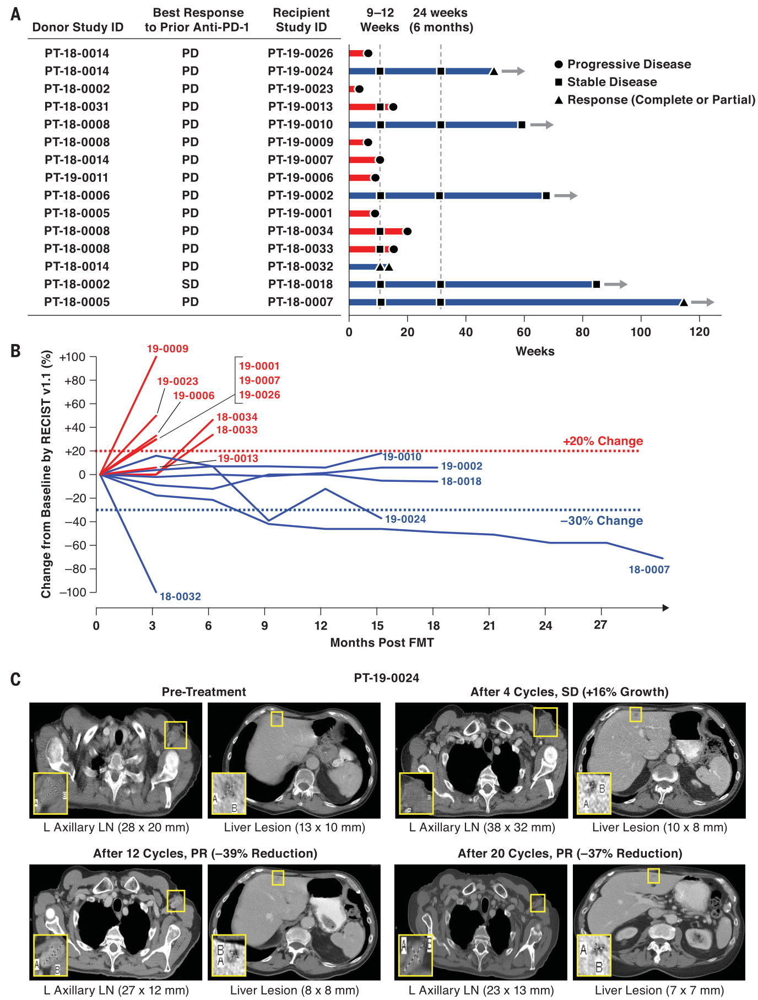
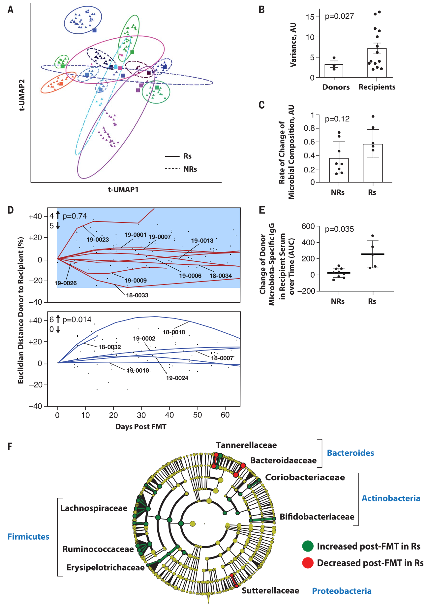

# Fecal microbiota transplant overcomes resistance to anti–PD-1 therapy in melanoma patients

### Abstract

抗程序性细胞死亡蛋白1（PD-1）治疗可为晚期黑色素瘤患者提供长期的临床益处。在临床前模型和癌症患者中，肠道菌群的组成与抗PD-1疗效相关。**为了研究是否可以通过改变肠道菌群来克服针对抗PD-1的耐药性，该临床试验评估了响应者衍生的粪便微生物菌群移植（FMT）与抗PD-1一起治疗PD-1难治性黑色素瘤患者的安全性和有效性**。 这种组合具有良好的耐受性，可在15名患者中的6名患者中提供临床益处，并引起快速且持久的微生物群摄动。应答者表现出丰富的分类单元，以前被证明与抗PD-1的应答相关，CD8 + T细胞活化增加，白介素8表达髓样细胞的频率降低。响应者具有独特的蛋白质组学和代谢组学特征，跨神经网络分析证实肠道微生物组调节了这些变化。总体而言，我们的研究结果表明FMT和抗PD-1改变了肠道微生物组，并对肿瘤微环境进行了重组，以克服晚期黑色素瘤子集中对抗PD-1的耐药性。

### Introduction

靶向编程性细胞死亡蛋白1（PD-1）的单克隆抗体（m Abs）的免疫检查点阻断可为近40％的晚期黑色素瘤患者提供长期临床益处（1-5）。除了支持抗PD-1 m Abs（anti-PD-1）的肿瘤-内在机制外，肠道微生物组还是抗PD-1反应的主要肿瘤-外在调节剂（6–9） 。在小鼠中，肠道微生物组的组成可调节抗PD-1和抗程序性死亡配体1（PD-L1）的治疗活性，并通过给予某些肠道赠品或粪便微生物群移植（FMT）促进抗–PD – 1在荷黑素瘤小鼠中的功效（10–12）。尽管多项研究报告说，癌症患者中有利的肠道微生物组与抗PD-1的反应有关，但其确切组成尚不完全清楚（10-12）。特别是在黑色素瘤中，属于各种门的关键细菌物种，包括放线菌（双歧杆菌科和科杆菌属和种）和硬毛菌（Ruminococcaceae属和Lachnospiraceae spp。）与癌症患者对靶向PD-1的m Abs的良好反应相关。 ，尽管在不同的研究中已经报道了在识别物种之间的一致性有限（10-14）。尚未评估基于微生物组的疗法能否克服晚期黑色素瘤患者对PD-1的耐药性。为了解决这个问题，我们设计了一项单臂临床试验，以评估从长期长期应答（R）黑色素瘤患者和PD-1难治性转移性黑色素瘤患者中使用抗PD-1获得的FMT的安全性和有效性（ NCT03341143；图S1）。

### Result

##### A subset of PD-1–refractory melanoma patients respond to fecal microbiota transplant and anti–PD-1 therapy

在2018年6月至2020年1月之间招募了16名黑色素瘤患者（表S1），此处显示的结果反映了2020年9月1日的数据截止。所有黑色素瘤患者均为抗PD-1治疗的原发性难治性患者，定义为由独立放射科医生使用反应评估方法评估，对单独使用抗PD-1或与抗细胞毒性T淋巴细胞相关蛋白4或研究药物联合使用均无先前反应，并且已确认原发进行性疾病（PD）实体瘤的标准（RECIST v1.1）（15，16）。在纳入试验的PD-1难治性患者中，只有一名在影像学上证实为PD之前对短期稳定疾病（SD）的反应最佳。所有入选患者和可捐献者均进行了连续粪便取样和广泛的传染性研究，以消除传播传染原的可能性（图S2）。 7名捐赠者（包括4名完全缓解（CR）和3名部分缓解（PR），中位无进展生存期（PFS）为56个月（范围：45到70个月）用于治疗16例患者（表S2） 。连续获取血液和粪便样本，并筛选FMT之前的32种病毒，细菌，真菌和原生动物制剂（图S2）。与派姆单抗一起使用单一的供体来源的FMT（图S1），然后每3周进行另外的派姆单抗治疗，直至疾病进展或出现无法忍受的毒性。每12周（四个周期）进行一次放射学评估，并使用RECIST v1.1对反应进行分类。在入组的16例患者中，有15例接受了FMT和pembrolizumab治疗，并且至少进行了一次再分期计算机断层扫描（CT）扫描，因此被认为可评估其疗效。

FMT后快速临床下降（被认为是疾病快速进展的继发因素）的一名患者可评估安全性但无反应。 15例患者中有3例（PT-18-0032，CR; PT-18-0007和PT-19-0024，PR）记录了客观反应（OR）[OR率（ORR）：20％]，而15例患者中有3例（PT-18-0018，PT-19-0002和PT-190.0010）（20％）的SD持续耐久超过12个月（图1，A和B）。提供了所有3例RR的R患者的代表性放射影像学实例（图1 C以及图S3和S4）。在中位随访7个月时，所有患者的中位PFS和总体生存期（OS）分别为3.0和7.0个月。在六位疾病控制患者（即OR和SD）中，PFS和OS的中位数分别为14.0和14.0个月（图1 B）。在这些患者中，一名患者（PT-18-0007）在> 2年后表现出持续性PR，目前正在接受监测，而四名患者（PT-18-0018，PT-19-0002，PT-19-0010和PT -19-0024）仍在接受治疗。一名影像学CR不足的患者（PT-18-0032）-进行了选择性外科手术以治疗椎管狭窄，但发生了与治疗无关的脊髓梗塞，随后病逝。我们的研究表明，在一部分PD-1难治性黑色素瘤患者中，FMT和抗PD-1克服了对抗PD-1的耐药性。尽管这些初步发现需要在更大的随机临床试验中进行进一步评估，但是观察到的ORR优于在抗PD-1疗法难以治疗的黑色素瘤患者中报告的OR Rs（17）。与治疗相关的不良事件（A Es）极少（表S3）。尽管所有患者均经历了至少一次AE，但这些患者大多为低级（1级，72.9％； 2级，20.0％）。内分泌性A Es主要为甲状腺功能减退，发生在17.6％的患者中，并且可以通过激素替代治疗。 3例患者发生3 A级Es：2例疲劳，排除并解决了潜在的内分泌学问题； 1例需要住院，静脉内注射的周围运动神经病（PT-19-0024）免疫球蛋白和皮质类固醇可在再次使用派姆单抗后再消除后遗症。

##### Fecal microbiota transplant induces persistent perturbation of recipients’ gut microbiome

为了评估FMT对受体肠道微生物群组成的影响以及与临床反应之间的关系，根据RECIST 1.1标准，FMT和抗PD-1≥12个月后的OR或SD定义为：形成了shot弹枪宏基因组测序，对从接受者（n = 15）和供体（n = 7）获得的223个粪便样品进行了测序。对于每个收件人，我们对一个FMT前样品（在FMT前7到21天获得）和所有可用的FMT后样品（每周一次，连续12周，然后每3周一次，只要患者仍在试验中）进行测序。 （图2A）。对于每个对应的FMT，我们对独特的供体进行了排序-从特定FMT供体获得的特定“ FMT注入液”（表S2和图S5 A）。统一的流形逼近和投影（UMAP）分析显示了收件人（图2A）和供体（图S5A）中不同的肠道菌群组成。对于接受抗PD-1 CR或PR的捐献者输注的患者，在FMT之后没有观察到明显的反应差异（图S5 B）。 CR供体中的微生物区系比PR供体中的菌群具有更高的α多样性，但是FMT前供体与受体之间没有观察到显着差异（图S5 C）。在接受者中，肠道微生物群组成在Rs和无反应者（N Rs）进行一次FMT后发生了变化（图2 A），这种改变一直持续到除非发生显着扰动（例如，在PT-18-0032在第22天之前使用抗生素和PT-18-00018在第84天之前）。值得注意的是，从各个捐赠者那里获得的所有单独收集的输注液彼此高度相似（图S5，A和D）。为了评估患者和接受者之间的变异性，我们计算了接受者和捐赠者（仅具有至少三个样本的人）的所有可用样本中所有时间点和所有分类单元的样本方差（图2 B）。与Rs相比，FMT后所有接受者的方差均显着大于供体（图2B）（图S6）。我们使用多维欧几里德距离量化了接受者中微生物组群落的差异和变化率。具体而言，从每天穿越的欧几里得距离推断出，穿越的速度在Rs中趋于高于N Rs（图2 C）。尽管该参数未达到统计意义（可能是由于样本量有限），但欧氏距离仍无法将实现疾病控制的患者与未实现疾病控制的患者区分开。