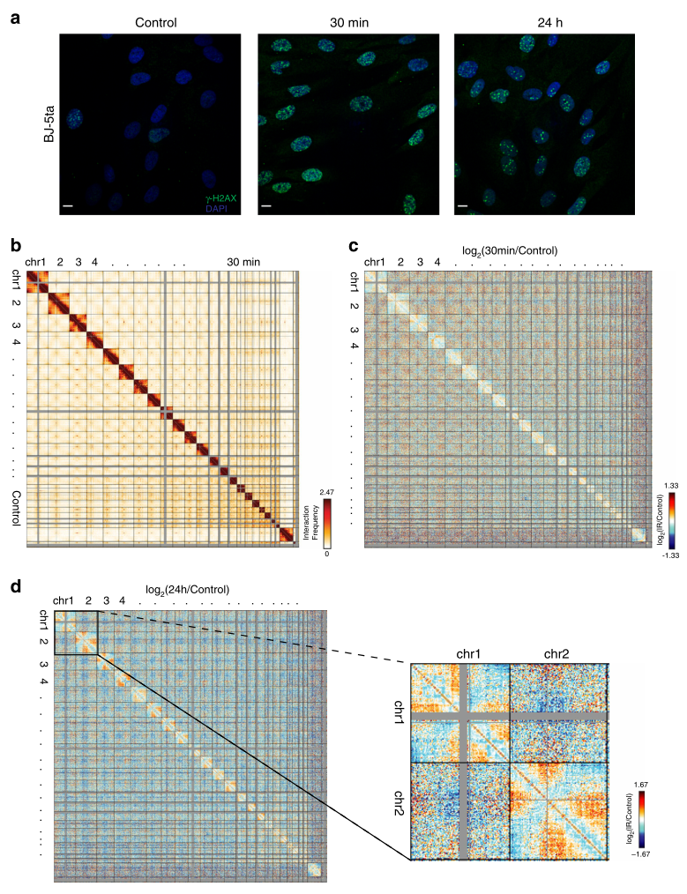
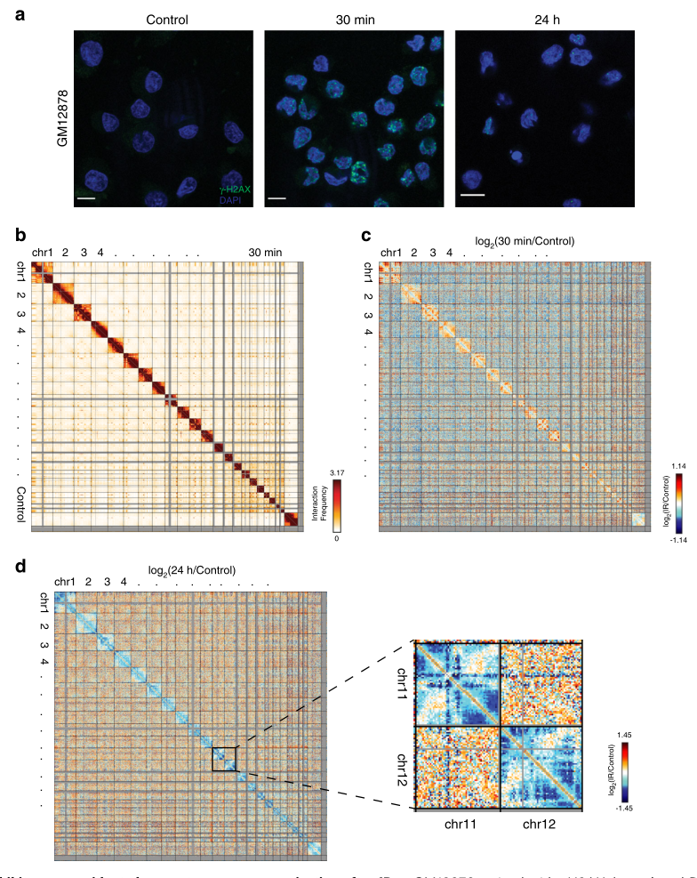
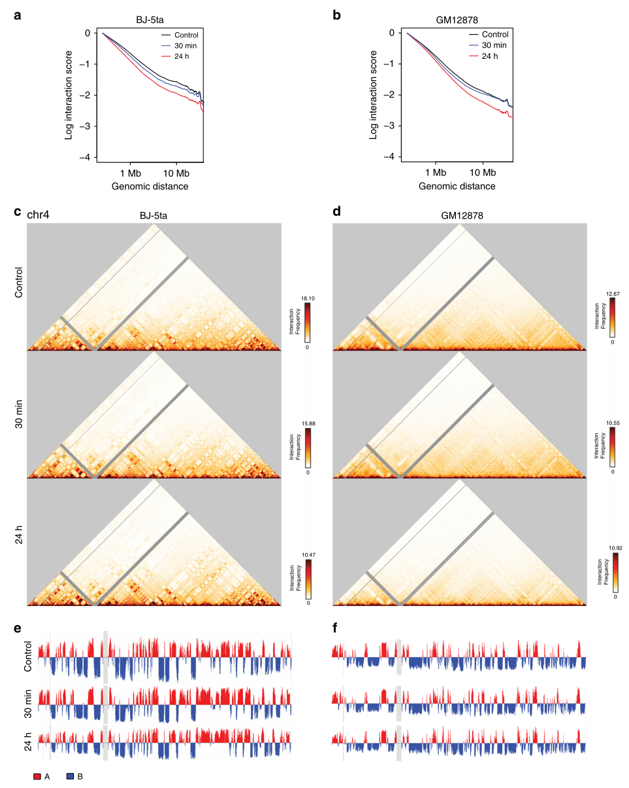
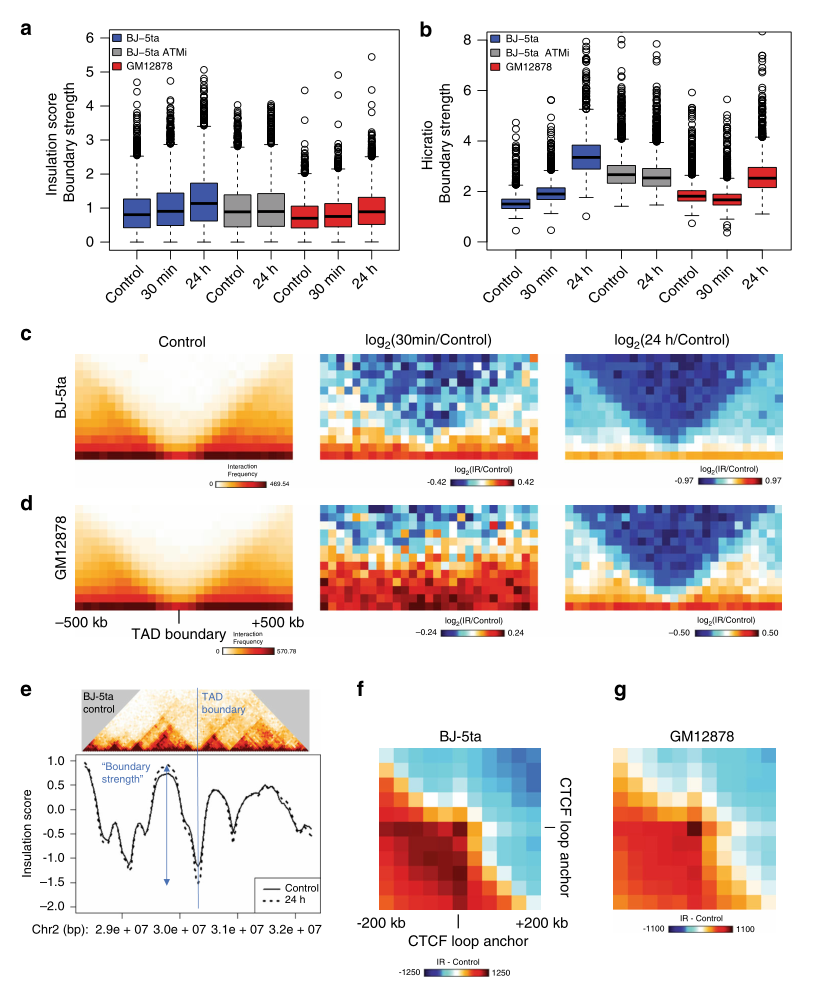
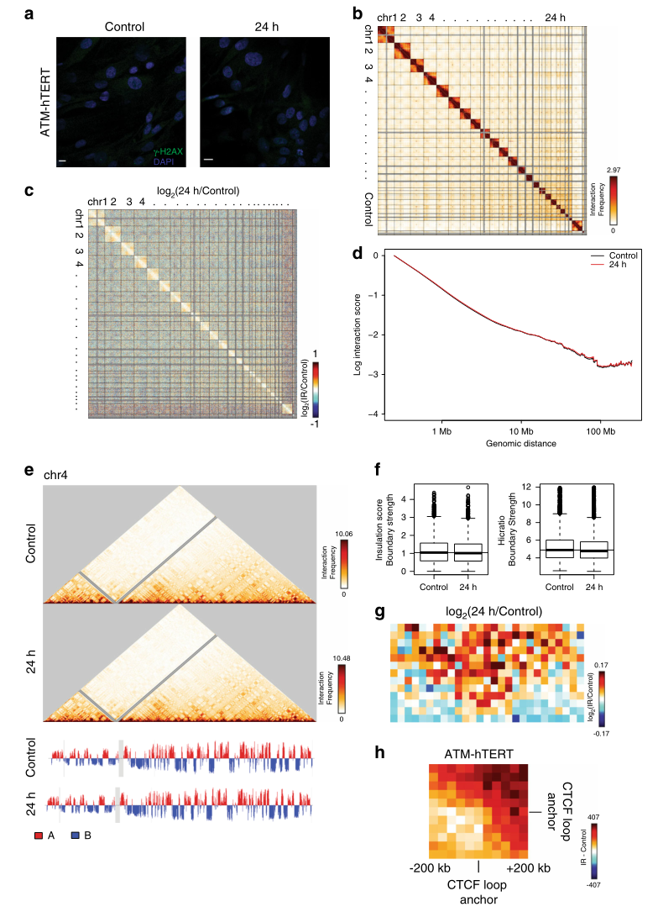
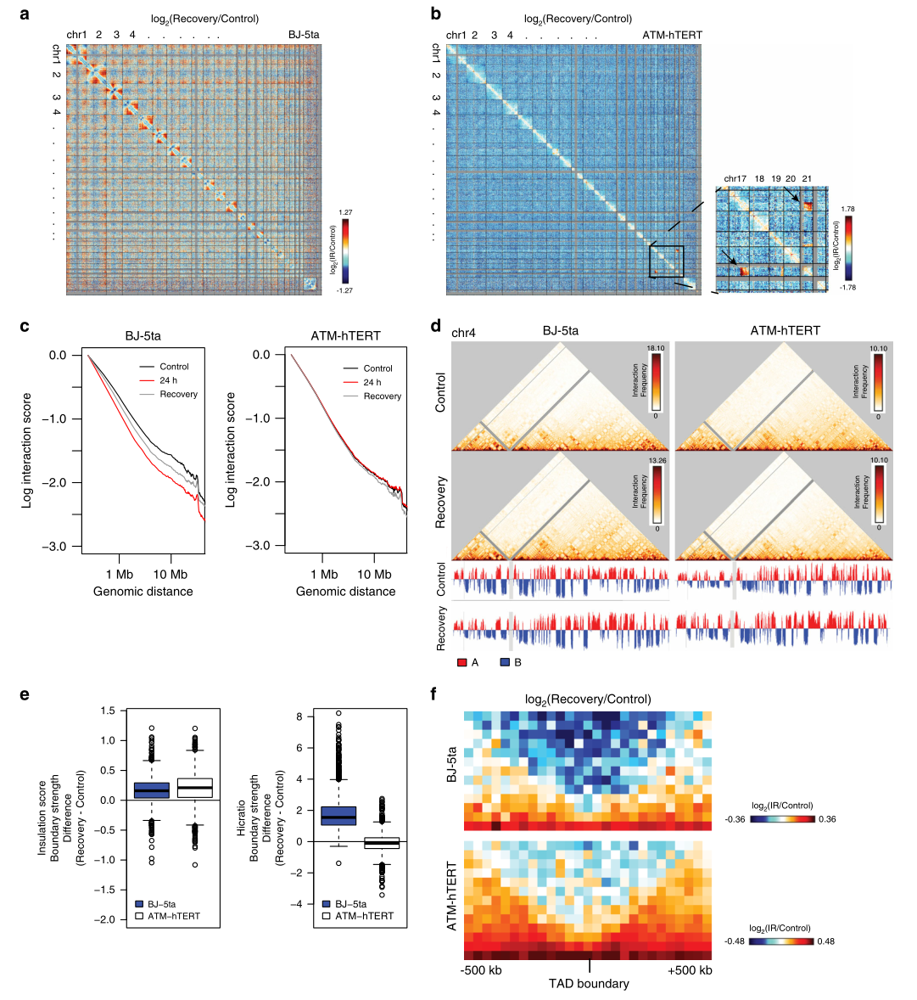

# 辐射诱导的DNA损伤和修复对三维基因组组织的影响

### Abstract

人们对3D基因组结构如何应对DNA损伤知之甚少

研究DNA损伤反应和修复对3D基因组折叠的影响

所有能进行修复的细胞类型都显示出拓扑相关结构域(TADS)的分离增加，在ATM缺陷的成纤维细胞中没有观察到照射后TAD边界的加强

### Introduction

电离辐射(IR)是一种众所周知的致癌物，IR可引起广泛的DNA损伤，其中双链断裂(DSB)是最致命的损伤。有效的DNA修复对于通过抑制染色体易位和基因组改变来维持基因组的完整性是必要的

大多数研究都集中在线性DNA序列水平，我们就研究3D基因组结构域。

CCCTC结合因子(CTCF)和粘附素被证明是IR17-20诱导的DNA损伤的早期反应。这些蛋白最近也被证明在染色体折叠21-24中发挥重要作用，有助于拓扑结合域(TADS)的形成。CTCF通过阻断粘附素23的环挤出活动来帮助建立TAD边界。

### Result

##### 皮肤成纤维细胞在IR后显示基因组结构的细微变化

> 由于处于不同细胞周期阶段(G1、S和G2/M)的细胞对IR暴露的反应不同，我们将成纤维细胞培养到融合的接触抑制状态，其中大多数细胞处于G0/G1期

X射线照射的BJ-5ta细胞在暴露后30分钟显示γ-H2AX蛋白水平升高，随后在IR后24小时下降，表明DNADSB得到有效修复(图1A和补充图2A，b)，24小时仍有未修复的病灶。

尽管用γ-H2AX观察到了明显的双链断裂诱导和修复事件，但与未照射的对照细胞相比，在IR暴露30分钟(图1B)，没有反复移位、插入或缺失的证据

与对照组相比，照射后30分钟接触频率的对数比显示染色体臂之间的相互作用减少。这表明辐射后染色体臂分离，这可能表明失去了Rabl样的构型38。(图1C)

端粒和着丝粒之间的相互作用有所增加(图1D)。

##### 淋巴母细胞在IR后表现出更明显的基因组结构变化。

与BJ-5ta一样，在IR后30分钟，GM12878细胞中γ-H2AX蛋白的水平升高，随后在IR后24小时下降到基线水平(图2A和补充图6A，b)

与BJ-5ta细胞很像，GM12878在基因组结构中没有表现出任何反复的易位、插入或缺失(图2B和补充图7A)。

GM12878细胞在照射后30min表现出更加多变的反应。虽然在两个重复中染色体内相互作用都有所增加，但观察到的相互作用模式并不一致(图2C和补充图7B)。

与成纤维细胞相比，GM12878细胞在IR暴露24小时后显示出更多特定区域染色体内相互作用的局部性丢失模式(图2D)。

##### 尽管IR暴露后远端相互作用减少，但隔室特性不变

该图显示BJ-5ta和GM12878细胞系在24小时后都失去了中远程相互作用(图3A，b以及补充图7D和8)。

单染色体接触图显示IR和对照条件之间的接触模式没有明显变化，表明A/B隔室的一致性不受IR的影响(图3C，d)。检查了强度，变化不一致且很弱。隔室内相互作用的强度并不总是受到IR和DNA修复的影响。

##### 暴露于IR后，TAD边界强度和CTCF环增加

> 使用InsulationScore41和HicRatio方法42计算了每个边界的边界强度(TAD之间的接触分离度)

确定了BJ-5ta和GM12878细胞在IR后24小时的TAD边界强度增加(图4A，b和补充图11A，b)。

在BJ-5ta成纤维细胞中观察到的TAD增强可以被一种atm激酶抑制剂KU-55933阻断(图4A，b；表明DNA修复途径导致TAD边界增强(图4A，b)

绘制了TAD边界周围的平均交互剖面，跨越TAD边界的相互作用都减少了(表明TAD分离增加)(图4C，d和补充图10A-d)。

特定的位点上也可以检测到(图4E和补充图13)。

> 如果IR后TAD边界由于DNA损伤后CTCF的募集增加而加强，我们预计这也可能增加CTCF介导的环内的接触频率。

检查CTCF环，确实显示出平均强度增加(图4F，g)。

##### ATM是IR诱导的基因组结构改变所必需的。

> 观察到的边界和CTCF环强化与DSBs被动混合断裂的染色体所预期的相反，因此我们假设这些变化取决于细胞对DNA损伤的主动反应。ATM在DSB的修复中发挥关键作用，负责DNA损伤反应相关蛋白的招募。

> 对用人端粒酶逆转录酶(ATM-hTERT)永生化的ATM突变成纤维细胞进行了类似的IR实验

IR后γ-H2AX的平均荧光强度低于在BJ-5ta成纤维细胞中观察到的平均荧光强度(图5A和补充图15)。存在表明另一种机制，可能是atr途径，补偿了缺陷

像之前两种能修复的细胞类型一样，在IR后24小时，ATM-hTERT细胞中没有观察到复发的易位(图5B)。

IR后24小时Hi-C接触图与对照组的对数比率显示，这些ATM突变细胞在IR后接触者仅有轻微变化(图5C)。BJ-5ta和GM12878细胞远端相互作用的减少依赖于DNA损伤反应和修复

与BJ-5ta细胞一样，ATM突变细胞在暴露于IR后24小时保持A/B隔室特性(图5e)。

IR后ATM突变细胞中TAD边界强度略有下降(图5F)。

绘制TAD边界周围的平均相互作用轮廓，证实了X射线照射后ATM突变细胞中跨TAD边界的平均相互作用增加(图5G)。

聚集相互作用模式在ATM突变细胞中没有显示CTCF环的增加(图5H)。

ATM对于增加TADS的分离是必要的，而在没有ATM的情况下，基因组区域有更高的机会跨越TAD边界相互作用。

两组对照：AT患者的原代人成纤维细胞(GM02052)、ATM抑制剂处理BJ-5ta细胞

##### 在ATM突变体中，3D基因组对IR的反应延迟，并在野生型成纤维细胞中持续存在。

> 为了确定IR和DSB后续修复对3D基因组的长期影响，允许细胞恢复和增殖，直到融合(~4-5天)。

BJ-5ta大多数染色体的着丝粒区域的相互作用减少，照射后24小时改变的相互作用在恢复过程中更加明显(图6A)。与1D比较

ATM突变细胞中，恢复5天后出现了两个新的易位：在17和21号染色体之间和19和21号染色体之间(图6B)。与ATM突变细胞的修复缺陷性质是一致的

BJ-5TA恢复过程中的中远程相互作用仍然减少(图6C)。ATM突变体也如此。

BJ-5ta和ATM突变细胞中都保持了A/B室的一致性，这与30分钟和24小时IR反应获得的数据一致(图6d)。

BJ-5ta中，TADS在IR后长期保持着更高的偏析(图6e)。

BJ-5ta TAD边界的相互作用减少了(图6F)。

