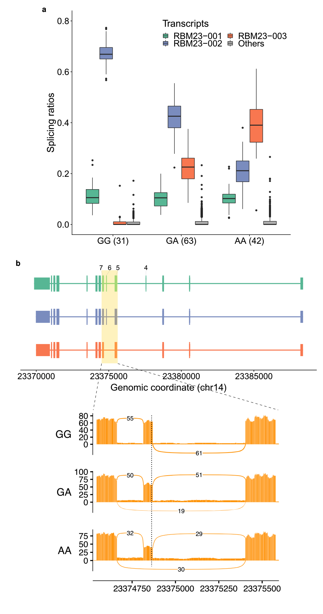
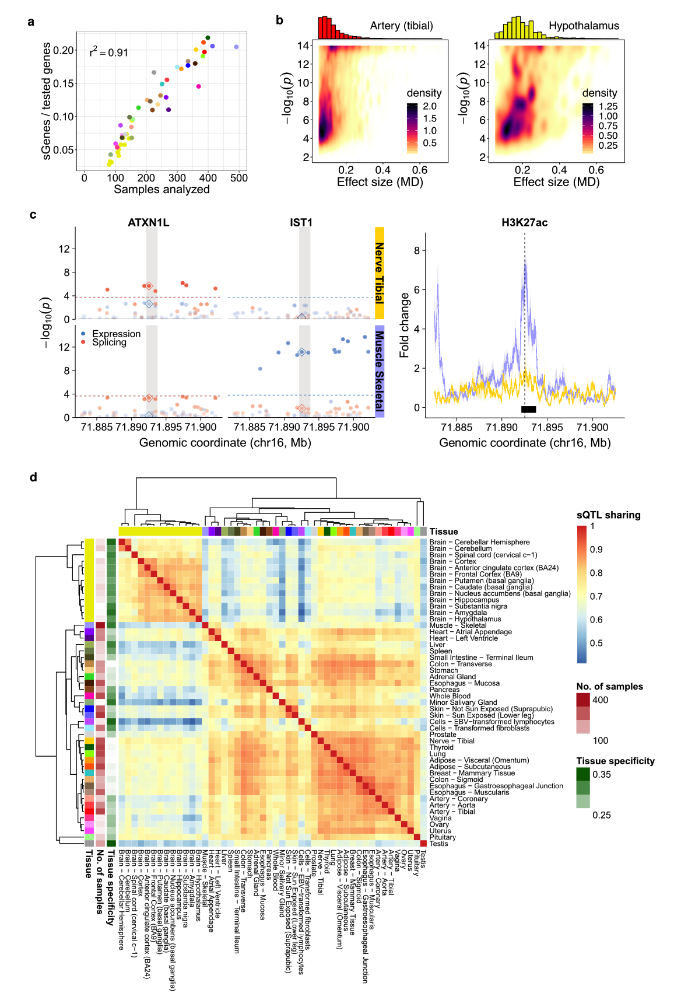
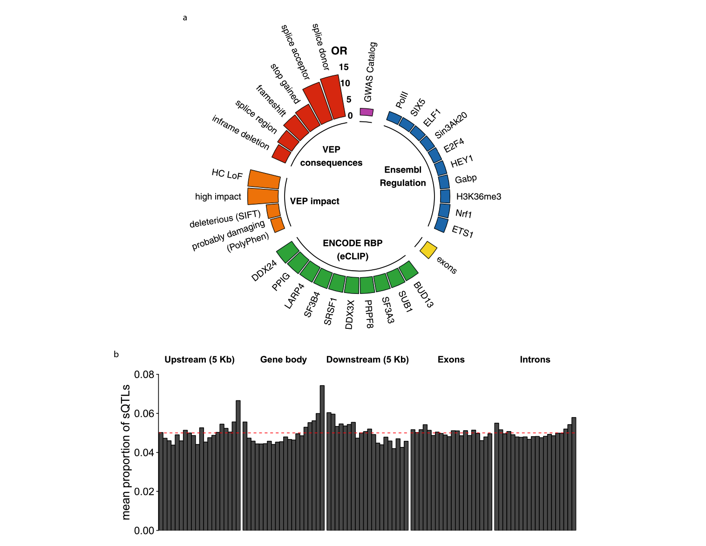
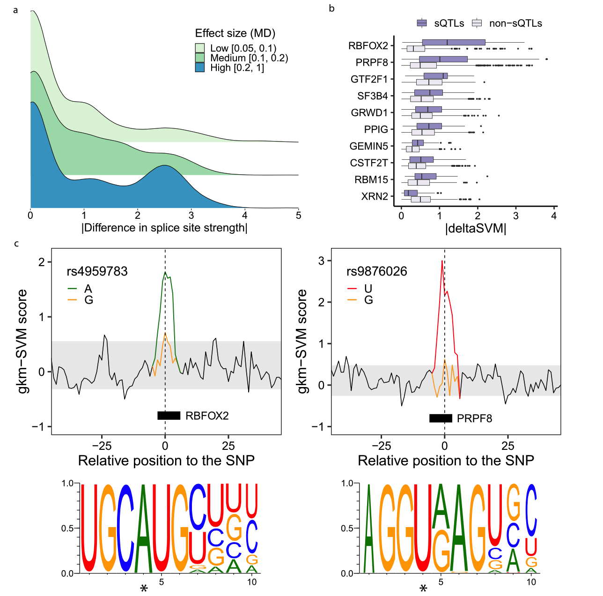
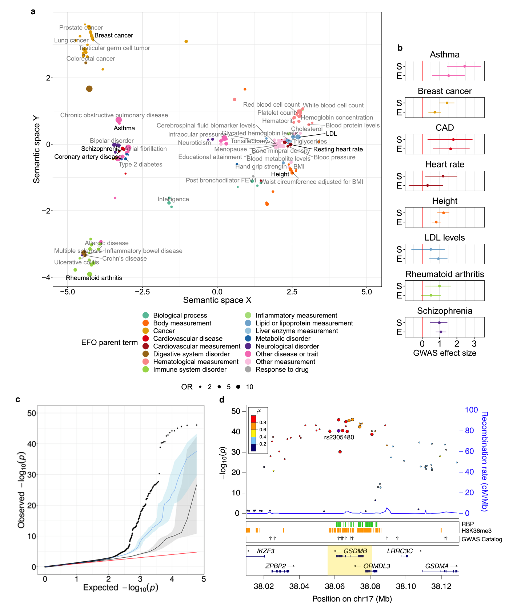

# 鉴定和分析人类基因组中多个组织的剪接数量性状基因座

### abstract

选择性剪接（AS）是真核mRNA生物发生中的基本步骤。在这里，我们为发现影响AS的遗传变异（拼接QTLs，sQTLs）开发了一条高效且可重复的管道。我们使用它来分析GTEx数据集，从而生成人类基因组中sQTLs的综合目录。对该目录的下游分析可深入了解剪接调控的基本机制。我们报告说，一组QTLs在多个组织之间共享。QTLs通常针对基因的整体剪接模式，而不是针对个别剪接事件。许多还影响相同或其他基因的表达，揭示通过不同机制起作用的调控基因座。QTLs倾向于位于转录后剪接的内含子中，内含子将作为剪接调控的热点。尽管许多变体通过改变剪接位点的序列来影响剪接模式，但还有更多的修饰RNA结合蛋白的结合位点。影响剪接的遗传变异可能比影响基因表达的变异具有更强的表型影响。

### Introduction

选择性剪接（AS）是一个单一基因产生多种转录异构体的过程。这是增加高级真核生物2功能复杂性的关键机制。通常，其改变会导致病理状况3。AS受严格的调节，通常是组织，细胞类型或条件特定的，涉及广泛的顺式和反式调节元素4、5。由于AS通常与转录结合，转录因子和染色质结构在其调控中也起着作用6。

近年来，通过RNA-seq对大批基因型个体进行转录组分析，已经鉴定出影响AS的遗传变异，即剪接数量性状基因座或sQTLs7-12。在各种实验环境中进行的QTL分析有助于深入了解GWAS与许多特征相关的机制，例如与脂肪相关的特征13，阿尔茨海默氏病10，精神分裂症9或乳腺癌14等。与影响基因表达的变体相比，QTLs实际上可能以相似或什至更大的程度促成复杂的性状和疾病。

通常用于QTL定位的绝大多数方法都将剪接视为单变量表型。他们评估遗传变异与个体转录本的丰富度之间的关联性7,16，或单个外显子的拼接9,17或内含子12,15。但是，这种方法忽略了AS测量的高度相关结构（例如，在恒定的基因表达水平下，较高水平的剪接同工型必然与较低水平的其他同工型相对应）。相反，我们提出了一种方法，该方法考虑了选择性剪接的内在多变量本质：测试了变体与AS表型载体的关联性，例如基因转录本同工型的相对丰度或内含子的内含子切除率。LeafCutter获得的内含子簇18。

基于这种方法，我们开发了一种用于高效且可重现的QTL映射的管道。在这里，我们利用它来利用基因型-组织表达（GTEx）联盟产生的多组织转录组数据，从而产生影响人类基因组剪接的遗传变异综合目录。该目录的下游分析揭示了许多与拼接规则有关的功能。因此，与剪接的多变量性质一致，我们观察到sQTL倾向于涉及多个剪接事件。sQTLs的很大一部分也会影响基因表达，这反映了剪接和转录之间的密切关系。但是，我们发现，在许多情况下，除sQTL靶标外的其他基因的表达均受同一变体影响。在这些情况下，调节基因座的多效性不是由剪接和转录过程之间的相互作用介导的，而是通过不同的机制发挥作用，作用于不同的基因上，否则这些基因可能不会直接相互作用。我们还发现sQTLs倾向于优先位于转录后剪接的内含子中：因此，这些内含子将作为剪接调控的热点。尽管许多变体通过直接改变剪接位点的序列来影响剪接模式，但还有更多变体修饰RNA结合蛋白（RBPs）与转录本内靶序列的结合。我们观察到，QTLs对GWAS性状和疾病的影响比对仅影响基因表达的变异影响更大，这证实了较早的报道，这表明剪接突变是许多遗传性疾病的基础15,19。在几种情况下，GWAS关联对于改变RBP结合位点的QTL具有特别强的作用。

### results

#### 跨GTEx组织的顺式剪接QTLs的鉴定

对于QTL定位，我们开发了QTLseekeR2，这是一个基于sQTLseekeR的软件，该软件可识别与给定基因的转录同工型的相对丰度变化相关的遗传变异。sQTLseekeR使用Hellinger距离来估计各观测值之间同工型丰度的变异性，并使用安德森方法21,22（一种非参数方差的多元分析）来评估关联的重要性（请参见方法和补充说明1）。。除了其他增强功能外，sQTLseekeR2提高了p值计算的准确性和速度，并允许在测试与基因型的关联之前考虑其他协变量，同时保持sQTLseekeR的多元统计检验。它还实现了一种多重检验校正方案，该方案针对每个基因，以经验方式表征在无关联的无效假设下预期的p-值的分布（请参见“方法和补充说明1”）。为确保高度并行，可移植和可重现的QTL映射，我们将QTLseekeR2嵌入了Nextflow23（加上Docker，https：//www.docker.com）计算中，该工作流名为sqtlseeker2-nf，在https：//上提供的github。com/guigolab/sqtlseeker2-nf。

在这里，我们使用GTEx联盟产生的表达和基因型数据，广泛分析了sqtlseeker2-nf鉴定的sQTLs。对于大多数分析，我们采用了从V7获得的同工型定量（dbGaP登录号phs000424.v7.p2），对应于来自620个死者的53个组织的10,361个样品。选择48个样本大小≥70的组织进行sQTL分析。假设大多数对选择性剪接具有顺式作用的变异体可能是在初级转录本或其附近区域携带的，我们在定义为基因体加上基因边界上游和下游5Kb的顺式窗口中测试了变异体。另外，为了证明sQTLseekeR2的统计框架不仅限于转录本丰度分析，而且可以利用其他与剪接相关的多元表型，我们还根据获得的内含子切除率计算了sQTLs。来自GTExRNA的seq数据（补充说明2）。最后，我们还提供了GTExV8中sqtlseeker2-nf标识的sQTL，我们将其与最近发表的出版物12中描述的GTEx联盟生产的sQTL进行了比较。我们表明，两组QTLs确实在捕获的AS事件的性质上确实有所不同。我们的方法可以检测到更多影响基因末端和内含子保留的事件，而GTEx联盟的方法则可以检测到更多涉及内部外显子的事件。这两个QTL集在变体和基因水平上的几个生物学特征方面也有所不同。例如，我们的方法似乎更有能力鉴定影响具有较低表达水平和较短内含子的基因的QTL，以及涉及具有较低次要等位基因频率（MAF）的变体。相比之下，GTEx联盟的方法具有更大的能力来鉴定影响表达水平更高和内含子更长的基因的QTL（补充说明3，补充数据7）。

以0.05的错误发现率（FDR），我们在GTExV7中发现了总共210,485个顺式sQTL，影响6,963个基因（即s基因：6,685个蛋白质编码基因和278个长的基因间非编码RNAs，lincRNAs）。。平均每个组织，我们确定了1,158个s基因（补充表1）。发现所有测试的蛋白质编码基因和lincRNAs分别占44％和34％是s基因。在类似的实验环境中，GTEx联合会报告了分别影响所有测试的蛋白质编码基因和lincRNAs的95％和71％的基因变异的基因变异（表达QTL，eQTL）24。为了说明用sqtlseeker2-nf鉴定的sQTLs的性质，在图1中，我们显示了SNPrs2295682的示例，该基因是RBM23基因在46个组织中共享的sQTL，在脑子区域（例如皮质）具有更大的作用。SNP强烈影响靶基因的AS同工型的相对丰度，主要同工型取决于sQTL的基因型。

正如预期的那样，s基因的数量超过测试基因的数量随着组织样本大小的增加而增长（r2=0.91）。随着样本数量的增加，检测sQTLs的功率增益得到了解释（图2a）。没有观察到饱和的迹象。一些组织，如骨骼肌或全血（QTLs比预期的少）和睾丸（QTLs比预期的多），逃脱了总体趋势。对于eQTLs24也观察到了这一点。与组织样本大小相比，使用xCell25估计的组织的细胞类型异质性似乎对sQTL发现没有很大影响（s基因数量与被测基因数量之间的部分相关性与估计的控制组织样本大小的细胞类型异质性为0.23，p-值为0.11，请参见方法）。

SQTL效应大小，以基因型组之间调整的转录本相对表达中的绝对最大差异（MD）衡量（请参见方法），通常低至中度（MD从0.05至0.20）。尽管如此，约20％的QTLs会产生较大的影响（MD≥0.20）。如人们所料，随着样本量的增加，在整个组织中检测到的中值效应量会大大下降（补充图1），因为较大的样本量可以检测到较小的效应。图2b表示两个样本量明显不同的组织的胫骨动脉（n=388）和下丘脑（n=108）的QTL效应大小（MD值）与p-值以及前者的分布。

s基因的GO富集分析显示了各种各样的生物学过程，包括细胞转运，免疫反应，线粒体功能以及有趣的是RNA加工（补充图2a）。如前所述，这可能暗示了某种剪接自动调节的机制。相反，没有sQTLs的被测基因在与信号传导，尤其是发育相关的功能上丰富（补充图2b）。这与报道的没有eQTLs24的基因的行为相似，这是因为没有sQTLs的基因在所有组织中的表达均少于s基因（双面WilcoxonRank-Sum检验p值<10-16）。

在其他研究中，此处发现的sQTLs高度重复。我们将它们与在BlueprintProject27中获得的三种主要人类血细胞类型（CD14+单核细胞，CD16+中性粒细胞和幼稚CD4+T细胞，请参见方法）进行了比较。大多数GTEx的QTLs在0.05FDR时复制（从脑子区域的π1=0.80到全血中的π1=0.96）。不出所料，全血显示出最高的QTL复制率（补充图3）。

我们描述了与sQTL相关的AS事件的类型（请参见方法，补充图4a）。请注意，这里我们还说明了转录本多样性的其他相关来源，例如替代转录的起始和终止28。QTL通常涉及多个事件（平均2.63）。大约34％的QTL与至少一个涉及内部外显子和/或内含子的AS事件有关。其中，外显子跳过是最常见的简单事件（占所有事件的7％至10％）。另外，58％的QTLs与影响第一个/最后一个外显子和非翻译区（UTRs）的事件有关。与sQTLs相关的AS事件的情况在整个组织中非常相似。但是，与非脑组织相比，脑子区域具有一些特殊性，例如较大比例的外显子跳跃事件和较小比例的涉及3'基因末端的复杂事件（有关详细信息，请参见补充图4b，c）。

我们发现52％的已鉴定sQTLs也是同一基因和组织的eQTLs，尽管仅在3％的情况下，最高sQTL与最高eQTL吻合。相对较大的重叠，与之前的一些研究报告15有所不同，与GTEx试点研究中观察到的QTLseekeR的QTLs相匹配29。这部分是由于我们的QTLs除了标准的剪接事件外，还能够参与转录末端。它还表明在转录水平（例如，影响转录并因此剪接的变体）或转录物稳定性水平（例如，影响剪接的变体）以及在转录水平上，基因表达和剪接的共调节程度很大。结果，转录本稳定性和基因表达）。

我们集中研究了一组148,618个变异体，这些变异体至少在两个组织中被测试与两个或多个基因（即g1和g2）的表达和剪接相关，并鉴定了6,552个病例，其中该变异体仅针对基因g1在一个组织中不是基因g2，而不是基因g2，并且在不同组织中它只是基因g2的eQTL，而基因g1则不是。这些案例揭示了基因组中的调节基因座，通过相同的因果变体或通过连锁不平衡（LD）中的不同因果变体，通过可能不同的分子机制对不同的基因具有不同的作用。我们称这种现象为异质麻同性。请注意，由于我们缺乏评估异质性的特定统计测试（请参见“方法和讨论”），因此我们应该将异质性基因座的识别视为第一近似值。然而，我们发现了这些基因座的双重调控行为的其他生物学支持。我们从ENTExProject中鉴定出与六个组蛋白修饰相对应的ChIP-seq峰，这些峰与上面的多效性变体重叠（请参见方法）。我们假设在不同组织中具有不同调节作用（即剪接和表达）的基因座在这些组织中的组蛋白修饰将被不同地标记。确实，我们观察到24％的多效性变体中的组蛋白修饰变化（补充数据1），而非19％的非多效性变体中的变化（双面Fisher精确检验p值0.045，请参见方法）。不管潜在的因果结构如何，异质性基因座都将揭示允许对不同过程进行协调调控并影响不同基因的基因组区域，否则这些基因似乎不会彼此直接相互作用。虽然需要进一步的工作来确定这种现象的相关性和普遍性，但图2c和补充图5b显示了一些潜在有趣的示例。

#### SQTL在各个组织之间高度共享

GTEx中可用的大量组织使我们能够评估组织共享和sQTLs的特异性。对于每对组织，我们选择在两个基因组中都测试过的变体-基因对，发现至少有一个显着，并计算了它们的效应大小（MD值）之间的皮尔逊相关性（r）。基于这些相关性的层次聚类将具有相似sQTL共享模式的组织进行了分组（图2d）。当使用更严格的Jaccard索引时，可获得类似的聚类（补充图6）。脑子区域聚集在一起，并与其余组织分开，形成第二个主要集群。我们观察到两组中每个组的sQTL共享程度较高（分别为“r1⁄40.80和0.78”），但在两者之间却较低（“r1⁄40.64”）。GTEx24中的eQTLs描述了相同的模式。我们进一步将组织特异性估计为st=1“rt，其中”rt是给定组织t与其他组织之间的平均相关性（组织特异性估计如图2d所示）。平均而言，大脑的QTLs比非大脑的QTLs更具组织特异性（“st1⁄40.31vs0.25，双面Wilcoxon等级-Sum检验p-值9.32⋅10−5）。其他组织相对较高组织特异性QTL包括睾丸（0.37），骨骼肌（0.33）或肝脏（0.32）。

具有较大影响的SQTLs与具有较小影响的SQTLs共享更多（补充图7a）。与eQTLs24一样，检测到影响小的sQTLs需要更大的样本量，因此样本量小的组织中的sQTLs倾向于更多的共享，而样本量大的组织中鉴定的sQTLs则倾向于更大的样本量。更多组织特异性（补充图7b）。为了排除样本数量对QTL共享模式的影响，我们将原始数据集下采样为每个组织100、200和300个样本，然后再次评估sQTL共享。我们发现上面的sQTL共享模式是独立于样本大小进行复制的（补充图8）。

为了捕获更复杂的共享模式，我们进一步设计了一种几何方法，该方法比较了组织之间由于sQTLs而导致的整个剪接表型的变化（请参见方法和补充图9a）。衍生的组织树状图（补充图9b）与通过简单方法（即基于MD值和Jaccard指数）生成的树状图以及在GTEx的LeafCuttersQTLs上使用多元自适应收缩获得的方法具有高度相似性。V812（补充图9c）。这有力地支持了所观察到的QTL共享模式的鲁棒性。

S基因也有明显的共有：在所有组织中测试的基因中有66％是至少两个组织中的s基因。为了识别特定于组织的s基因，我们计算了τs，它是基于s基因重要性的τindex31的变体。我们还采用标准τ来确定s基因表达的组织特异性（请参见方法）。我们发现了469个受强组织特异性剪接调控的基因（高度组织特异性s基因），其中81个未显示组织特异性表达（补充数据2）。这些基因的GO富集（宇宙：所有s基因）确定了与RNA加工及其调控有关的生物学过程（FDR<0.1时，五个有效术语中的三个：通过酯交换反应进行RNA剪接，RNA剪接的调控和mRNA加工的调控）再次提出了一些自动调节拼接的机制26。

#### SQTLs丰富了与剪接有关的基因组功能元件和具有高影响力的变异体。

为了阐明QTL可能影响剪接的机制，我们构建了人类基因组的全面功能注释（请参见“方法”）。总体而言，我们在sQTLs附近观察到高密度的功能元素（补充图10）。接下来，针对与剪接无关的相似变体的无效分布（双面费舍尔精确检验，FDR<0.05），我们评估了每个功能类别中sQTLs的富集。图3a总结了最主要的富集（完整列表，以及与每个富集相关的统计显着性，如补充图11所示）。

——————————看到这里————————————

正如人们可能会从真正影响剪接的真正变体中预期的那样，QTLs在剪接位点中高度富集（供体：OR=12.98，可调。p-值<10-16;接受者：OR=12.23，可调p-值1.22⋅10-15）。它们还显示出外显子，转录因子结合位点（TFBS，既是激活剂又是阻遏物），RBP结合位点（包括几个相关的剪接因子和剪接体成分）和RNAPolII位点的富集。sQTLs倾向于落在开放的染色质区域中，并显示出多个染色质标记的富集，尤其是对于H3K36me3（OR=2.85，p值<10-16）。相比之下，H3K27me3区域的sQTLs耗尽（或=0.63，调整p-值<10-16）。sQTLs在预测的蛋白质功能丧失后果（停止-获得，移码，VEP高影响变异，LOFTEE高-功能丧失高可信度损失（HC-LoF））和潜在有害变异（根据Polyphen32和SIFT33分数）。此外，我们发现在高LD（r2≥0.80）且GWAS命中（OR=2.08，调整p-值<10-16）的变体中有很多。在进行分层富集时（请参见方法），我们发现具有较大影响大小的QTLs在高影响力变异，剪接位点和GWAS命中上更富集，而具有较小影响大小的QTLs在RBP结合位点，TFBS上具有更大的富集和开放的染色质区域（补充图12）。

与倾向于聚集在转录起始位点（TSS）周围的QTL相对[7,24]，我们发现QTL优先位于转录终止位点（TTS）附近（图3b），15。另外，虽然外显子的QTLs均匀分布，但内含子的QTLs偏向剪接位点。总体而言，sQTLs比非sQTLs更靠近剪接位点（双面Wilcoxon等级-总和检验p-值<10-16，补充图13）。

#### SQTLs影响剪接位点强度和RBP结合

功能注释的丰富（图3a）提出了sQTL可能影响剪接的几种机制。其中之一是改变接头部位的强度。因此，对于带注释的剪接位点序列中的每个变体，我们使用位置权重矩阵（PWMs）对考虑参考和替代等位基因的位点进行了评分（请参见方法）。总体而言，与非sQTL变体相比，更大比例的sQTLs改变了剪接位点强度（63％对49％，OR=1.79，双面费舍尔精确检验p值<10-16）。sQTLs的拼接位点强度的绝对差异也更大（双面Wilcoxon等级-总和检验p值1.98×10-7），并随sQTL效应大小而增加（图4a）。

sQTLs可能影响剪接的另一种机制是修饰RBP结合位点。为了对其进行研究，我们使用了来自ENCODE项目34的HepG2和K562细胞系的113个RBP的CLIP峰。我们采用了基于k-mer的机器学习方法，该方法在识别转录因子结合位点方面表现优于PWMs35，并提供了一个独特的框架来评估遗传变异对结合的影响36。首先，我们针对每个RBP在高置信度eCLIP峰序列上训练了一个空缺的k-mer支持向量机（gkm-SVM）37。保留79个RBP，交叉验证的平均ROCAUC≥0.8。然后，我们通过deltaSVMmetric36估算了与每个RBP的eCLIP峰重叠的所有变体（无论是否为QTL）的影响，该指标测量了变体等位基因之间的预测潜力差异（请参见方法）。为了确保结果的稳健性，我们进一步将分析限制在最能预测RBP在任一等位基因上结合的前5％变异中，具有至少30sQTLs的RBPs，最终得到32个RBPs。（请参见方法）。

在FDR<0.05时，发现十个RBP的sQTLs与非sQTLs之间的δSVM差异显着（图4b，相应的gkm-SVMROC曲线和图案徽标显示在补充图14中）。和15）。值得注意的是，对于这9种蛋白质，sQTLs的ΔdeltaSVM值要比非sQTLs的大，如调节剪接的变体所预期的那样。此外，它们中的三个（PPIG，SF3B4和PRPF8）在前十个RBP中，其结合位点在QTL中更富集（图3a）。在图4c中，我们显示了SNPsrs4959783和rs9876026对基因PSMG4和TAMM41的QTL的影响的示例（另见补充图16），并破坏了RBPs的RBFOX2和PRPF8的结合位点。，分别。

我们进一步研究了等位基因特异性RBP结合（ASB）是否在sQTL发生。我们使用BEAPR（等位基因-特定蛋白-RNA相互作用的结合估计）[38]在ENCODEeCLIP数据集中确定了一组ASB变体，并将它们与我们的QTLs重叠（请参见方法）。我们发现，与非sQTLs相比，在所有RBPs中，sQTLs在ASB变异中都高度丰富（OR=2.30，双面费舍尔精确检验p-值<10-16）。当考虑单个RBPs时，在FDR<0.05的情况下，我们发现ASB变体中的sQTLs显着丰富了其中的22个（补充图17），包括上面确定的六个sQT具有更大的δSVM值的变种。Ls。总而言之，这些结果表明sQTL可能通过等位基因特异性结合RBP而影响剪接。

总体而言，sQTLs在剪接位点的效应大小（MD）大于与RBP和CLIP峰重叠的SQTLs的效应大小（两侧Wilcoxon等级-总和检验p值1.98⋅10-7，补充图18），尽管sQTLs在剪接位点的比例要小得多（占所有sQTLs的1.5％比8.3％）。通常，两种机制可能同时发生，因为许多RBP在剪接位点附近结合。PRPF8就是这种情况，它与剪接供体的序列特异性结合39。实际上，修饰“δSVM”并已被BEAPR鉴定为PRPF8的等位基因特异性结合SNP的SNPrs9876026（图4c）也破坏了供体的剪接位点。

#### S QT Ls优先位于转录后剪接的内含子上。

尽管剪接通常是通过共转录进行的（大多数内含子在转录终止和聚腺苷酸化之前就已剪接），但仍有一组转录本（通常是剪接的）往往处理得更慢，甚至在转录后也是如此40。我们评估了遗传变异体在调控共转录和转录后剪接（此处分别称为cs和ps）中的作用。为了鉴定cs和ps内含子，我们确定了核和胞质RNA中带注释的内含子的剪接完成程度-seq数据可用于ENCODE项目的13个细胞系（请参阅方法-ods）。我们集中研究了至少10个被分析细胞系（分别为14699和6419个内含子）中被归类为cs或ps的内含子子集。

我们在ps内含子中观察到比cs内含子更高的变异体密度（4.38 vs 3.34变异体/ Kb，沿着内含子分布不同，补充图19a）。 ps内含子中s QT Ls变异体的比例要大于cs内含子（9.2％对比6.6％，OR = 1.47，双面费舍尔精确检验p值<10-16）。当考虑相同基因和组织的s QT Ls而不是e QT Ls时，这种富集作用更强（OR = 1.67，p-值<10-16）。此外，相对于cs内含子中的s QT Ls，相对于cs内含子中的s QT Ls，在RB Ps和Pol II结合位点中，并且在组蛋白标记如H3 K36me3和H3 K4me3中，染色质区域显着富集。和TFBS（补充图19b）。两种内含子在QT Ls重叠剪接位点和GWAS命中的比例没有显着差异。

这些结果表明，剪接调节优选在ps内含子处发生。这是可以预期的，因为这些内含子在初级转录本中保留的时间更长，通过与RB Ps和其他因子（包括染色质相关因子）的相互作用提供了更多的调控机会。

#### S QT Ls帮助您深入了解疾病和复杂特征

S QT Ls帮助您深入了解疾病和复杂特征。为了探讨影响疾病和复杂性状剪接的调控变异的相关性，我们评估了GT Ex s QT Ls与GWAS目录（https://www.ebi.ac.uk/gwas）之间的重叠，该范围扩展至包括GWAS命中率的高LD（r2≥0.80）。与非s QT Ls相比，s QT Ls在与多种GWAS性状和疾病相关的变体中显示出实质性的富集（中位OR = 3.23）。在具有最大QTL富集的疾病中，我们发现许多以前与它们的病理生理相关的替代剪接（补充数据3）。我们根据实验因素本体论（EFO）41计算得出的信息，将丰富信息与各个GWAS术语之间的语义相似性估计值进行了集成。然后，我们应用了多维标度（MDS）来汇总和表示结果（请参见方法）。这使我们能够确定与QTL相关的主要表型。性状测量（MDS图的右侧）和疾病（左侧）是观察到的富集GWAS术语的两个主要组（图5a）。在后者中，我们确定了与癌症，自身免疫性疾病和其他疾病（神经，心血管，代谢等）相对应的亚组。

我们还针对代表观察到的簇的丰富特征的子集，对全基因组进行了GWAS汇总统计，包括哮喘42，乳腺癌43，冠状动脉疾病44，心率45，
身高46，低密度脂蛋白胆固醇水平47，类风湿关节炎48和精神分裂症49。我们进一步表征了使用fgwas50影响剪接的变体和仅影响基因表达的变体对疾病表型的贡献（请参见“方法”）。总体而言，两种类型的变体显示的效果大小均显着不同于零（图5b）。此外，对于分析的某些特征，包括哮喘，乳腺癌，心率和身高，我们观察到s QT L之间的GWAS关联要强于仅影响基因表达的变体（图5c和补充图20），这表明这些改变剪接可能在这些特性的分子机制中起着重要的作用。

此外，我们观察到，GWAS变体在位于剪接位点（OR = 2.66，双面费舍尔精确检验p值1.02×10-9）或RBP结合位点（OR = 1.78，两个）中的s个QT Ls中特别丰富。 -双面Fisher精确检验p-值<10-16）。特别是，某些具有某些可用摘要统计数据的特征和疾病显示，RBP结合位点中的QT L的GWAS关联性强于其他QT L的GWAS关联。值得注意的是，这种行为似乎是特质/疾病-和RBP-特定的（补充图21）。

QTL作图如何有助于深入了解GWAS关联的潜在机制的一个有趣例子是哮喘和加德明b基因（GSDMB）。与仅影响基因表达或既不影响表达也不剪接的变异相比，哮喘对s QTL变异的影响最大（最大似然估计= 2.32，图5b），对s QTL的关联更强。确实，我们确定了超过850 s的QT L与已知的哮喘基因座共定位，影响了与免疫相关的基因的剪接模式，包括白介素和免疫细胞受体（IL13，TLSP，IL1 RL1，TLR1），主要的组织相容性复合物（HLA） -DQA1，HLA-DQB1）或干扰素激活的转录因子（IRF1）。但是，我们还发现了其他基因，例如GSDMB，在该疾病的病理生理过程中具有先验性较差的作用。

GSDMB基因座（17q21）一直被认为是哮喘42和其他自身免疫性疾病（例如1型糖尿病51，溃疡性结肠炎52或类风湿性关节炎53）的遗传易感性的原因。尽管尚不清楚其确切功能，但GSDMB在哮喘中的人支气管上皮细胞中高度表达54,55，并且已知在小鼠中过度表达人GSDMB转基因会诱发哮喘表型55。此外，GSMDB和其他胃泌素的脂质结合N末端结构域会引起焦细胞凋亡56，可能导致触发哮喘病理生理的炎症分子释放。

GSDMB是包括肺在内的39个GT Ex组织中的s基因（s基因FDR = 1.42×10-10，中值MD = 0.22）。实际上，GSDMB的s QT Ls是与哮喘相关的最重要的变异之一[42]（图5d）。已显示剪接受体变体rs11078928（chr17：38064469，T / C）的等位基因C导致外显子6的跳跃，该外显子在N-末端结构域编码13个氨基酸，破坏了它的发烧活性54。虽然主要等位基因（T）与哮喘的发病率较高相关，但C等位基因的哮喘风险较低54。我们已将rs11078928确定为GSDMB的QTL，其替代等位基因C精确促进同种型GSDMB-001和GSDMB-002（外显子6跳过）与同种型GSDMB-003（外显子6包括在内）的表达（补充图22）。 。

